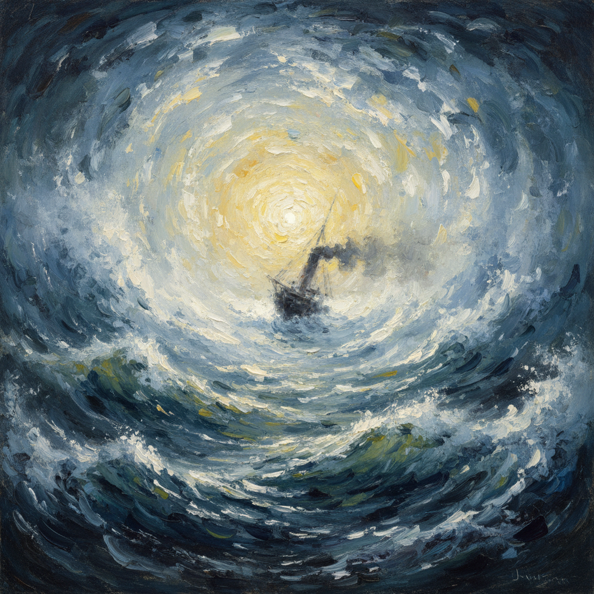

# J.M.W. Turner 透纳

> "The Sun is God." — Turner's last words

## 概述

约瑟夫·马洛德·威廉·透纳（Joseph Mallord William Turner，1775–1851）是英国最伟大的画家，也是西方艺术史上对光线和大气最极端的探索者。他从精确的地形画起步，逐渐走向越来越抽象的光与色彩的漩涡——晚期作品几乎完全溶解了形体，只剩下光、蒸汽和色彩的纯粹能量。

透纳被称为"光之画家"，他对光线和大气的极端探索预示了印象派和抽象表现主义，比它们早了半个世纪以上。

## 核心特征

| 特征 | 描述 |
|------|------|
| 光线崇拜 | 对光线的极端追求——太阳、火焰、暴风雨中的光 |
| 大气溶解 | 形体在光线和蒸汽中逐渐溶解 |
| 色彩漩涡 | 晚期作品中旋转的色彩能量 |
| 崇高美学 | 自然的恐怖力量——暴风雨、雪崩、海难 |
| 技法多变 | 从精确水彩到狂放油画的巨大跨度 |
| 预示未来 | 预示了印象派和抽象表现主义 |

## 视觉特征

- **光线**：炽烈的、几乎令人目眩的光芒
- **色彩**：金黄、猩红、白色的炽热色调
- **形体**：从清晰到完全溶解的渐进过程
- **大气**：雾、蒸汽、烟、暴风雨的弥漫
- **笔触**：晚期越来越狂放自由
- **构图**：常以漩涡或放射状组织画面

## 代表作品

| 作品 | 年代 | 意义 |
|------|------|------|
| *The Fighting Temeraire* | 1839 | 旧时代的挽歌——最受英国人喜爱的画 |
| *Rain, Steam and Speed* | 1844 | 工业时代的速度与力量 |
| *Snow Storm – Steam-Boat off a Harbour's Mouth* | 1842 | 自然暴力的漩涡 |
| *The Slave Ship* | 1840 | 道德愤怒与视觉壮丽的结合 |
| *Norham Castle, Sunrise* | c.1845 | 晚期最抽象的作品之一 |
| *Light and Colour (Goethe's Theory)* | 1843 | 色彩理论的视觉实验 |

## 真实作品（公共领域）

透纳的作品已进入公共领域：

| 作品 | 来源 |
|------|------|
| *The Fighting Temeraire* | [National Gallery](https://www.nationalgallery.org.uk/paintings/joseph-mallord-william-turner-the-fighting-temeraire) |
| *Rain, Steam and Speed* | [National Gallery](https://www.nationalgallery.org.uk/paintings/joseph-mallord-william-turner-rain-steam-and-speed-the-great-western-railway) |
| *Tate Turner Collection* | [Tate](https://www.tate.org.uk/art/artists/joseph-mallord-william-turner-558) |

> ⚠️ 本条目优先使用真实作品。如需本地图片，请从上述来源手动下载后放入 `assets/artworks/turner/` 并压缩。

## AI生成概念图

## 与其他风格的关系

- **Romanticism** → 浪漫主义崇高美学的极致
- **Impressionism** → 莫奈在伦敦看到透纳后深受启发
- **Abstract Expressionism** → 晚期作品预示了抽象表现主义
- **Luminism** → 美国光线主义的灵感来源
- **Plein Air** → 大量户外水彩速写

---

*浮光艺志 | Chronicle of Artistry*
