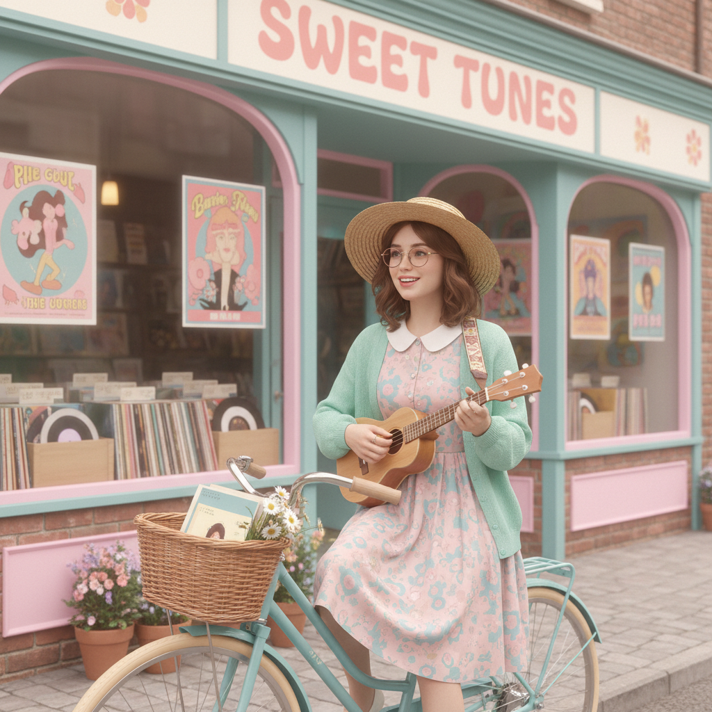

# Twee Pop 小清新流行



> **"尤克里里、碎花裙、独立唱片店——温柔也是一种反叛。"**

## 概述

| 维度 | 描述 |
|------|------|
| 时期 | 1986–至今 |
| 别名 | Twee, Twee Pop, Indie Pop, C86 |
| 核心色彩 | 淡粉、天蓝、薄荷绿、奶油白、鹅黄 |
| 关键元素 | 碎花、Peter Pan领、尤克里里、复古自行车 |
| 代表人物 | Belle and Sebastian, Camera Obscura, She & Him |
| 关联风格 | Indie, Cottagecore, Mori Girl, Vintage |

---

## 历史脉络

| 年份 | 事件 |
|------|------|
| 1986 | NME C86 合辑——Twee/Indie Pop 命名 |
| 1988 | Sarah Records 成立——Twee 厂牌圣地 |
| 1996 | Belle and Sebastian 出道——Twee 复兴 |
| 2006 | Zooey Deschanel——Twee 主流化 |
| 2009 | (500) Days of Summer——Twee 美学电影 |
| 2012 | "Twee" 成为贬义词——反 Twee 浪潮 |
| 2020s | 以 Cottagecore 形式回归 |

### 核心哲学

Twee 的精神是**"温柔不是软弱——在粗暴的世界里选择可爱是一种勇气"**：
- 温柔 = 反叛（对"酷"的反叛）
- 小 = 美（独立厂牌、小众、手工）
- 真诚 = 力量（"不需要装酷"）
- 怀旧 = 审美（60s/70s 复古）
- "在一个崇拜'酷'的世界里，选择'可爱'需要更大的勇气"

---

## 视觉语法

### 色彩系统

```
主色：
  淡粉 (#FFB6C1) — 温柔
  天蓝 (#87CEEB) — 清新
  薄荷绿 (#98FB98) — 自然
  奶油白 (#FFFDD0) — 温暖
  鹅黄 (#FAFAD2) — 快乐

辅色：
  淡紫 (#E6E6FA) — 梦幻
  珊瑚 (#FF7F50) — 活力
  棕色 (#8B7355) — 复古

规则：
  - 柔和、低饱和度
  - 复古感（60s/70s 色调）
  - 温暖 > 冷酷
  - 手绘/手写感

质感：
  棉 — 碎花裙
  针织 — 开衫、围巾
  纸 — 手写信、杂志
  木 — 尤克里里、书架
```

### 标志性元素

| 类别 | 元素 |
|------|------|
| 服装 | 碎花裙、Peter Pan领、针织开衫 |
| 配饰 | 圆框眼镜、发带、胸针 |
| 物品 | 尤克里里、复古自行车、黑胶唱片 |
| 空间 | 独立书店、咖啡馆、唱片店 |
| 音乐 | Indie Pop、Lo-fi、Folk |
| 态度 | 温柔、真诚、怀旧、小众 |

---

## 与千禧怀旧的关系

### 2000s-2010s 独立文化的视觉面
- Twee = Indie 文化的"穿搭指南"
- 与 Hipster 高度交叉（但更温柔）
- Etsy + Tumblr + 独立音乐 = Twee 生态
- "Twee 是 Hipster 的温柔版本"

### Cottagecore 的精神前身
- Twee (2000s) → Cottagecore (2018)
- 两者共享"温柔""手工""自然""怀旧"
- Twee = 城市版 / Cottagecore = 乡村版
- "同样的灵魂，不同的地理"

---

## 中国语境

- "小清新"在中国的直接对应
- 2010-2015 中国"文艺青年"美学
- 豆瓣文化与 Twee 的精神交叉
- 独立书店、咖啡馆文化在中国的兴起

---

## 设计应用

| 场景 | 应用方式 |
|------|----------|
| 品牌 | 手绘+柔和色+复古+温暖+真诚 |
| 空间 | 独立书店+咖啡馆+木质+温暖 |
| 音乐 | Indie Pop 视觉+手绘封面+Lo-fi |
| 数字 | 手绘+柔和+复古滤镜+手写字 |

---

## 相关风格

← [Indie 独立](indie-sleaze.md) | [Cottagecore 田园核](cottagecore.md) →

↑ [返回千禧怀旧目录](README.md) | [返回总目录](../README.md)
