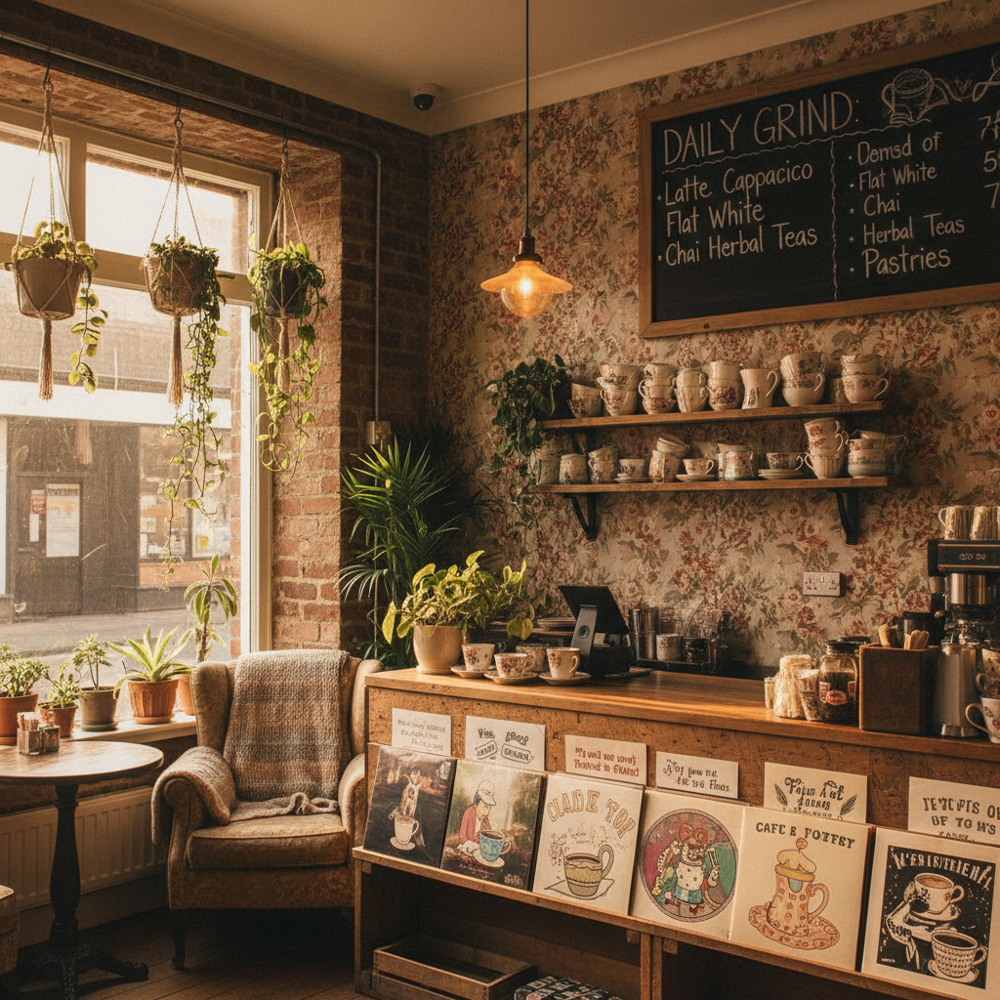

# Twee 小清新独立




> **"Peter Pan 领、复古自行车和独立唱片店——拒绝长大的文艺青年。"**

## 概述

| 维度 | 描述 |
|------|------|
| 时期 | 1980s 起源 / 2009–2014 鼎盛 / 2022 TikTok 回潮 |
| 别名 | Twee Pop, Indie Cute, Hipster Lite, Manic Pixie Dream Girl |
| 核心色彩 | 粉彩色、芥末黄、复古红、天蓝 |
| 关键元素 | Peter Pan 领、A字裙、复古眼镜、胶片相机、自行车 |
| 代表人物 | Zooey Deschanel, Wes Anderson, Belle & Sebastian |
| 关联风格 | Kidcore, Cottagecore, Indie Sleaze (对立面) |

---

## 历史脉络

### 1980s：音乐起源

"Twee" 源自英国俚语，意为"过分甜美"。作为美学标签，它最初指 1980 年代英国独立流行音乐中一种刻意天真、反对粗犷的态度：

- **C86 合辑**（1986）：NME 杂志发行的独立音乐合辑，定义了 jangly pop 的声音
- **Sarah Records**（1987–1995）：布里斯托尔厂牌，发行极度甜美的独立流行
- **K Records**（1982–至今）：美国奥林匹亚厂牌，Beat Happening 的极简天真

音乐特征：简单的吉他和弦、轻柔的人声、歌词关于初恋和害羞、刻意的业余感。

### 2000s–2014：视觉美学的成形

Twee 从音乐标签扩展为完整的生活方式美学：

**关键文化产品**：
- 《Garden State》(2004)：Natalie Portman 的 "Manic Pixie Dream Girl" 原型
- 《(500) Days of Summer》(2009)：Zooey Deschanel 成为 Twee 的视觉代言人
- 《Moonrise Kingdom》(2012)：Wes Anderson 的对称构图和粉彩色板
- 《New Girl》(2011–2018)：Jess 的 Peter Pan 领和复古连衣裙

**Tumblr 与 Etsy 时代**：
- Tumblr 上的 #twee 标签：复古打字机、胶片照片、独立书店
- Etsy 上的手工市集：手工首饰、复古服装、letterpress 印刷品
- ModCloth：Twee 风格的主要零售商
- Anthropologie：更商业化的 Twee

### 2014–2020：衰落

Marc Spitz 在 2014 年出版《Twee: The Gentle Revolution》时，这个运动已经开始衰落：
- 被批评为"白人中产阶级的特权美学"
- "Manic Pixie Dream Girl" 成为贬义词
- 极简主义和 normcore 取代了 Twee 的文化位置
- Instagram 的精致美学与 Twee 的"随意感"冲突

### 2022–至今：TikTok 回潮

Z 世代在 TikTok 上重新发现 Twee：
- #twee 标签获得新一波关注
- 与 "indie kid" 美学重合
- Wes Anderson 风格的短视频成为热门格式
- 复古胶片相机再次流行

---

## 视觉语法

### 色彩系统

```
主色：
  芥末黄 (#FFDB58) — 最标志性的 Twee 色
  复古红 (#CD5C5C) — 温暖但不鲜艳
  天蓝 (#87CEEB) — 清新感
  薄荷绿 (#98FB98) — 春天感
  奶油白 (#FFFDD0) — 背景色

辅色：
  粉彩色系（但比 Pastel Goth 更暖）
  棕色/驼色（复古感）
  海军蓝（学院感）

质感：
  做旧/复古感 — 不是全新的，是"有故事的"
  手工感 — 不完美但有温度
  纸质感 — letterpress、牛皮纸、手写字
```

### 标志性元素

| 类别 | 元素 |
|------|------|
| 服装 | Peter Pan 领衬衫、A字裙、开衫、高腰裤 |
| 鞋履 | Oxford 鞋、Mary Jane、帆布鞋、雨靴 |
| 配饰 | 复古圆框眼镜、胸针、发带、贝雷帽 |
| 物品 | 胶片相机、复古自行车、黑胶唱片、打字机 |
| 空间 | 独立书店、复古咖啡馆、花园、旧货市场 |
| 图案 | 波点、格子、碎花、条纹（但都是小尺寸的） |

### Wes Anderson 的视觉贡献

Wes Anderson 的电影美学与 Twee 高度重合，甚至可以说他定义了 Twee 的视觉标准：
- **对称构图**：强迫症般的居中对称
- **粉彩色板**：每部电影都有严格的色彩系统
- **复古字体**：Futura 字体的大量使用
- **微缩模型感**：一切都像精心布置的玩具屋
- **制服/统一着装**：角色穿着整齐划一的服装

---

## 与千禧怀旧的关系

Twee 怀念的是一种**前数字时代的慢生活想象**：
- 用胶片相机而不是手机拍照
- 在独立书店而不是 Amazon 买书
- 骑自行车而不是开车
- 写信而不是发消息
- 听黑胶唱片而不是流媒体

这种怀旧带有明显的**选择性**——它怀念的是中产阶级生活中"美好"的部分，而忽略了那个时代的不便和不平等。

---

## 中国语境

Twee 在中国的对应概念是**"小清新"**：
- 2010年前后豆瓣上的"小清新"文化
- 独立音乐（陈绮贞、苏打绿）的视觉风格
- 文艺青年的生活方式想象
- LOMO 相机、明信片、手账文化
- 独立咖啡馆和书店的空间美学

---

## 设计应用

| 场景 | 应用方式 |
|------|----------|
| 品牌设计 | 手写字体 + 粉彩色 + 复古插画 |
| 包装 | 牛皮纸 + letterpress + 棉绳 |
| 摄影 | 胶片质感 + 自然光 + 复古道具 |
| 空间 | 木质家具 + 绿植 + 复古海报 + 暖光 |

---

## 延伸阅读

- Aesthetics Wiki: [Twee](https://aesthetics.fandom.com/wiki/Twee)
- Marc Spitz《Twee: The Gentle Revolution in Music, Books, Television, Fashion, and Film》(2014)
- Wes Anderson 电影美术分析

---

## 相关风格

← [Indie Sleaze 独立邋遢](indie-sleaze.md) | [Kidcore 童年核](kidcore.md) →

↑ [返回千禧怀旧目录](README.md) | [返回总目录](../README.md)
