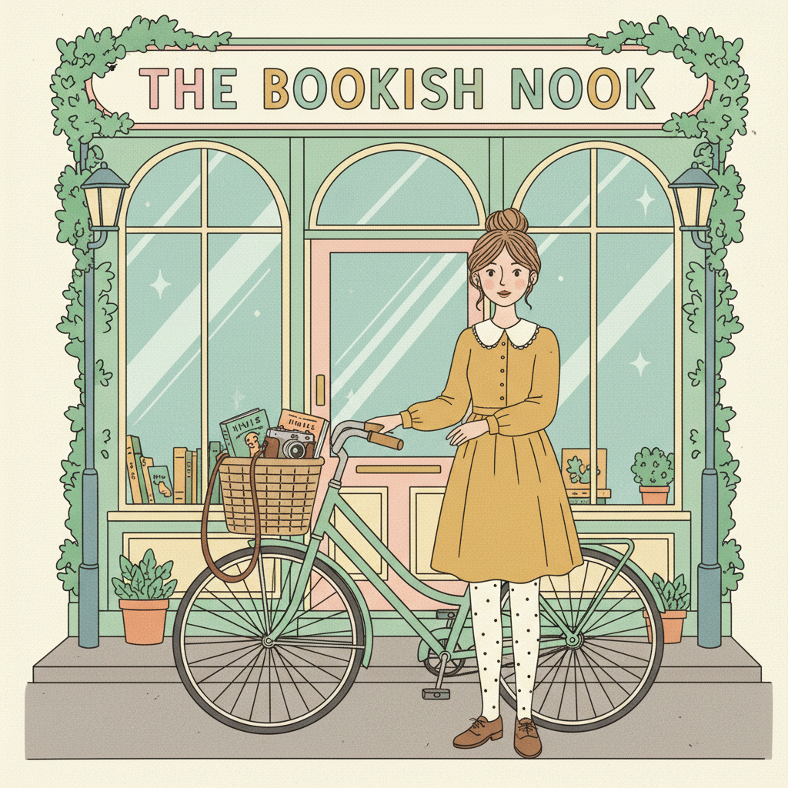

# Twee 小清新独立



> **"Peter Pan领、复古自行车、手写信——在Wes Anderson的色板里过一辈子。"**

## 概述

| 维度 | 描述 |
|------|------|
| 时期 | 2009–2014（根源更早） |
| 别名 | Twee, Twee Pop, Indie Cute, Quirky |
| 核心色彩 | 粉彩色、芥末黄、薄荷绿、珊瑚粉、奶油白 |
| 关键元素 | Peter Pan领、复古自行车、手写字、胶片相机 |
| 代表人物 | Zooey Deschanel、Wes Anderson、Belle & Sebastian |
| 关联风格 | Cottagecore, Indie Kid, Kinderwhore (反面), Normcore (反面) |

---

## 历史脉络

### 从独立音乐到生活方式

| 年份 | 事件 |
|------|------|
| 1986 | C86 合辑——Twee Pop 音乐起源 |
| 1990s | Belle & Sebastian、Camera Obscura |
| 2003 | Etsy 创立——手工文化平台 |
| 2009 | 《和莎莫的500天》上映 |
| 2011 | Zooey Deschanel 的 New Girl |
| 2012 | Twee 美学巅峰——Pinterest 时代 |
| 2014 | 被 Normcore 取代 |

### 它代表什么？

| 元素 | 含义 |
|------|------|
| Peter Pan 领 | 童真、天真、"我拒绝长大" |
| 复古自行车 | 慢生活、环保、"我不需要车" |
| 手写信 | 真诚、温度、反数字化 |
| 胶片相机 | 不完美的美、怀旧、"每一张都珍贵" |
| 独立书店 | 小众、品味、"我不去连锁店" |

### 核心哲学

Twee 的精神是**"在粗糙的世界里选择精致和温柔"**：
- 可爱不是幼稚——是一种抵抗
- 小事物比大事物更有价值
- 手工 > 机器
- 慢 > 快
- "我选择活在一个更温柔的世界里"
- 不酷也没关系——酷本身就是一种暴力

---

## 视觉语法

### 色彩系统

```
主色：
  芥末黄 (#FFDB58) — 温暖、复古
  薄荷绿 (#98FF98) — 清新、天真
  珊瑚粉 (#FF7F50) — 甜美、活力
  奶油白 (#FFFDD0) — 柔和、干净
  天蓝 (#87CEEB) — 晴朗、乐观

辅色：
  棕色 (#8B4513) — 复古、手工
  淡紫 (#E6E6FA) — 梦幻
  红色 (#FF6347) — 点缀

规则：
  - 粉彩色为主
  - 低饱和度
  - 温暖色调
  - 不用黑色（太"酷"了）
  - 颜色搭配"不协调但可爱"

质感：
  棉布 — 碎花、格纹
  毛线 — 手织、温暖
  纸张 — 手写、手工
  木头 — 自然、温暖
  胶片 — 颗粒感、不完美
```

### 标志性元素

| 类别 | 元素 |
|------|------|
| 服装 | Peter Pan领、碎花裙、针织开衫、高腰裤 |
| 配饰 | 圆框眼镜、发带、胸针、帆布包 |
| 物品 | 复古自行车、胶片相机、黑胶唱片、手写信 |
| 食物 | 杯子蛋糕、手冲咖啡、有机食品 |
| 空间 | 独立书店、复古咖啡馆、二手店 |
| 字体 | 手写体、衬线体、打字机字体 |

---

## 与千禧怀旧的关系

### 2009–2014 的时代精神
- 金融危机后的"小确幸"
- "我买不起房但我可以烤杯子蛋糕"
- 对消费主义的温和抵抗
- Instagram 早期的滤镜美学

### 为什么消失了？
- 2014 年 Normcore 宣布"可爱已死"
- 被批评为"白人中产阶级的特权美学"
- 过度商业化——从独立变成了 Urban Outfitters
- 但精神延续到了 Cottagecore

---

## 中国语境

- "小清新"——中国版 Twee 的完美翻译
- 2010–2015 年豆瓣/人人网的小清新文化
- 独立音乐、独立书店、文艺青年
- 与"日系"/"森女"的交叉
- 厦门、丽江、大理 = 中国的 Twee 圣地

---

## 设计应用

| 场景 | 应用方式 |
|------|----------|
| 品牌 | 粉彩色+手写字体+手绘插画+温暖 |
| 包装 | 牛皮纸+手写标签+碎花+麻绳 |
| 空间 | 木质+暖光+植物+手工装饰 |
| 数字 | 手绘图标+粉彩配色+圆角+温暖字体 |

---

## 相关风格

← [Cottagecore 田园核](cottagecore.md) | [Indie Kid 独立小孩](indie-kid.md) →

↑ [返回千禧怀旧目录](README.md) | [返回总目录](../README.md)
