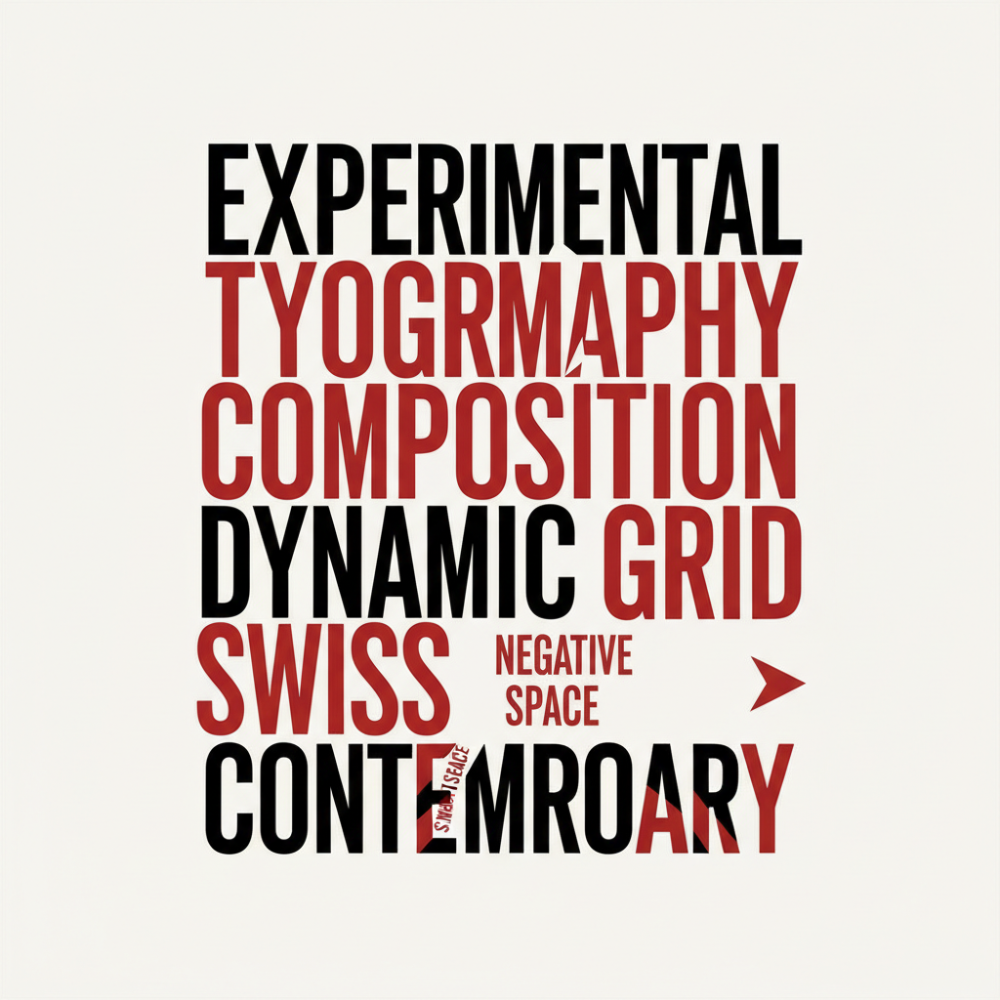

# Typography Art 字体艺术



> **"字母不只是信息的载体——字母本身就是形状、节奏和情感。"**

## 概述

| 维度 | 描述 |
|------|------|
| 时期 | 1450(活字印刷)–至今 |
| 别名 | Typography Art, Typographic Design, Lettering Art, 字体设计 |
| 核心色彩 | 黑白为基础、任何颜色为表达 |
| 关键元素 | 字体设计、排版、字母作为图形、文字与空间的关系 |
| 代表人物 | Jan Tschichold, Herb Lubalin, Erik Spiekermann, Jessica Hische |
| 关联风格 | Swiss Design, Bauhaus, Graffiti, Calligraphy, Brutalism Design |

---

## 历史脉络

| 年份 | 事件 |
|------|------|
| 1450 | 古腾堡活字印刷——字体设计开始 |
| 1920s | Bauhaus——字体作为设计元素 |
| 1928 | Jan Tschichold《新字体排版》 |
| 1957 | Helvetica 诞生——现代字体的象征 |
| 1984 | Macintosh——桌面排版革命 |
| 2000s | Web字体——屏幕字体设计 |
| 2020s | 可变字体(Variable Fonts)——字体的新维度 |

### 核心哲学

字体艺术的精神是**"字母是最古老的图形设计——也是最强大的"**：
- 形状 = 情感（"圆体温暖、尖角锐利、衬线优雅"）
- 空间 = 呼吸（"字距和行距决定阅读的节奏"）
- 层次 = 叙事（"大小粗细 = 信息的优先级"）
- 限制 = 创意（"只用文字——反而更有力量"）
- "好的字体设计是隐形的——你不会注意到它，但你会感受到它"

---

## 视觉语法

### 色彩系统

```
经典：
  黑色 (#000000) — 正文、力量
  白色 (#FFFFFF) — 空间、呼吸
  红色 (#FF0000) — 强调、警告

表达性：
  任何颜色 — 情感表达
  渐变 — 现代感
  金色 — 奢华
  霓虹 — 夜生活

规则：
  - 对比是核心
  - 颜色服务于可读性
  - 少即是多
  - 颜色 = 层次

质感：
  印刷 — 凸版、丝网
  数字 — 像素精确
  手写 — 笔触、个性
  3D — 立体、阴影
```

### 标志性元素

| 类别 | 元素 |
|------|------|
| 字体类型 | 衬线、无衬线、手写、装饰、等宽 |
| 排版 | 网格、层次、对齐、留白 |
| 技法 | Lettering、Calligraphy、Type Design |
| 表达 | 文字画、字体海报、实验排版 |
| 工具 | Glyphs, FontLab, Illustrator, InDesign |
| 态度 | 精确、优雅、功能、表达、系统 |

---

## 与千禧怀旧的关系

### 字体 = 时代的面孔
- 每个时代都有代表字体：Art Deco的几何体、60s的迷幻体、Y2K的未来体
- "看到某种字体——就能立刻回到那个时代"
- 千禧年的字体：Eurostile, Bank Gothic, OCR → 科技感
- 2020s: 可变字体、动态字体 → 字体的新时代

### 社交媒体时代的字体
- Instagram/TikTok → 手写字体复兴
- "在数字时代——手写字体反而更珍贵"
- 品牌定制字体 = 当代最重要的品牌资产之一

---

## 中国语境

- 中文字体设计的独特挑战（数千汉字）
- 中国字体设计师和字体公司
- 汉字与拉丁字母的排版差异
- 中国书法传统与现代字体设计的对话

---

## 设计应用

| 场景 | 应用方式 |
|------|----------|
| 品牌 | Logo+定制字体+品牌识别 |
| 出版 | 书籍+杂志+排版+封面 |
| 海报 | 字体海报+实验排版+展览 |
| 数字 | UI字体+Web排版+动态字体 |

---

## 相关风格

← [Swiss Design 瑞士设计](swiss-design.md) | [Graffiti 涂鸦艺术](graffiti.md) →

↑ [返回千禧怀旧目录](README.md) | [返回总目录](../README.md)
