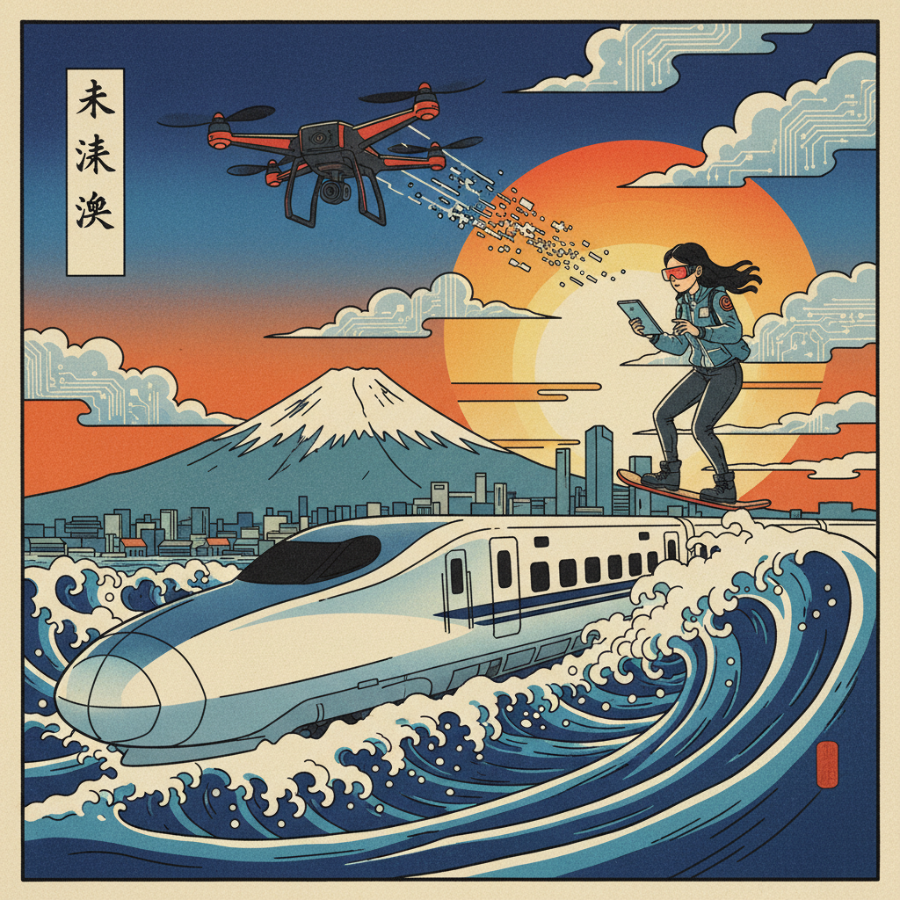

# Ukiyo-e Revival 浮世绘复兴

> **时期：** 1990年代–至今  
> **关键词：** 木版画传统、当代重释、平面构图、浮世绘技法、跨文化融合

## 概述

Ukiyo-e Revival（浮世绘复兴）是当代艺术家对日本江户时代浮世绘传统的重新诠释运动。艺术家们运用传统木版画技法或数字工具，将浮世绘的平面构图、大胆用色和装饰性线条与当代流行文化、都市景观相结合，创造出既有古典韵味又具现代感的视觉作品。

## 风格特征

- **平面构图**：无透视的装饰性画面组织
- **轮廓线**：清晰有力的黑色轮廓
- **渐变色块**：bokashi技法的色彩渐变
- **波浪纹样**：水、云、风的程式化表现
- **当代题材**：用传统技法描绘现代生活

## 代表人物与作品

- 山口晃（传统技法+当代都市）
- 石田�的彻也（超现实浮世绘）
- Paul Binnie（西方浮世绘版画家）
- Ukiyo-e Heroes项目（游戏角色浮世绘化）

## 概念图

