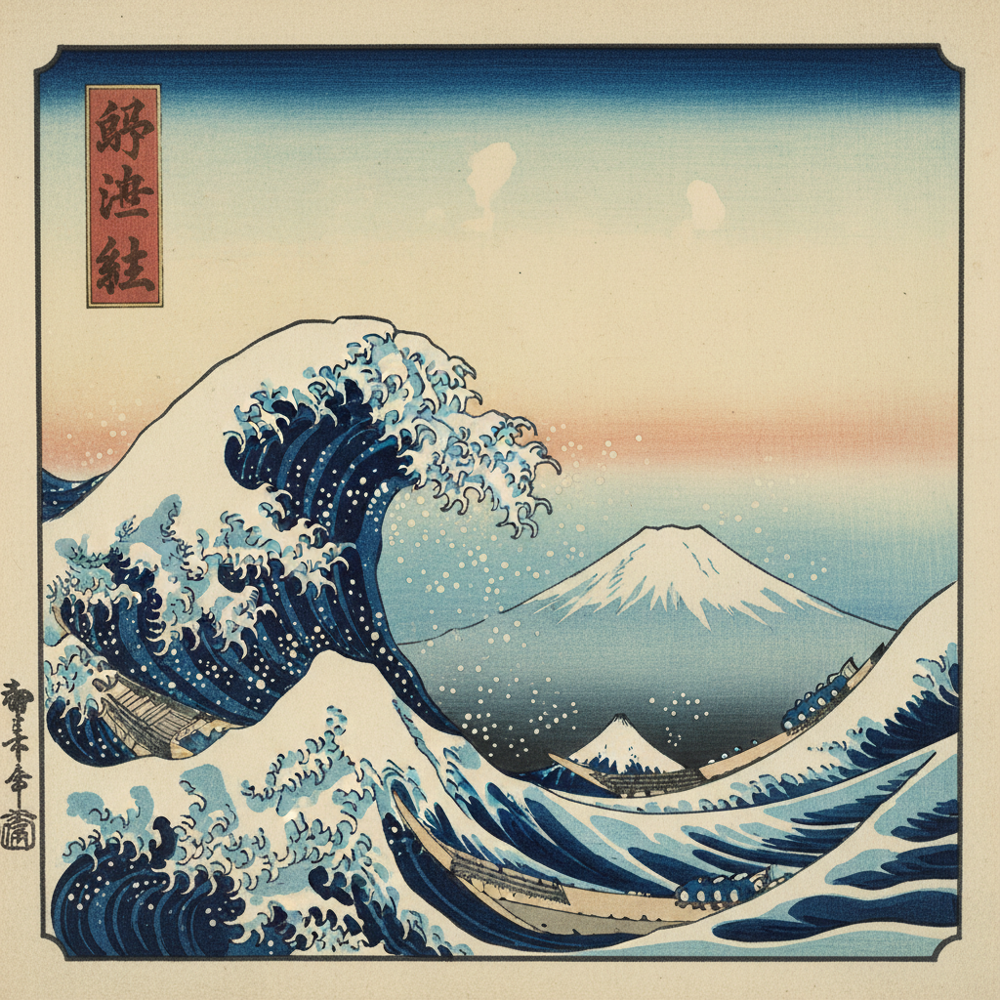

# Ukiyo-e 浮世绘 | 浮世絵

> **"浮世的欢愉——江户町人用木版画定格了樱花、美人和巨浪。"**

## 概述

浮世绘（Ukiyo-e / うきよえ / 浮世絵）是日本江户时代（1603-1868）的木版画和绘画艺术，"浮世"意为"浮华的尘世"，"絵"意为"画"。浮世绘描绘江户（东京）町人阶层的日常生活——美人（美人画）、歌舞伎演员（役者絵）、风景（名所絵）、花鸟等。这种艺术通过木版印刷大量生产，价格低廉，是江户时代的"大众媒体"。19世纪传入欧洲后，深刻影响了印象派和后印象派画家（梵高、莫奈、德加）。

## 主要类型

| 类型 | 日语名 | 代表画师 |
|------|--------|----------|
| 美人画 | 美人画 | 喜多川歌麿 |
| 役者绘 | 役者絵 | 东洲�的写乐 |
| 风景画 | 名所絵 | 葛饰北斋、�的广重 |
| 花鸟画 | 花鳥画 | 歌川広重 |
| 武者绘 | 武者絵 | 歌川国芳 |
| 春画 | 春画 | 各大画师 |

## 核心特征

- **木版印刷**：多色套印木版画
- **平面化**：无西方透视，平面构图
- **轮廓线**：清晰的黑色轮廓线
- **大胆构图**：不对称、截断式构图
- **鲜艳色彩**：植物和矿物颜料
- **大量生产**：价格低廉的大众艺术

## 经典作品

| 作品 | 画师 |
|------|------|
| 《神奈川冲浪里》 | 葛饰北斋 |
| 《富岳三十六景》 | 葛饰北斋 |
| 《东海道五十三次》 | 歌川広重 |
| 《大首绘》系列 | 喜多川歌麿 |
| 《东�的大相扑》 | 歌川国芳 |

## 视觉特征

- 清晰的黑色轮廓线
- 平面化的色彩填充
- 大胆的不对称构图
- 鲜艳的多色套印
- 留白的巧妙运用
- 动态的瞬间捕捉

## 与其他风格的关系

| 风格 | 关系 |
|------|------|
| 印象派 | 浮世绘直接影响莫奈等 |
| Art Nouveau | 受浮世绘平面化影响 |
| 漫画/动画 | 浮世绘是日本漫画的远祖 |
| Pop Art | 共享大众艺术和大量生产 |
| 当代日本设计 | 浮世绘是日本视觉身份 |

## 概念图

---

*浮光艺志 | Chronicle of Artistry*
