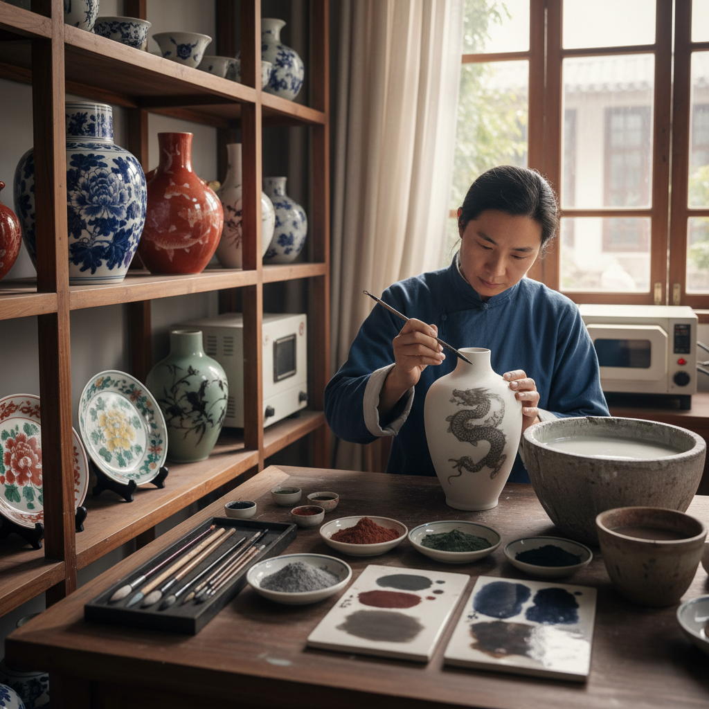

# Underglaze Art 釉下彩艺术

> "Underglaze painting is an act of faith — the artist paints on raw clay with pigments that look nothing like their final colors, then covers everything with a layer of transparent glaze and fires it all together at temperatures that would melt steel. Only when the kiln cools and the piece emerges does the painter see the true result: colors transformed by fire into permanent jewel tones sealed forever beneath a glassy surface." — Unknown

## 概述

釉下彩艺术（Underglaze Art）是在未施釉的素坯或已素烧的坯体上用矿物颜料绑画，然后施以透明釉并经高温一次烧成的陶瓷装饰技法——颜料被封存在釉层之下，永不磨损、永不褪色。釉下彩是陶瓷装饰中最耐久的技法，以中国的青花瓷和釉里红为最高代表。

釉下彩艺术的实践包括：1）青花——钴蓝色的釉下彩绑画；2）釉里红——铜红色的釉下彩；3）釉下五彩——多种颜色的釉下彩绑画；4）铁绘——使用氧化铁的釉下装饰；5）当代釉下彩——将传统技法与现代艺术结合的创作。

## 核心特征

| 特征 | 描述 |
|------|------|
| 永久 | 釉层保护永不褪色 |
| 高温 | 高温一次烧成 |
| 变色 | 烧前烧后色彩不同 |
| 耐磨 | 釉面保护不磨损 |
| 安全 | 食品安全（釉封颜料） |
| 古老 | 千年历史的技法 |

## 视觉特征

- **透明**：透明釉下的色彩
- **柔和**：釉层过滤的柔和效果
- **深度**：釉层带来的深度感
- **流动**：高温下颜料的微妙流动
- **光泽**：透明釉的玻璃光泽
- **永恒**：历经岁月不变的色彩

## 代表作品

| 作品 | 艺术家/文化 | 年代 | 意义 |
|------|-------------|------|------|
| *元青花* | 中国元代 | 14世纪 | 青花瓷的成熟 |
| *釉里红* | 中国明代 | 14-17世纪 | 铜红釉下彩 |
| *醴陵釉下五彩* | 中国近代 | 1907至今 | 多色釉下彩 |
| *Korean celadon inlay* | 韩国高丽 | 12世纪 | 高丽青瓷镶嵌 |
| *Japanese sometsuke* | 日本 | 17世纪至今 | 日本染付 |

## 历史时间线

| 时期 | 事件 |
|------|------|
| 唐代 | 中国早期釉下彩的出现 |
| 元代 | 青花瓷的成熟和繁荣 |
| 明清 | 釉下彩技法的多样化 |
| 1907年 | 醴陵釉下五彩的创制 |
| 当代 | 釉下彩的现代传承和创新 |

## 中国语境

釉下彩艺术在中国有最辉煌的传统——中国是釉下彩技术的发源地和最高成就所在。中国的青花瓷是世界上最著名的釉下彩品种——从元代成熟以来影响了全球陶瓷装饰。中国的釉里红是极其珍贵的釉下彩品种——因为铜红在高温还原气氛中极难控制，成品率极低。中国湖南醴陵的釉下五彩是中国独创的多色釉下彩技法——突破了传统釉下彩色彩单一的限制。中国的釉下彩技艺被列入多项国家级非物质文化遗产——包括景德镇青花瓷、醴陵釉下五彩等。中国当代的陶瓷艺术家在釉下彩领域持续创新——探索新的颜料、新的表现手法和新的艺术语言。

## AI生成概念图

## 与其他风格的关系

- **Overglaze** → 釉上彩
- **Porcelain Painting** → 瓷绘艺术
- **Ceramics** → 陶瓷艺术
- **Blue and White** → 青花瓷
- **Chinese Painting** → 中国画
- **Glaze Art** → 釉艺术

---

*浮光艺志 | Chronicle of Artistry*
