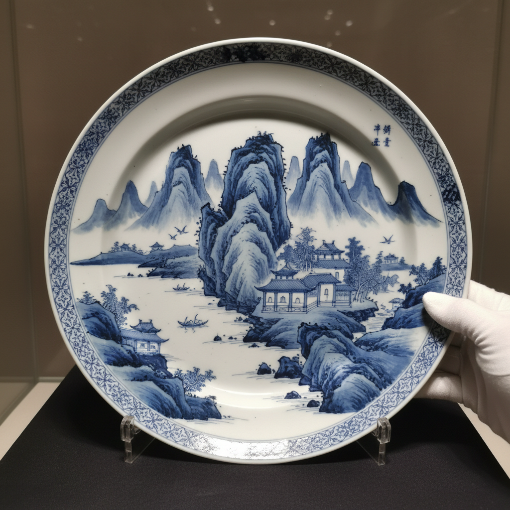

# Underglaze Painting Art 釉下彩艺术

> "Underglaze painting is drawing beneath ice — pigment brushed onto raw clay or bisque, then sealed forever under a coat of transparent glaze that fires to glass, the image trapped between body and surface like a fossil in amber, protected from wear and time by its crystal ceiling, the colors muted but eternal, visible through the glaze as through clear water over a painted riverbed." — Unknown

## 概述

釉下彩艺术（Underglaze Painting Art）是一种在未施釉的坯体或素烧坯上用彩料绘制图案，然后覆盖透明釉烧制的陶瓷装饰技法。釉下彩的图案被封存在釉层之下，永远不会磨损——这是它相对于釉上彩的最大优势。中国的青花瓷（钴蓝釉下彩）是世界上最著名的釉下彩品种，此外还有釉里红、釉下五彩等。

釉下彩艺术的核心要素包括：1）坯体绘画——在未施釉的坯体上绘制；2）透明釉覆盖——用透明釉覆盖画面；3）高温烧制——在高温下一次烧成；4）永久保护——釉层永久保护画面；5）耐磨性——画面不会被磨损；6）色彩限制——高温下可用颜色有限；7）一次性——绘制后无法修改。

## 核心特征

| 特征 | 描述 |
|------|------|
| 釉下绘制 | 在釉层之下的绘画 |
| 永久保护 | 釉层永久保护画面 |
| 耐磨耐用 | 画面永不磨损 |
| 高温烧成 | 与釉一起高温烧制 |
| 色彩限制 | 可用颜色受高温限制 |
| 不可修改 | 绘制后无法更改 |

## 视觉特征

- **釉下深度**：画面在釉层之下的深度感
- **柔和色调**：透过釉层看到的柔和色彩
- **蓝白经典**：青花的蓝白对比
- **水墨效果**：如水墨画般的渲染
- **光滑表面**：釉面的光滑触感
- **永恒感**：不会褪色的永恒画面

## 代表作品

| 作品 | 艺术家/窑口 | 年代 | 意义 |
|------|-------------|------|------|
| *元青花鬼谷子下山罐* | 景德镇 | 元代 | 青花瓷的巅峰 |
| *宣德青花* | 景德镇御窑 | 明宣德 | 青花的黄金时代 |
| *釉里红* | 景德镇 | 元-清 | 铜红釉下彩 |
| *醴陵釉下五彩* | 醴陵 | 清末-民国 | 釉下多色彩绘 |
| *伊兹尼克釉下彩* | 土耳其 | 15-16世纪 | 伊斯兰釉下彩 |

## 历史时间线

| 时期 | 事件 |
|------|------|
| 唐代 | 长沙窑釉下彩的早期探索 |
| 元代 | 青花瓷的成熟 |
| 明代 | 青花瓷的黄金时代 |
| 清代 | 釉下彩技术的多样化 |
| 清末 | 醴陵釉下五彩的创新 |
| 当代 | 釉下彩的传承与创新 |

## 中国语境

釉下彩是中国陶瓷最重要的装饰技法之一。中国的青花瓷——以钴料在白瓷坯体上绘制图案再施透明釉烧制——是世界上最具影响力的陶瓷品种。从元代至今，青花瓷一直是中国陶瓷的代表。除青花外，中国还发展出釉里红（铜红釉下彩）、青花釉里红（蓝红双色）、醴陵釉下五彩（多色釉下彩）等品种。景德镇的青花绘制技艺——分水、勾线、渲染——是极其精湛的手工技艺。釉下彩因其耐久性，也是中国日用瓷的主要装饰方式。

## AI生成概念图

## 与其他风格的关系

- **Blue and White** → 青花瓷
- **Overglaze Enamel** → 釉上彩
- **Cobalt Glaze** → 钴蓝釉
- **Copper Red** → 釉里红
- **Ink Painting** → 水墨画
- **Jingdezhen** → 景德镇传统

---

*浮光艺志 | Chronicle of Artistry*
