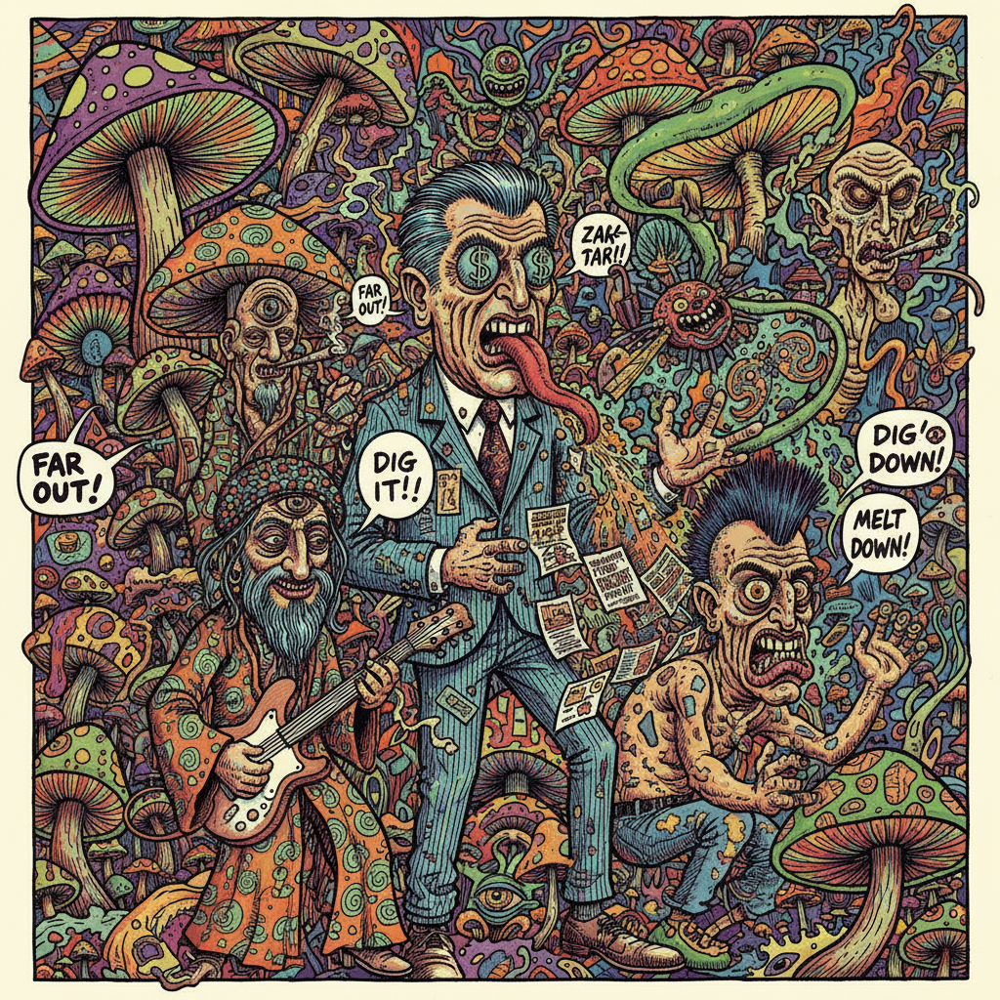

# Underground Comix 地下漫画

> **时期：** 1960年代–1980年代  
> **关键词：** 反文化、自出版、禁忌题材、粗犷线条、讽刺幽默

## 概述

Underground Comix（地下漫画）是1960年代美国反文化运动的产物，以自出版、反审查、探索禁忌题材为核心精神。罗伯特·克拉姆等艺术家用粗犷的笔触和尖锐的讽刺挑战主流漫画的"漫画准则"（Comics Code），将性、毒品、政治和社会批判带入漫画领域，开创了独立漫画的先河。

## 风格特征

- **粗犷线条**：密集的交叉排线和夸张变形
- **讽刺幽默**：黑色幽默和社会批判
- **自出版**：小印量、低成本的独立发行
- **禁忌题材**：性、暴力、毒品文化的直接描绘
- **手工质感**：保留手绘的原始能量

## 代表人物与作品

- 罗伯特·克拉姆《Zap Comix》
- 吉尔伯特·谢尔顿《Fabulous Furry Freak Brothers》
- 斯班·罗德里格斯《Trashman》
- 蒂娜·罗宾斯（女性地下漫画先驱）

## 概念图

