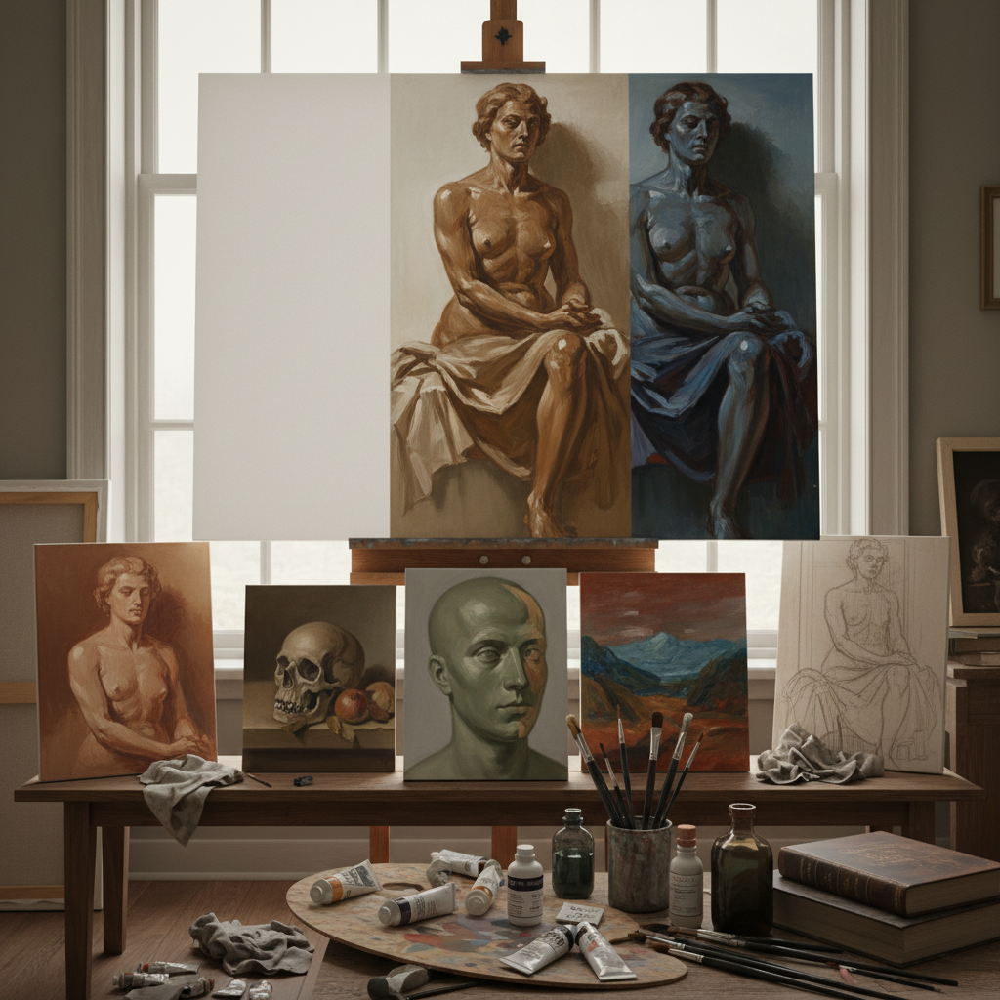

# Underpainting Technique 底层画法

> "Underpainting is the skeleton beneath the skin of a painting — an invisible architecture of value and form that supports everything above it, giving the final image a structural integrity that direct painting can never quite achieve." — Unknown

## 概述

底层画法（Underpainting Technique）是古典油画中的核心技法之一——在正式上色之前，先用单色或有限色彩完成画面的基本构图、明暗关系和形体塑造。底层画（underpainting）为后续的色彩层提供结构基础——就像建筑的骨架支撑着外墙和装饰。底层画法是间接画法（indirect painting）的核心组成部分。

底层画法有多种形式：灰色底层（grisaille）使用灰色调建立明暗；绿土底层（verdaccio/terre verte）使用绿色调为肤色打底；棕色底层（brunaille）使用棕色调建立温暖的基调；彩色底层（imprimatura）使用透明的有色底层统一画面色调。底层画法的优势在于将复杂的绘画过程分解为可控的步骤——先解决形体和明暗，再解决色彩和细节。

## 核心特征

| 特征 | 描述 |
|------|------|
| 底层 | 作为底层基础 |
| 结构 | 建立画面结构 |
| 分步 | 分步骤的方法 |
| 单色 | 通常单色或有限色彩 |
| 古典 | 古典油画核心技法 |
| 间接 | 间接画法的组成 |

## 视觉特征

- **单色**：单色的底层
- **结构**：清晰的形体结构
- **明暗**：准确的明暗关系
- **透明**：后续层的透明叠加
- **深度**：多层次的色彩深度
- **统一**：统一的色调基础

## 代表作品

| 作品 | 艺术家 | 年代 | 意义 |
|------|--------|------|------|
| *Unfinished works* | Various Old Masters | 古典 | 可见底层的未完成作品 |
| *Grisaille panels* | Various | 中世纪 | 灰色底层画 |
| *Verdaccio studies* | Italian Masters | 文艺复兴 | 绿土底层 |
| *Academic studies* | Various | 19世纪 | 学院派底层练习 |
| *Contemporary classical* | Various | 当代 | 当代古典画家的底层 |

## 历史时间线

| 时期 | 事件 |
|------|------|
| 中世纪 | 蛋彩画中的底层传统 |
| 文艺复兴 | 底层画法的系统化 |
| 16-17世纪 | 威尼斯画派和荷兰画派的底层技法 |
| 18-19世纪 | 学院派对底层画法的标准化教学 |
| 印象派后 | 直接画法兴起，底层画法减少 |
| 当代 | 古典技法复兴中的底层画法 |

## 中国语境

底层画法在中国的古典写实油画教育中有重要地位。中国的美术学院在教授油画技法时，会系统讲授底层画法的各种形式。中国的写实油画传统中，许多画家使用底层画法来建立画面的明暗基础。中国的油画修复研究中，对古典油画的底层结构有深入的分析。中国的一些当代写实画家在创作中使用多层底层技法来追求古典油画的深度和光泽。

## AI生成概念图

## 与其他风格的关系

- **Dead Layer** → 死色层
- **Grisaille** → 灰色画法
- **Terre Verte Underpainting** → 绿土底层
- **Glazing** → 罩染法
- **Indirect Painting** → 间接画法
- **Academic Painting** → 学院派绘画

---

*浮光艺志 | Chronicle of Artistry*
