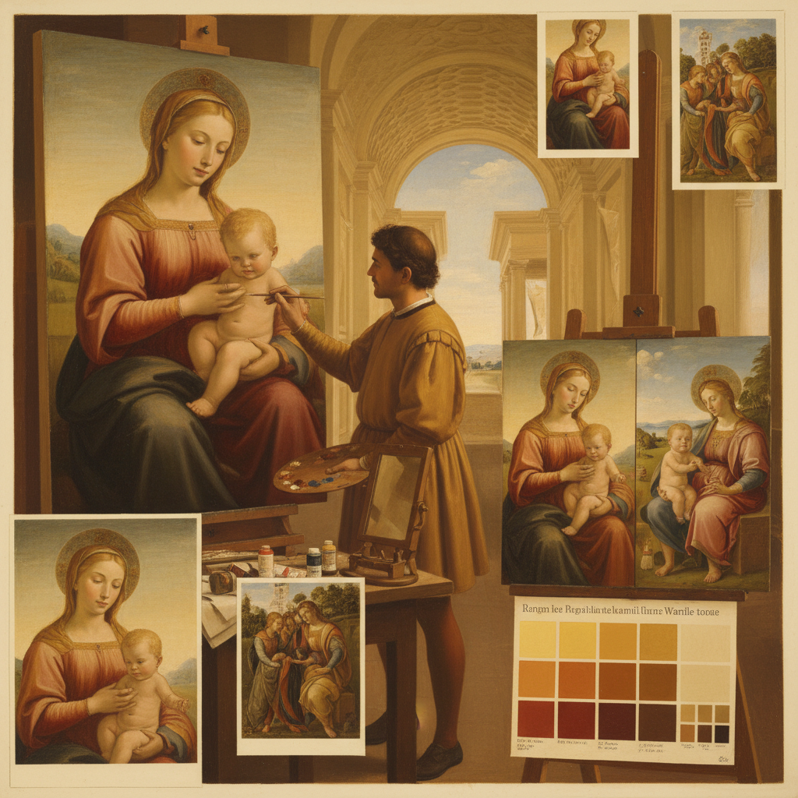

# Unione Technique 统一技法

> "Unione is the golden mean of Renaissance color — neither the extreme contrasts of chiaroscuro nor the smoky dissolution of sfumato, but a harmonious middle path where colors flow into one another with gentle warmth, maintaining their individual beauty while creating a unified whole, the technique that gave Raphael's Madonnas their serene luminosity and made his compositions feel as natural as sunlight on a spring morning." — Unknown

## 概述

统一技法（Unione），意大利语意为"union"（统一/联合），是文艺复兴时期的四大典型绘画技法之一（与sfumato、chiaroscuro、cangiante并列）。Unione的特点是使用柔和的色调过渡和和谐的色彩关系来统一画面——既不像chiaroscuro那样使用极端的明暗对比，也不像sfumato那样将一切溶解在烟雾中，而是让所有的颜色和色调在一种温暖、和谐、平衡的关系中共存。

Unione最典型的代表是拉斐尔（Raphael）——他的圣母像和大型壁画展示了完美的色彩统一和和谐。Unione的关键在于"中间调"的丰富性——画面中没有极端的黑或极端的白，所有的色调都在一个舒适的中间范围内变化，创造出一种宁静、优雅、和谐的整体效果。Unione也强调色彩的"温暖"——使用暖色调来统一画面。

## 核心特征

| 特征 | 描述 |
|------|------|
| 和谐 | 色彩的和谐统一 |
| 中间调 | 丰富的中间色调 |
| 温暖 | 温暖的整体色调 |
| 平衡 | 明暗的平衡关系 |
| 柔和 | 柔和的色调过渡 |
| 拉斐尔 | 拉斐尔的标志技法 |

## 视觉特征

- **和谐**：整体的色彩和谐
- **温暖**：温暖的色调氛围
- **柔和**：柔和的过渡
- **平衡**：明暗的平衡
- **宁静**：宁静优雅的感觉
- **统一**：画面的整体统一

## 代表作品

| 作品 | 艺术家 | 年代 | 意义 |
|------|--------|------|------|
| *Sistine Madonna* | Raphael | 1512 | 拉斐尔的统一技法 |
| *The School of Athens* | Raphael | 1509-1511 | 雅典学院的色彩统一 |
| *Madonna of the Meadow* | Raphael | 1505-1506 | 草地圣母的和谐色彩 |
| *Transfiguration* | Raphael | 1516-1520 | 变容的色彩统一 |
| *La Fornarina* | Raphael | 约1520 | 面包师女儿的肤色统一 |

## 历史时间线

| 时期 | 事件 |
|------|------|
| 15世纪 | Unione的早期发展 |
| 1500-1520 | 拉斐尔的unione鼎盛 |
| 16世纪 | 学院派对unione的继承 |
| 19世纪 | 学院派的色彩和谐理论 |
| 当代 | Unione的学术研究和复兴 |

## 中国语境

统一技法在中国的西方美术史教育中作为文艺复兴绘画的重要概念被介绍。中国的美术院校在讲解拉斐尔时会分析unione的色彩和谐原理。有趣的是，中国传统绘画美学中的"气韵生动"和"统一和谐"理念与unione有深层的相通之处——都追求画面的整体统一和内在和谐。中国画论中的"墨色统一"和"笔墨一体"也体现了类似的统一美学。中国的一些写实油画家在创作中追求类似unione的色彩和谐。

## AI生成概念图

## 与其他风格的关系

- **Raphael** → 拉斐尔
- **Sfumato** → 晕涂法
- **Chiaroscuro** → 明暗法
- **Cangiante** → 变色技法
- **Renaissance** → 文艺复兴
- **Color Harmony** → 色彩和谐

---

*浮光艺志 | Chronicle of Artistry*
