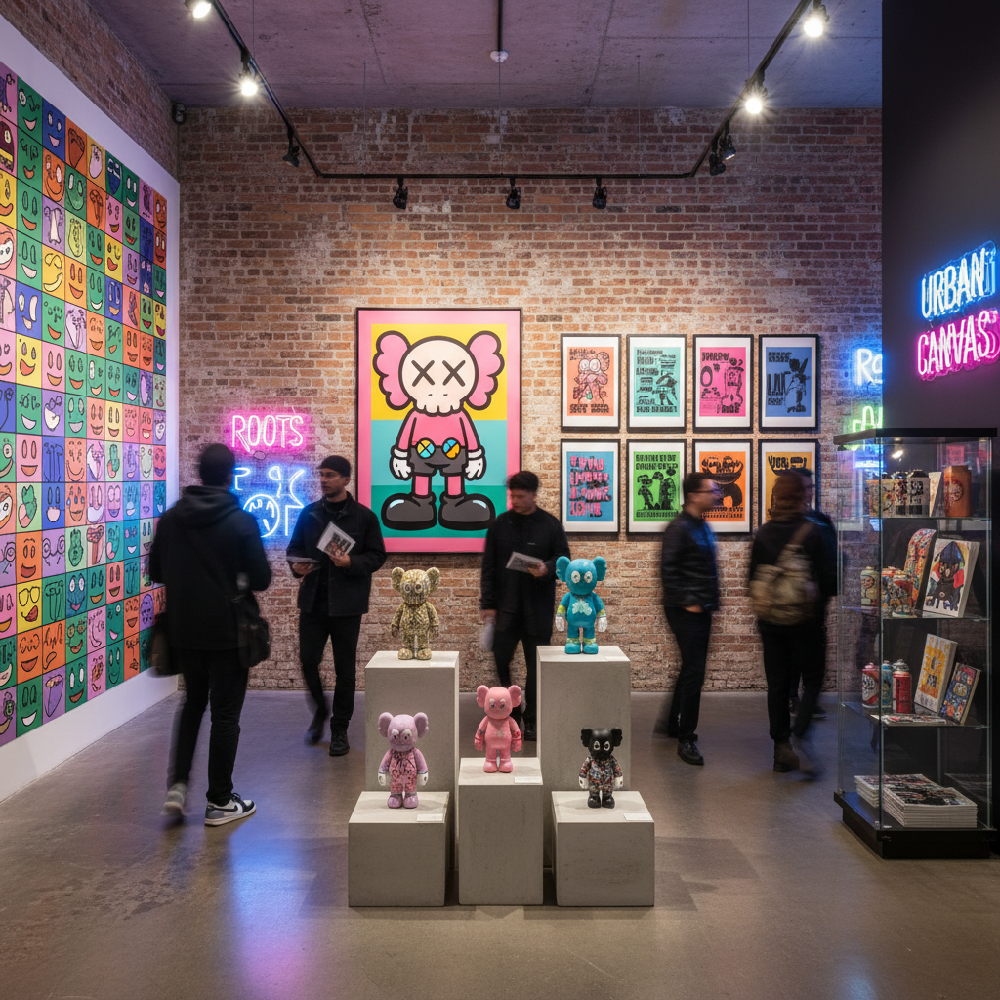

# Urban Contemporary Art 城市当代艺术

> "Urban Contemporary is the gallery-ready evolution of street culture — a movement that refuses the false binary between underground and institutional, that brings the energy of graffiti, skateboarding, hip-hop, and DIY culture into white-walled spaces without losing its edge, that proves you can sell prints and still keep it real, that the kid painting freight trains and the collector buying at Art Basel might be the same person twenty years apart, and that the most vital art of our time often comes not from MFA programs but from the streets, the skate parks, and the internet." — Unknown

## 概述

城市当代艺术（Urban Contemporary Art）是一个涵盖性术语，指从街头文化、涂鸦、滑板文化、嘻哈、朋克和DIY亚文化中发展出来的当代艺术实践。它比"街头艺术"更广泛——不仅包括在公共空间创作的作品，也包括在画廊、美术馆和数字空间中展示的、根植于城市亚文化美学的艺术。

城市当代艺术的特征包括：与流行文化和亚文化的紧密联系、强烈的图形设计感、限量版画和艺术玩具的生产、社交媒体的积极使用、以及对传统艺术界等级制度的挑战。代表性的艺术家和品牌包括：KAWS、Shepard Fairey、Invader、Futura、Barry McGee、以及众多通过Instagram和限量发售建立影响力的新一代艺术家。城市当代艺术已经成为一个庞大的市场，连接着艺术、设计、时尚和收藏文化。

## 核心特征

| 特征 | 描述 |
|------|------|
| 街头 | 街头文化的根源 |
| 图形 | 强烈的图形设计感 |
| 限量 | 限量版画和玩具 |
| 跨界 | 艺术与商业的跨界 |
| 社交 | 社交媒体的传播 |
| 民主 | 艺术的民主化 |

## 视觉特征

- **图形**：大胆的图形设计
- **色彩**：鲜明的色彩对比
- **角色**：标志性的角色设计
- **字体**：独特的字体和标志
- **拼贴**：混合媒介和拼贴
- **版画**：丝网印刷的质感

## 代表作品

| 作品 | 艺术家 | 年代 | 意义 |
|------|--------|------|------|
| *Companion* | KAWS | 1999起 | 城市当代的标志 |
| *OBEY Giant* | Shepard Fairey | 1989起 | 街头到画廊 |
| *Space Invaders* | Invader | 1998起 | 像素艺术入侵 |
| *Pointman* | Futura | 1980年代起 | 涂鸦的抽象化 |
| *Various works* | Barry McGee | 1990年代起 | 使命区美学 |

## 历史时间线

| 时期 | 事件 |
|------|------|
| 1980年代 | 涂鸦进入画廊 |
| 1990年代 | 滑板和街头文化的艺术化 |
| 2000年代 | 限量版画市场的爆发 |
| 2010年代 | 社交媒体时代的城市当代 |
| 当代 | NFT和数字收藏的融合 |

## 中国语境

城市当代艺术在中国有爆发式的增长，特别是在2010年代以后。中国的城市当代艺术场景包括：潮流艺术玩具（Art Toy）市场的繁荣（如泡泡玛特/Pop Mart）、街头艺术家的画廊化、限量版画和联名合作的流行、以及社交媒体上的艺术家品牌建设。中国的一些城市当代艺术家在国际上获得了认可，同时中国市场也成为国际城市当代艺术家的重要目的地。中国的城市当代艺术有其独特的文化特征——将中国传统元素（如书法、水墨、神话形象）与街头美学结合，创造出具有中国特色的城市当代视觉语言。

## AI生成概念图

## 与其他风格的关系

- **Street Art** → 街头艺术
- **Post-Graffiti** → 后涂鸦
- **Pop Art** → 波普艺术
- **Graphic Design** → 平面设计
- **Art Toy** → 潮流玩具
- **Skateboard Culture** → 滑板文化

---

*浮光艺志 | Chronicle of Artistry*
