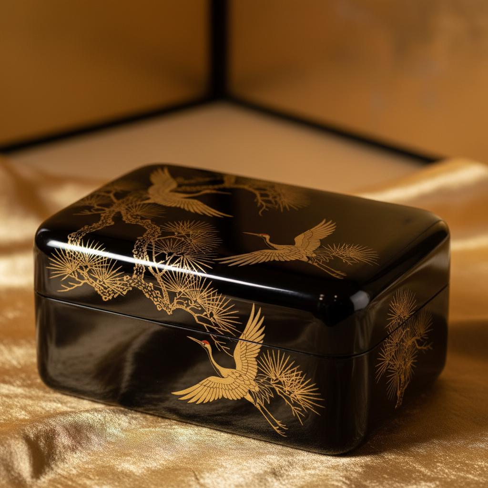

# Urushi Art 漆艺

> "Urushi is patience made visible — each layer of lacquer must dry in humid darkness for days before the next can be applied, and a fine piece may require thirty, fifty, or even a hundred layers built up over months or years. The result is a surface of extraordinary depth and luminosity, a material that seems to glow from within. Urushi is not merely a coating but a transformation: wood becomes stone-hard, cloth becomes armor, and the ordinary becomes precious." — Unknown

## 概述

漆艺（Urushi Art）是使用天然漆（从漆树中提取的树液）进行涂装、装饰和造型的传统工艺——通过反复涂漆、打磨和装饰创造出具有深邃光泽和极高耐久性的器物。漆艺是东亚最古老和最精致的工艺传统之一，在中国有超过7000年的历史，后传播至日本、韩国和东南亚。

漆艺的实践包括：1）髹漆——基本的涂漆技法；2）�的绘——用金银粉在漆面上绘制图案；3）螺钿——在漆面镶嵌贝壳片；4）堆漆——堆积漆层创造浮雕；5）雕漆——在厚漆层上雕刻图案；6）变涂——利用漆的自然纹理创造装饰效果；7）干漆——用漆和麻布塑造立体形态；8）当代漆艺——将传统技法与现代设计结合的创作。

## 核心特征

| 特征 | 描述 |
|------|------|
| 耐久 | 极高的耐久性 |
| 光泽 | 深邃的光泽效果 |
| 层次 | 多层涂装的深度 |
| 耐心 | 需要极大的耐心 |
| 古老 | 7000年以上的历史 |
| 东亚 | 东亚文化的代表 |

## 视觉特征

- **光泽**：深邃温润的光泽
- **深度**：多层漆的视觉深度
- **色彩**：黑、红、金的经典配色
- **光滑**：极其光滑的表面
- **装饰**：精美的装饰图案
- **温润**：温润如玉的质感

## 代表作品

| 作品 | 艺术家/文化 | 年代 | 意义 |
|------|-------------|------|------|
| *河姆渡漆碗* | 中国 | 约7000年前 | 最早的漆器 |
| *曾侯乙漆棺* | 中国 | 战国 | 战国漆艺巅峰 |
| *Japanese maki-e boxes* | 日本 | 平安-江户 | 日本莳绘 |
| *Korean najeonchilgi* | 韩国 | 高丽 | 韩国螺钿漆器 |
| *Contemporary urushi* | 当代 | 当代 | 当代漆艺 |

## 历史时间线

| 时期 | 事件 |
|------|------|
| 新石器时代 | 中国漆艺的起源（7000年前） |
| 战国-汉代 | 中国漆艺的第一个黄金时代 |
| 唐-宋 | 漆艺传入日本和韩国 |
| 明-清 | 中国雕漆的巅峰 |
| 当代 | 漆艺的全球传播和创新 |

## 中国语境

漆艺是中国最古老和最重要的传统工艺之一。中国是漆艺的发源地——河姆渡遗址出土的漆碗证明中国漆艺有7000年以上的历史。中国的漆艺传统极其丰富——包括雕漆（剔红、剔黑）、螺钿、描金、堆漆、犀皮等数十种技法。北京的雕漆、福州的脱胎漆器、扬州的螺钿漆器、平遥的推光漆器都是国家级非物质文化遗产。中国当代的漆艺教育在多所美术学院设有专业——培养新一代漆艺艺术家。中国的漆艺家正在探索漆的当代表达——将传统材料与现代艺术语言结合。中国的漆艺市场正在复兴——高端漆器作为艺术品和收藏品获得越来越多的关注。

## AI生成概念图

## 与其他风格的关系

- **Kintsugi** → 金缮
- **Maki-e** → 莳绘
- **Raden** → 螺钿
- **Chinese Art** → 中国艺术
- **Japanese Art** → 日本艺术
- **Decorative Art** → 装饰艺术

---

*浮光艺志 | Chronicle of Artistry*
