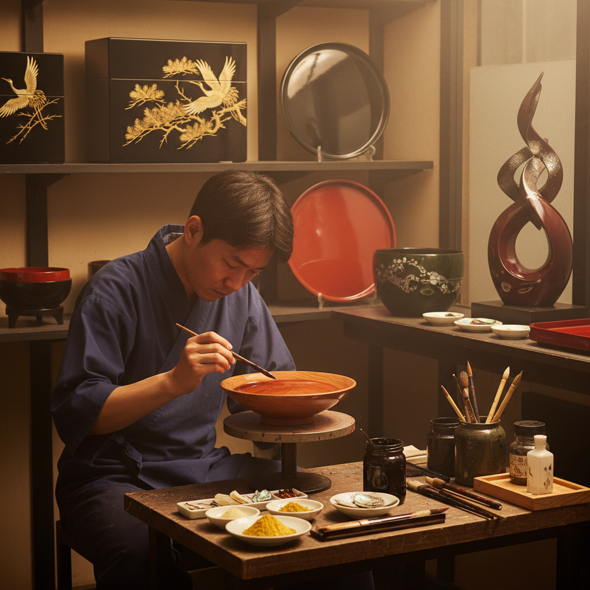

# Urushi 漆艺

> "Urushi is patience distilled into lacquer — each coat must cure in darkness and humidity, and a masterpiece may take years of invisible layers before it reveals its depth." — Unknown

## 概述

漆艺（Urushi）是使用天然漆树汁液（urushi lacquer）进行涂装和装饰的东亚传统工艺。漆液从漆树（Toxicodendron vernicifluum）的树皮中采集，经过精制后涂刷在木、竹、纸或布胎上，在高湿度环境中固化形成坚硬、光滑、防水的涂层。漆艺的独特之处在于：每一层漆都需要在特定的温湿度条件下缓慢固化（而非干燥），一件精品可能需要涂数十层漆，每层之间需要打磨。漆艺的装饰技法极其丰富——�的绘（maki-e，撒金粉）、螺钿（raden，贝壳镶嵌）、沈金（chinkin，刻金）、堆漆、雕漆等。

漆艺的哲学在于：时间的积累——每一层看不见的漆都在为最终的深度和光泽做贡献，如同人生的积淀。

## 核心特征

| 特征 | 描述 |
|------|------|
| 天然漆 | 漆树汁液为材料 |
| 多层 | 数十层涂装 |
| 固化 | 高湿度环境固化 |
| 耐久 | 极其耐久防水 |
| 光泽 | 深邃的光泽 |
| 多技 | 装饰技法极丰富 |

## 视觉特征

- **深邃**：深邃的光泽
- **光滑**：极其光滑的表面
- **黑红**：经典的黑红配色
- **金**：莳绘的金色装饰
- **螺钿**：贝壳的虹彩
- **层次**：多层漆的深度感

## 代表作品

| 作品 | 艺术家 | 年代 | 意义 |
|------|--------|------|------|
| *Jomon lacquerware* | 匿名 | 公元前7000年 | 最早的漆器 |
| *Chinese carved lacquer* | 匿名 | 宋元明 | 中国雕漆 |
| *Japanese maki-e* | Various | 平安时代+ | 日本莳绘 |
| *Korean najeonchilgi* | 匿名 | 传统 | 韩国螺钿漆器 |
| *Contemporary urushi* | Various | 当代 | 当代漆艺 |

## 历史时间线

| 时期 | 事件 |
|------|------|
| 公元前7000年 | 日本最早的漆器 |
| 商周 | 中国漆器的发展 |
| 汉代 | 中国漆器的第一个高峰 |
| 平安时代 | 日本莳绘的发展 |
| 宋元明 | 中国雕漆的巅峰 |
| 当代 | 当代漆艺的全球化 |

## 中国语境

中国是漆艺的发源地之一——中国的漆器历史可追溯到7000年前的河姆渡文化。中国漆艺的辉煌包括：战国秦汉的彩绘漆器、唐代的金银平脱、宋元的雕漆（剔红、剔黑）、明清的百宝嵌。中国的漆艺被列为国家级非物质文化遗产，主要产地包括福建福州（脱胎漆器）、北京（雕漆）、扬州（点螺）、平遥（推光漆器）等。当代中国的漆艺家如甘而可等在传承和创新方面做出了重要贡献。中国美术学院等院校设有漆艺专业。

## AI生成概念图

## 与其他风格的关系

- **Lacquerware** → 漆器
- **Maki-e** → 莳绘
- **Kintsugi** → 金缮（漆修复）
- **Woodworking** → 木工（胎体）
- **Inlay** → 镶嵌（螺钿）
- **Gilding** → 贴金

---

*浮光艺志 | Chronicle of Artistry*
