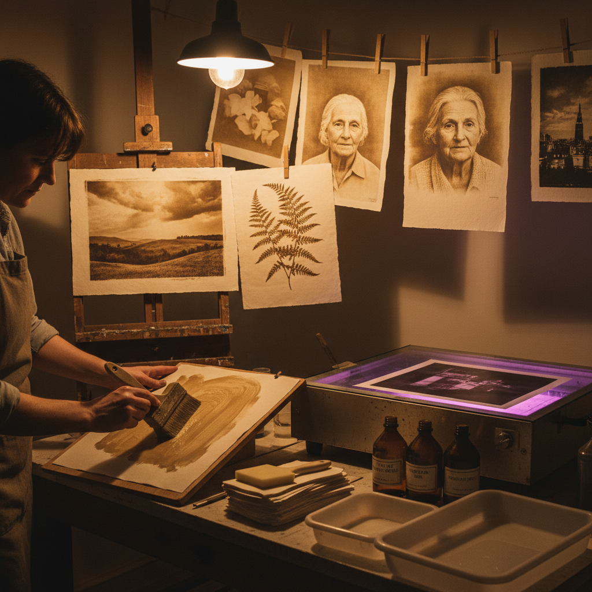

# Van Dyke Brown Printing 范戴克棕印刷

> "Van Dyke brown printing is iron and silver dancing in sunlight — ferric salts reduced by ultraviolet light, then precipitating metallic silver in warm brown tones that echo the Old Master drawings from which the process takes its name, each print a handcoated original with the warmth of aged parchment." — Unknown

## 概述

范戴克棕印刷（Van Dyke Brown Printing，也称Brownprint或Kallitype的简化版）是一种使用铁盐和银盐在紫外线曝光下产生温暖棕色调图像的替代摄影印刷工艺。这种工艺以17世纪佛兰德画家Anthony van Dyck命名——因为其产生的温暖棕色调类似于范戴克绘画中使用的棕色颜料。

范戴克棕印刷的过程：将柠檬酸铁铵、酒石酸和硝酸银的混合溶液涂在纸张上，干燥后通过负片接触曝光（紫外线或阳光）。曝光使铁盐还原，还原的铁盐将银盐还原为金属银，形成棕色图像。用水冲洗掉未反应的化学物质，用硫代硫酸钠定影。范戴克棕印刷是最简单和最经济的银基替代摄影工艺之一。

## 核心特征

| 特征 | 描述 |
|------|------|
| 铁银 | 铁盐和银盐 |
| 棕色 | 温暖的棕色调 |
| 紫外线 | 紫外线曝光 |
| 简单 | 过程相对简单 |
| 手涂 | 手工涂布感光液 |
| 经济 | 成本较低 |

## 视觉特征

- **棕色**：温暖的棕褐色调
- **柔和**：柔和的色调过渡
- **手工**：手工涂布的边缘
- **纸感**：与纸张融合的质感
- **温暖**：温暖的整体氛围
- **古典**：古典的视觉美感

## 代表作品

| 作品 | 艺术家 | 年代 | 意义 |
|------|--------|------|------|
| *Van Dyke brown landscapes* | Various | 当代 | 范戴克棕风景 |
| *Van Dyke brown portraits* | Various | 当代 | 范戴克棕肖像 |
| *Architectural blueprints* | Various | 历史 | 建筑蓝图的棕色版本 |
| *Contemporary VDB prints* | Various | 当代 | 当代范戴克棕印刷 |

## 历史时间线

| 时期 | 事件 |
|------|------|
| 1842年 | John Herschel的早期铁银实验 |
| 19世纪 | 作为蓝图的替代方案使用 |
| 20世纪 | 在替代摄影中的应用 |
| 当代 | 范戴克棕印刷的艺术化发展 |

## 中国语境

范戴克棕印刷在中国的替代摄影教育中有逐步的推广。中国的摄影艺术院校在替代摄影入门课程中常常教授范戴克棕印刷——因为它是最简单、最经济的银基替代工艺，适合初学者。中国的替代摄影工作坊和体验课程中，范戴克棕印刷是最常见的入门项目之一。中国的一些摄影艺术家使用范戴克棕印刷创作具有温暖古典美感的作品。

## AI生成概念图

## 与其他风格的关系

- **Cyanotype** → 氰版印刷
- **Kallitype** → 卡利版印刷
- **Salt Printing** → 盐纸印刷
- **Platinum Printing** → 铂金印刷
- **Alternative Photography** → 替代摄影
- **Sun Printing** → 日光印刷

---

*浮光艺志 | Chronicle of Artistry*
