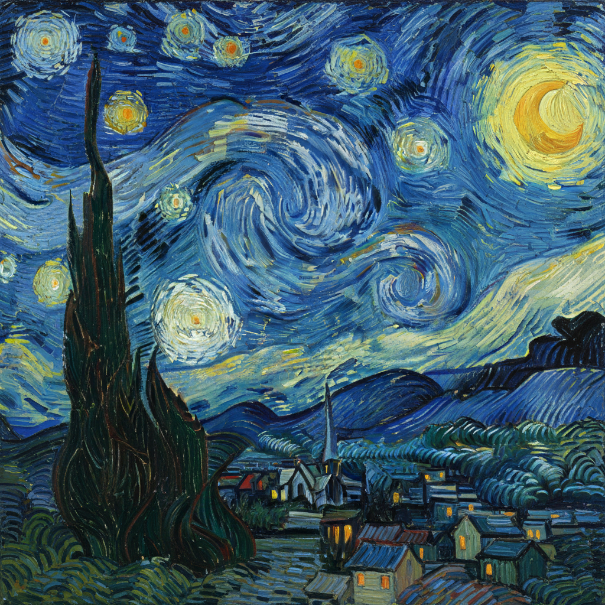

# Vincent van Gogh 梵高

> "I dream my painting and I paint my dream." — Vincent van Gogh

## 概述

文森特·威廉·梵高（Vincent Willem van Gogh，1853–1890）是荷兰后印象派画家，西方艺术史上最具情感力量和辨识度的艺术家之一。他在短短十年的创作生涯中（1880–1890）留下了约2100幅作品，其中包括约860幅油画——几乎全部创作于生命最后的两年半。

梵高以旋转的笔触、炽烈的色彩和对自然与人性的深刻共情创造了一种前所未有的表现性绘画语言。他生前仅卖出一幅画，死后却成为世界上最著名、最昂贵的画家之一。

## 核心特征

| 特征 | 描述 |
|------|------|
| 旋转笔触 | 厚重的、有方向性的旋转笔触 |
| 炽烈色彩 | 极度饱和的互补色对比——黄与紫、蓝与橙 |
| 情感投射 | 将内心情感直接投射到风景和物体上 |
| 厚涂质感 | 极厚的颜料堆积，产生浮雕般的质感 |
| 日本影响 | 深受浮世绘平面构图和鲜明色彩影响 |
| 系列创作 | 反复描绘同一主题——向日葵、星空、麦田 |

## 视觉特征

- **笔触**：粗犷有力的旋转和波浪形笔触
- **色彩**：铬黄、群青蓝、翡翠绿的极端饱和
- **轮廓**：深色轮廓线强化形体
- **动态**：一切都在运动——星星旋转、柏树燃烧、麦田翻涌
- **厚度**：极厚的颜料层，笔触如浮雕
- **光线**：内发光的色彩——物体自身在发光

## 代表作品

| 作品 | 年代 | 意义 |
|------|------|------|
| *The Starry Night* | 1889 | 世界上最著名的画作之一——旋转的星空 |
| *Sunflowers* | 1888 | 黄色的交响曲——为高更准备的装饰 |
| *Bedroom in Arles* | 1888 | 用色彩表达宁静——"绝对的休息" |
| *Wheatfield with Crows* | 1890 | 最后的杰作之一——不祥的天空 |
| *Self-Portrait with Bandaged Ear* | 1889 | 割耳后的自画像——痛苦与坚韧 |
| *Irises* | 1889 | 圣雷米精神病院中的花园 |

## 真实作品（公共领域）

梵高的作品已进入公共领域：

| 作品 | 来源 |
|------|------|
| *The Starry Night* | [MoMA](https://www.moma.org/collection/works/79802) |
| *Sunflowers* | [Van Gogh Museum](https://www.vangoghmuseum.nl/en/collection/s0031V1962) |
| *Self-Portraits* | [Van Gogh Museum](https://www.vangoghmuseum.nl/en) / [Wikimedia](https://commons.wikimedia.org/wiki/Vincent_van_Gogh) |

> ⚠️ 本条目优先使用真实作品。如需本地图片，请从上述来源手动下载后放入 `assets/artworks/van-gogh/` 并压缩。

## AI生成概念图

## 与其他风格的关系

- **Post-Impressionism** → 后印象派三巨头之一
- **Expressionism** → 表现主义的直接先驱
- **Fauvism** → 野兽派的色彩灵感来源
- **Impasto** → 厚涂法的极致代表
- **Japonisme** → 深受浮世绘影响
- **Abstract Expressionism** → 情感表达的先驱

---

*浮光艺志 | Chronicle of Artistry*
