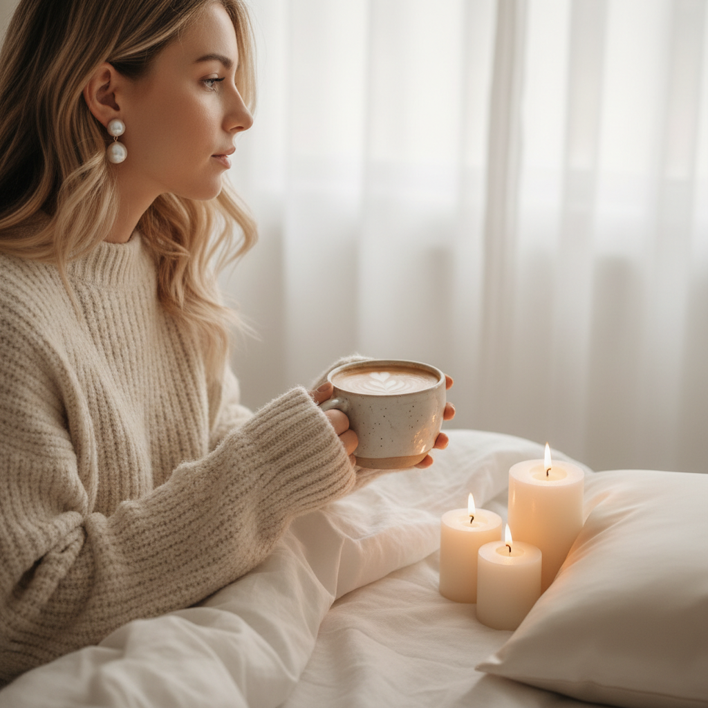

# Vanilla Girl 香草女孩



> **"米白毛衣、珍珠耳环、拿铁咖啡——把'普通'变成一种精致。"**

## 概述

| 维度 | 描述 |
|------|------|
| 时期 | 2022–至今 |
| 别名 | Vanilla Girl, Cream Aesthetic, Latte Girl |
| 核心色彩 | 米白、奶油色、驼色、淡粉、金色 |
| 关键元素 | 针织毛衣、珍珠、蜡烛、拿铁、丝绸 |
| 代表人物 | TikTok/Pinterest 社区驱动 |
| 关联风格 | Clean Girl, Quiet Luxury, Soft Girl, Hygge |

---

## 历史脉络

| 年份 | 事件 |
|------|------|
| 2019 | Clean Girl 美学兴起——极简护肤 |
| 2021 | "That Girl"趋势——健康+极简 |
| 2022 | Vanilla Girl 在 TikTok 命名——奶油色系 |
| 2023 | 与 Quiet Luxury 交叉——低调精致 |
| 2024 | 持续流行，成为"日常精致"的代名词 |

### 核心哲学

Vanilla Girl 的精神是**"'普通'不是贬义——把日常变成仪式"**：
- Vanilla = 不是"无聊"，是"经典"
- 简单 = 精致（"少但好"）
- 日常 = 仪式（"泡一杯拿铁也是自我关爱"）
- 舒适 = 第一优先级
- "我不需要戏剧性——平静就是奢侈"

---

## 视觉语法

### 色彩系统

```
主色：
  米白 (#F5F5DC) — 基底、温暖
  奶油 (#FFFDD0) — 柔软、甜蜜
  驼色 (#C19A6B) — 羊绒、咖啡
  淡粉 (#FFF0F5) — 温柔、女性
  金色 (#DAA520) — 首饰、光线

辅色：
  白色 (#FFFFFF) — 纯净
  浅灰 (#D3D3D3) — 中性
  棕色 (#8B7355) — 咖啡、木头

规则：
  - 所有颜色在"奶油-驼色"光谱内
  - 没有高饱和度
  - 没有黑色（或极少）
  - 色差微妙
  - 整体"温暖的白"

质感：
  针织 — 毛衣、毯子
  丝绸 — 睡衣、枕套
  羊绒 — 围巾、帽子
  陶瓷 — 杯子、花瓶
  蜡 — 蜡烛
```

### 标志性元素

| 类别 | 元素 |
|------|------|
| 服装 | 米白针织毛衣、丝绸睡衣、驼色大衣 |
| 配饰 | 珍珠耳环、金色细链、丝绸发带 |
| 饮品 | 拿铁、燕麦奶、热巧克力 |
| 空间 | 白色床品、蜡烛、鲜花、自然光 |
| 护肤 | 极简护肤、面膜、精华 |
| 态度 | 平静、精致、舒适、自我关爱 |

---

## 与千禧怀旧的关系

### "That Girl" 到 "Vanilla Girl" 的演变
- "That Girl" = 5am起床+运动+果汁 = 有压力
- Vanilla Girl = 放松版——"不需要那么努力"
- 从"自律"到"自爱"的转变
- "我可以穿着睡衣喝拿铁，这也是精致"

### 与 Clean Girl 的区别
- Clean Girl = 极简妆容+健康+运动
- Vanilla Girl = 奶油色系+舒适+居家
- 两者共享"极简""自然"
- Vanilla Girl 更"柔软"，Clean Girl 更"利落"

---

## 中国语境

- 与中国"奶油系"/"奶fufu"审美的对应
- 小红书上的"奶油色穿搭"
- 与中国"精致生活"概念的交叉
- "拿铁色"在中国时尚中的流行
- 与中国"氛围感"的融合

---

## 设计应用

| 场景 | 应用方式 |
|------|----------|
| 品牌 | 奶油色+极简+温暖+精致+舒适 |
| 空间 | 白色+米色+自然光+蜡烛+花 |
| 包装 | 米白+简约+质感纸张+金色细节 |
| 数字 | 暖白背景+细线条+柔和+留白 |

---

## 相关风格

← [Clean Girl 清洁女孩](clean-girl.md) | [Quiet Luxury 静奢](quiet-luxury.md) →

↑ [返回千禧怀旧目录](README.md) | [返回总目录](../README.md)
