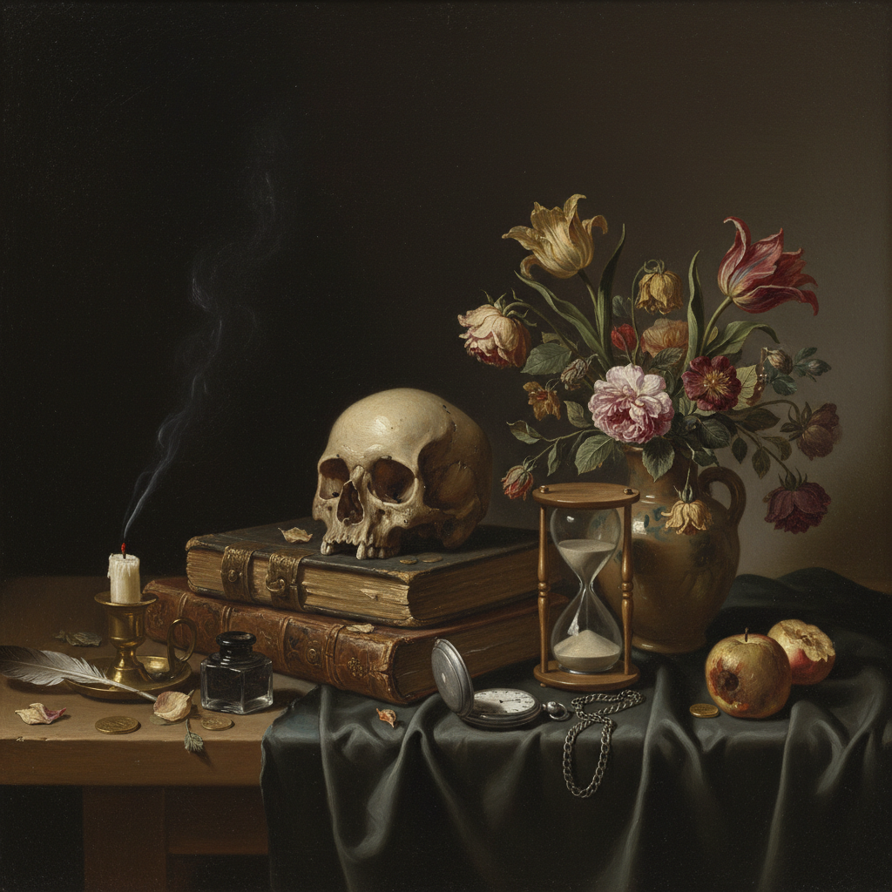

# Vanitas Painting 虚空画

> **时期：** 16世纪–18世纪  
> **关键词：** 骷髅、沙漏、枯花、生命无常、道德寓意

## 概述

Vanitas（虚空画）是一种以象征物暗示生命短暂和世俗虚荣的静物画类型，在17世纪荷兰黄金时代达到巅峰。骷髅代表死亡、沙漏代表时间流逝、枯萎的花朵代表美的消逝、乐器和书籍代表感官享乐的虚幻——每一件物品都是一句无声的警告：万物皆空，唯有灵魂永恒。

## 风格特征

- **象征物系统**：每件物品都有固定的寓意
- **精密写实**：以极高的技巧描绘物质表面
- **暗色调**：深色背景突出物品的戏剧性
- **对比并置**：奢华与腐朽、生命与死亡
- **道德训诫**：提醒观者超越物质追求

## 代表人物与作品

- 彼得·克拉斯 虚空静物
- 哈门·斯滕维克《寓言静物》
- 菲利普·德·尚帕涅《虚空》
- 当代：Damien Hirst《献给上帝之爱》

## 概念图

