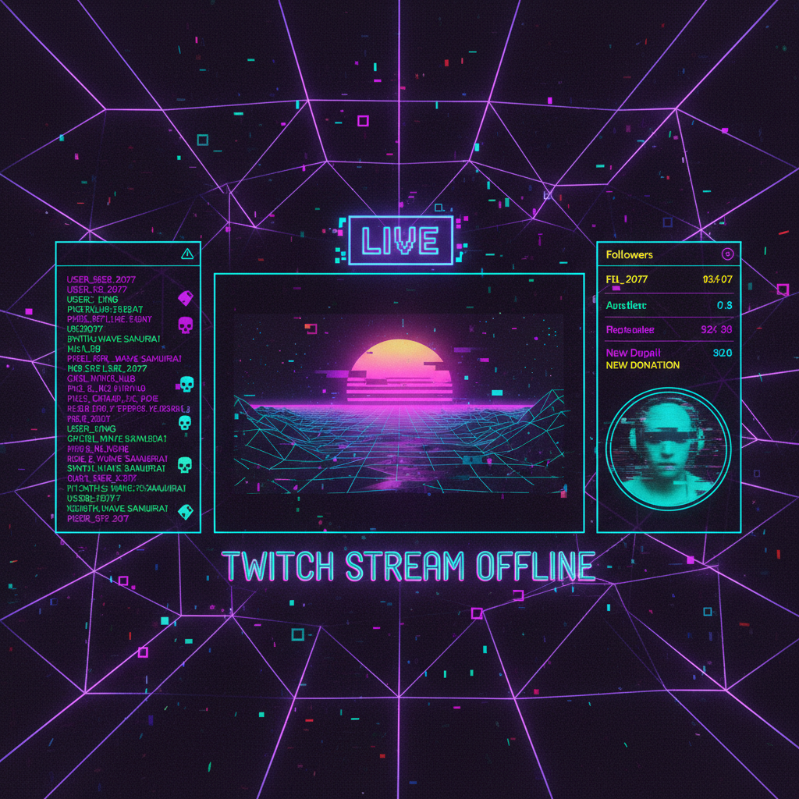

# Vapor Twitch 蒸汽抽搐



> **"故障信号、紫色闪烁、数据流崩溃——当蒸汽波遇上直播文化。"**

## 概述

| 维度 | 描述 |
|------|------|
| 时期 | 2018–至今 |
| 别名 | Vapor Twitch, Stream Aesthetic, Glitch Stream |
| 核心色彩 | 紫色、青色、粉色、黑色、霓虹绿 |
| 关键元素 | 故障效果、直播界面、像素化、霓虹文字 |
| 代表人物 | Twitch 主播社区、独立游戏开发者 |
| 关联风格 | Vaporwave, Synthwave, Glitchcore, Cyberpunk |

---

## 历史脉络

| 年份 | 事件 |
|------|------|
| 2012 | Vaporwave 诞生——互联网怀旧美学 |
| 2014 | Twitch 成为主流直播平台 |
| 2017 | 直播 overlay/面板设计成为独立设计领域 |
| 2018 | Vapor Twitch 风格融合——蒸汽波+直播UI |
| 2020 | 疫情推动直播文化爆发 |
| 2022 | 成为独立游戏和虚拟主播的标配美学 |

### 核心哲学

Vapor Twitch 的精神是**"数字原住民的视觉母语——屏幕就是我们的世界"**：
- 直播 = 真实（"我就是我，实时的"）
- 故障 = 美学（"bug 不是错误，是风格"）
- 紫色 = Twitch 的品牌色 → 成为整个文化的色彩
- 互联网 = 家（不是工具，是栖息地）
- "我的 overlay 就是我的身份"

---

## 视觉语法

### 色彩系统

```
主色：
  Twitch紫 (#9146FF) — 平台色、身份
  青色 (#00FFFF) — 数据、科技
  粉色 (#FF69B4) — 蒸汽波遗产
  黑色 (#0D0D0D) — 背景、深度
  霓虹绿 (#39FF14) — 在线、活跃

辅色：
  深蓝 (#1A1A2E) — 暗色UI背景
  橙色 (#FF6600) — 警告、通知
  白色 (#FFFFFF) — 文字、高光

质感：
  故障 — RGB分离、扫描线
  发光 — 霓虹、光晕
  透明 — 半透明面板
  像素 — 低分辨率元素
  流动 — 数据流、粒子
```

### 标志性元素

| 类别 | 元素 |
|------|------|
| UI | 直播 overlay、聊天框、订阅通知 |
| 效果 | 故障、RGB分离、扫描线、噪点 |
| 文字 | 霓虹字体、像素字体、日文片假名 |
| 图形 | 几何线条、网格、数据可视化 |
| 动态 | 粒子效果、光线追踪、波形 |
| 态度 | 数字原生、实时、互动、社区 |

---

## 与千禧怀旧的关系

### Vaporwave 的"活化"
- Vaporwave = 怀旧的、静态的、已死的消费主义
- Vapor Twitch = 活的、实时的、正在发生的
- 从"怀念过去的互联网"到"创造现在的互联网"
- 保留了紫色/青色/故障，但加入了"直播"的活力

### 虚拟主播（VTuber）文化
- VTuber = Vapor Twitch 美学的完美载体
- 虚拟形象 + 直播界面 + 故障效果
- 日本 → 全球的文化传播
- "我的虚拟形象比真实的我更真实"

---

## 中国语境

- 与中国直播文化（B站、抖音）的交叉
- 中国虚拟主播（VUP）社区
- 与中国"赛博朋克"审美的融合
- 直播间装修/overlay 设计市场

---

## 设计应用

| 场景 | 应用方式 |
|------|----------|
| 直播 | overlay+面板+通知+转场动画 |
| 游戏 | UI设计+加载画面+菜单 |
| 品牌 | 紫色+故障+霓虹+数字感 |
| 音乐 | 专辑封面+可视化+MV |

---

## 相关风格

← [Vaporwave 蒸汽波](vaporwave.md) | [Synthwave 合成波](synthwave.md) →

↑ [返回千禧怀旧目录](README.md) | [返回总目录](../README.md)
