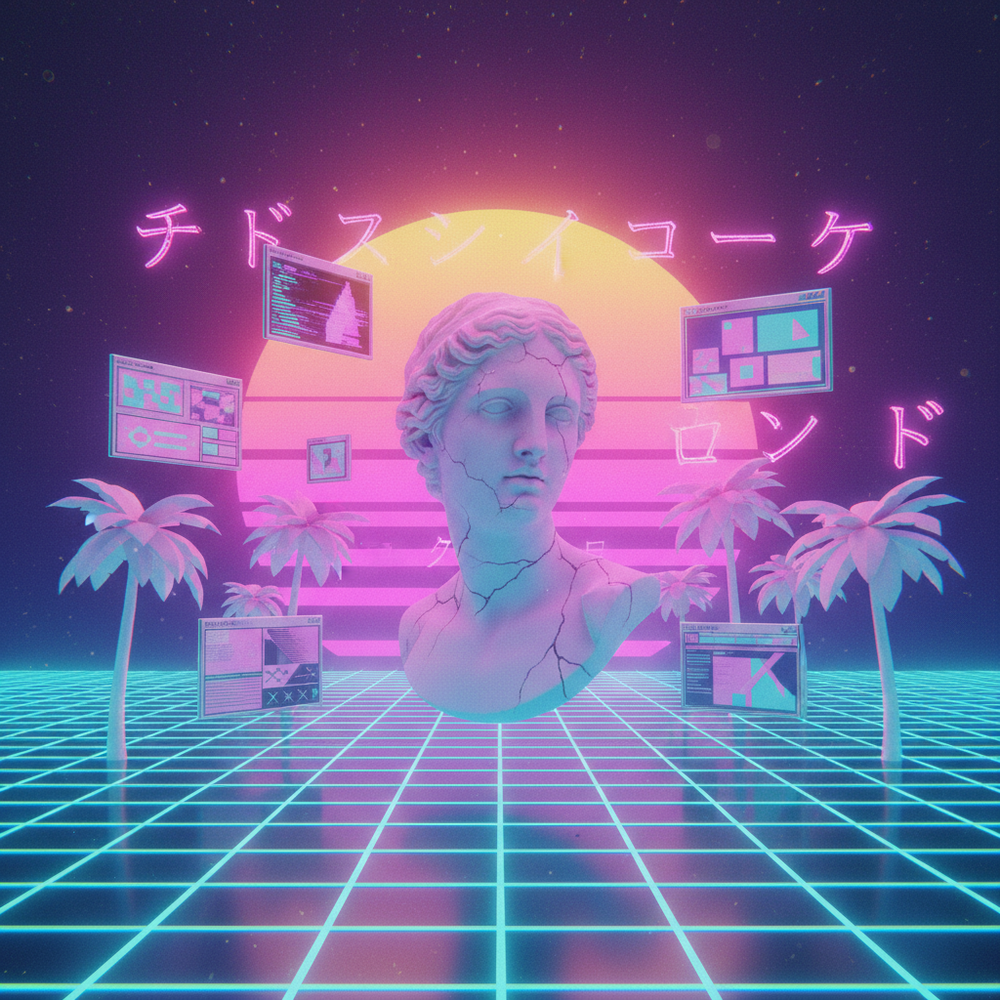

# Vaporwave Art 蒸汽波艺术

> "Vaporwave is the soundtrack to late capitalism's fever dream." — Internet culture

## 概述

蒸汽波（Vaporwave）是2010年代初兴起于互联网的微型文化运动，融合了音乐、视觉艺术和网络美学。它通过挪用和扭曲1980-90年代的商业音乐、广告图像和消费文化符号，创造出一种既怀旧又讽刺的超现实美学。

蒸汽波的视觉语言——粉紫色调、古希腊雕像、Windows 95界面、日文文字、棕榈树——已经成为互联网时代最具辨识度的美学风格之一。

## 核心特征

| 特征 | 描述 |
|------|------|
| 挪用 | 大量挪用80-90年代商业图像 |
| 怀旧 | 对消费主义黄金时代的怀旧 |
| 讽刺 | 对资本主义的暧昧讽刺 |
| 网络原生 | 诞生于互联网文化 |
| 匿名性 | 创作者常使用匿名身份 |
| 跨媒介 | 融合音乐、视觉和网络文化 |

## 视觉特征

- **色调**：粉色、紫色、青色的渐变
- **雕像**：古希腊/罗马雕像的碎片
- **界面**：Windows 95/98的界面元素
- **日文**：装饰性的日文片假名
- **网格**：透视网格和霓虹线条
- **棕榈树**：热带元素和落日

## 代表作品

| 作品/艺术家 | 年代 | 特征 |
|-------------|------|------|
| *Floral Shoppe* | Macintosh Plus | 2011 | 蒸汽波音乐的标志性专辑封面 |
| *eccojams Vol. 1* | Chuck Person | 2010 | 蒸汽波的先驱 |
| *Helios* | Helios | 2012+ | 蒸汽波视觉艺术 |
| r/VaporwaveAesthetics | Reddit社区 | 2014+ | 蒸汽波视觉的集散地 |
| *Simpsonwave* | 多位创作者 | 2016 | 蒸汽波与流行文化的融合 |
| *Vaporwave Room* | 多位创作者 | 2010s | 3D渲染的蒸汽波空间 |

## 历史时间线

| 时期 | 事件 |
|------|------|
| 2010 | Chuck Person的eccojams——蒸汽波的起源 |
| 2011 | Macintosh Plus的Floral Shoppe |
| 2012-13 | 蒸汽波作为音乐流派的确立 |
| 2014-15 | 视觉美学的独立发展 |
| 2016 | 进入主流文化——品牌开始使用 |
| 2017-至今 | 后蒸汽波——美学的持续影响 |

## 中国语境

蒸汽波在中国年轻人中有广泛影响——从B站的蒸汽波视频到社交媒体上的蒸汽波滤镜，从潮流服饰到室内设计。中国的蒸汽波创作者将中国元素（如中国80-90年代的广告、港台流行文化）融入蒸汽波美学，创造出"中华未来主义"（Sinofuturism）的变体。

## AI生成概念图

## 与其他风格的关系

- **Pop Art** → 波普对商业图像的挪用是蒸汽波的先驱
- **Glitch Art** → 故障美学与蒸汽波的数字扭曲
- **Net Art** → 网络艺术是蒸汽波的文化土壤
- **Surrealism** → 超现实的图像并置
- **Retro-Futurism** → 复古未来主义的美学
- **Postmodernism** → 后现代的挪用和讽刺策略

---

*浮光艺志 | Chronicle of Artistry*
