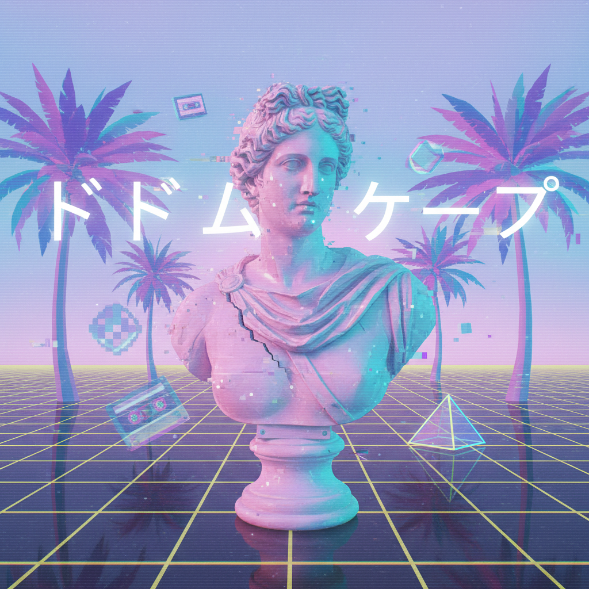
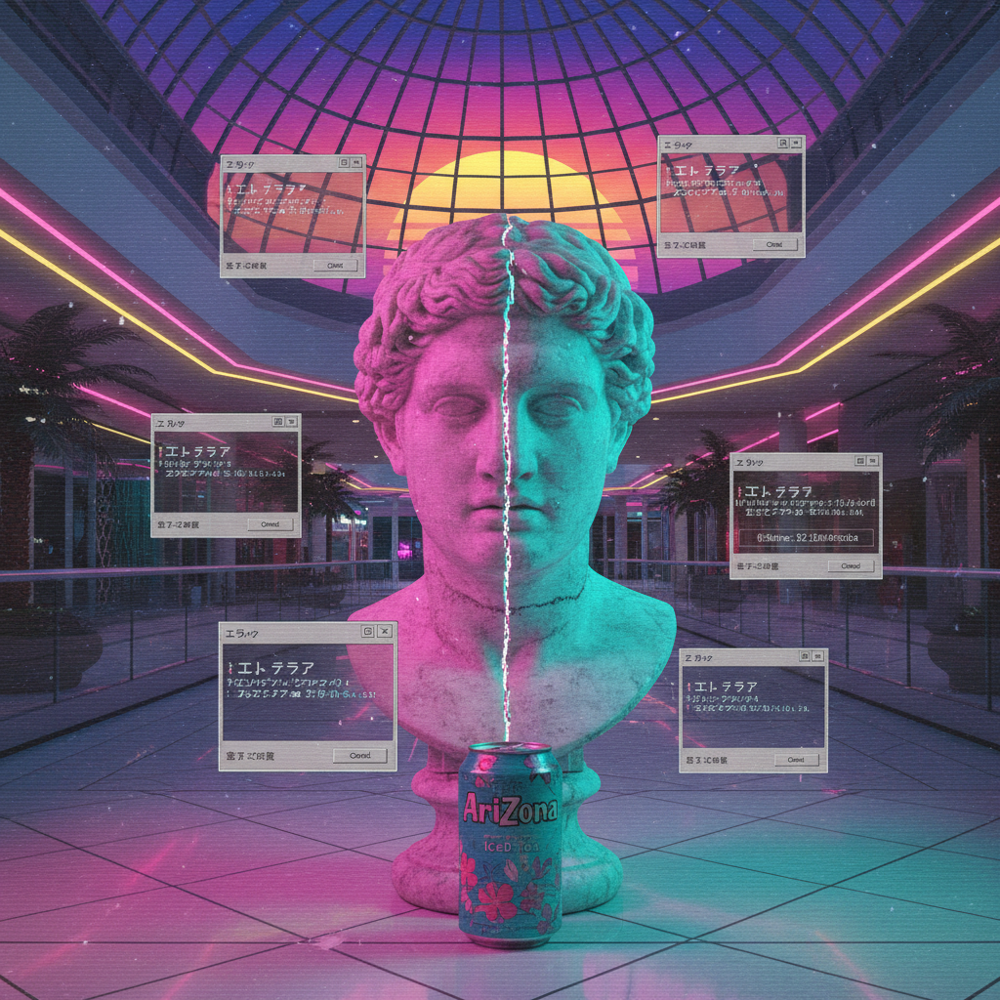
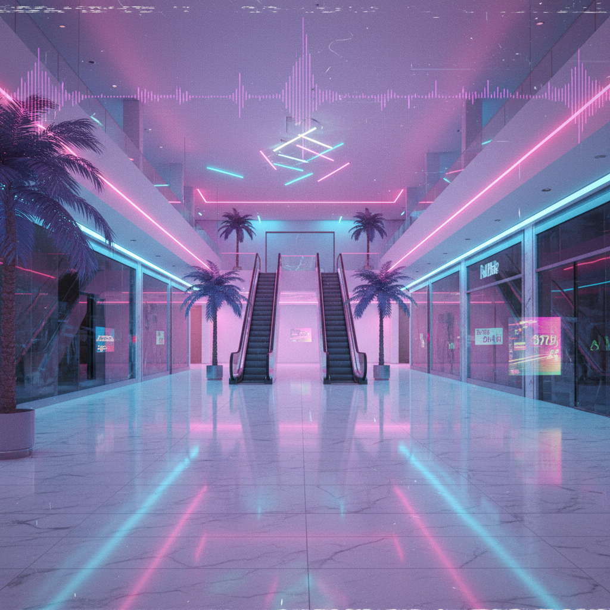

# 蒸汽波 | Vaporwave

> 你怀念的不是90年代，而是90年代许诺给你的未来。



## 概述

- **时间跨度**：2010 – 至今（回望 1980s–1990s）
- **发源地**：互联网（Tumblr、Bandcamp、Reddit）
- **核心理念**：对后工业时代消费主义、80年代雅皮文化和新世纪音乐的讽刺与迷恋并存
- **别名**：Aesthetic（あ え す て て ぃ っ く）

## 历史背景

蒸汽波诞生于2010年代初的互联网社区，最初是一种电子音乐流派——将80-90年代的商业音乐（电梯音乐、购物中心BGM、日本City Pop）进行采样、降速、切碎，创造出一种"水汽弥蒙"的迷幻听觉体验。

2011年，Macintosh Plus 的《リサフランク420 / 現代のコンピュー》在 Tumblr 上病毒式传播，成为蒸汽波的"圣经"，也为这种风格定下了视觉基调。随后蒸汽波从音乐延伸到视觉艺术，形成了一场完整的互联网美学运动。

### 诞生的土壤

蒸汽波不是凭空出现的，它有精确的文化前提：

- **2008年金融危机**：年轻人对资本主义的幻灭感达到顶峰
- **Tumblr 的兴起**：图片+音乐+短文的混合媒体平台，完美适配拼贴美学
- **Bandcamp 的免费发布**：任何人都能发布音乐，无需唱片公司
- **Chillwave (2009)**：Washed Out、Neon Indian 等乐队的"模糊怀旧"音乐为蒸汽波铺路
- **互联网原住民的成年**：90年代出生的人开始怀念童年的视觉记忆

### 关键时间线

| 时间 | 事件 |
|------|------|
| 2009 | Daniel Lopatin (OPN) 发布 "Nobody Here"，被视为原型 |
| 2010 | Chuck Person's Eccojams Vol. 1 — 采样+降速的方法论确立 |
| 2011 | Macintosh Plus《Floral Shoppe》— 蒸汽波的"圣经" |
| 2012 | 视觉美学成型：希腊雕像+粉紫渐变+日文 |
| 2013 | "蒸汽波已死"的第一波宣言（但它活了下来） |
| 2014-2015 | Future Funk 和 Mallsoft 等子流派分化 |
| 2016-2017 | 进入主流视野，品牌开始借用蒸汽波视觉 |
| 2018+ | 作为"互联网美学"的经典被归档和研究 |

### 名字的含义

"Vaporwave"这个名字本身就是一个讽刺：
- **Vapor**（蒸汽/虚无）：暗示"vaporware"——科技行业中宣布但从未发布的产品
- **Wave**（浪潮）：模仿 Chillwave、Synthwave 等音乐流派的命名惯例
- 合在一起：**一个从未真正存在的浪潮**——对消费主义空洞承诺的完美隐喻

## 视觉特征

### 色彩
- 低饱和度粉紫渐变（粉红、粉蓝、粉紫、薰衣草）
- 霓虹色点缀（洋红、青色）
- 模拟CRT显示器的荧光残影效果
- 偶尔的全白或全黑（极简变体）

### 核心视觉元素
- **古希腊/罗马雕塑**（大卫像、阿波罗）— 经典美学的解构
- **早期Windows界面**（错误弹窗、蓝屏、多窗口）
- **日文片假名/汉字** — 异域感与消费符号
- **热带植物**（棕榈树、蕨类）
- **海豚、热带鱼** — 90年代屏保意象
- **老式电子设备**（VHS磁带、CRT电视、Game Boy）
- **商业品牌Logo**（Pepsi、Arizona冰茶、Fiji Water）
- **网格/棋盘地面** — 虚拟空间感
- **空旷的购物中心** — 消费主义的废墟
- **大理石纹理** — 虚假的"高级感"

### 技法
- 故障艺术（Glitch Art）：错位、拉伸、色彩偏移
- 拼贴与采样：将不相关元素并置
- 低保真（Lo-Fi）：刻意的画质劣化
- VHS扫描线与噪点
- 3D渲染的空旷空间

### 为什么是日文？

蒸汽波大量使用日文片假名，原因是多层的：
- **80年代日本经济奇迹**：日本曾是"未来"的代名词
- **异域化效果**：对英语使用者来说，日文制造了一种"熟悉又陌生"的感觉
- **消费符号**：日本商品包装的精致设计本身就是消费主义的视觉浓缩
- **City Pop**：蒸汽波大量采样的日本80年代流行音乐

## 子流派

| 子流派 | 特征 | 代表 |
|--------|------|------|
| Future Funk | 更欢快、采样日本City Pop/Disco | Macross 82-99, Yung Bae |
| Mallsoft | 模拟空旷购物中心的回响 | 猫 シ Corp. |
| Late Night Lo-Fi | 深夜都市的孤独氛围 | 2814 |
| Vaportrap | 融合Trap节奏 | Blank Banshee |
| Simpsonwave | 辛普森动画+蒸汽波滤镜 | 网络meme |
| Broken Transmission | 更暗、更实验、更噪音 | — |
| Utopian Virtual | 极简、空灵、几乎无声 | — |

## 文化内核

蒸汽波的本质是**后现代主义的互联网变体**：

- **讽刺与迷恋的矛盾**：既批判消费主义，又沉迷于其美学碎片
- **怀旧的虚构性**：怀念一个从未真正经历过的"美好过去"
- **加速主义美学**：将资本主义的视觉垃圾推向极致以暴露其荒诞
- **数字乌托邦的废墟**：互联网曾许诺的美好未来的残骸

### "Hauntology"（幽灵学）

蒸汽波与哲学家德里达的"幽灵学"概念高度契合：
- 我们被**从未实现的未来**所"haunted"（纠缠）
- 80-90年代的消费文化许诺了一个永远不会到来的美好世界
- 蒸汽波就是这些"未来的幽灵"的视觉化

### 蒸汽波"死了"吗？

从2013年开始，每年都有人宣布"蒸汽波已死"。但它以不同形式持续存在：
- 作为一种**视觉语言**被品牌和广告吸收
- 作为一种**批评框架**影响了后来的互联网美学讨论
- 作为一种**怀旧模板**被无限复制和变体
- 它的"死亡"本身也符合其核心主题——**一切美好的事物都只是幻觉**

## 与相关风格的关系

```
Vaporwave (2010s)
 ├── ← Chillwave (2009) [音乐前身]
 ├── ← Synthpop/New Wave (1980s) [采样来源]
 ├── ← Japanese City Pop (1980s) [核心采样库]
 ├── ↔ Synthwave [常被混淆，但基调不同]
 │       Vaporwave = 讽刺/解构
 │       Synthwave = 致敬/怀念
 ├── → Future Funk [欢快子流派]
 ├── → Dreamcore/Weirdcore [精神继承]
 ├── → Lo-Fi Hip Hop [氛围继承]
 └── → Fashwave/Laborwave [政治化衍生，争议性]
```

## 图片画廊

| | |
|:---:|:---:|
|  |  |
| *核心视觉：粉青渐变、棕榈树、透视网格* | *大卫像故障：Win95弹窗与片假名* |
|  | |
| *霓虹空商场：大理石地面与棕榈树* | |

> 以上图片由 AI (Gemini 2.5 Flash Image) 生成，用于展示风格视觉特征。

## 延伸阅读

- [Vaporwave | Aesthetics Wiki](https://aesthetics.fandom.com/wiki/Vaporwave)
- [25 Aesthetic Artworks to Discover the Vaporwave Universe](https://indieground.net/blog/25-aesthetic-artworks-to-discover-the-vaporwave-universe/)
- [Grafton Tanner: Babbling Corpse — Vaporwave and the Commodification of Ghosts](https://www.zero-books.net/books/babbling-corpse)
- 网易云音乐: [vaporwave蒸汽波专题](https://music.163.com/web/pctopic?id=18862711)
- [蒸汽波——迷恋与怀旧](http://mt.sohu.com/a/750806996_121124742)

---

[← Y2K 美学](y2k.md) | [→ 合成器浪潮 Synthwave](synthwave.md) | [↑ 返回目录](README.md)
