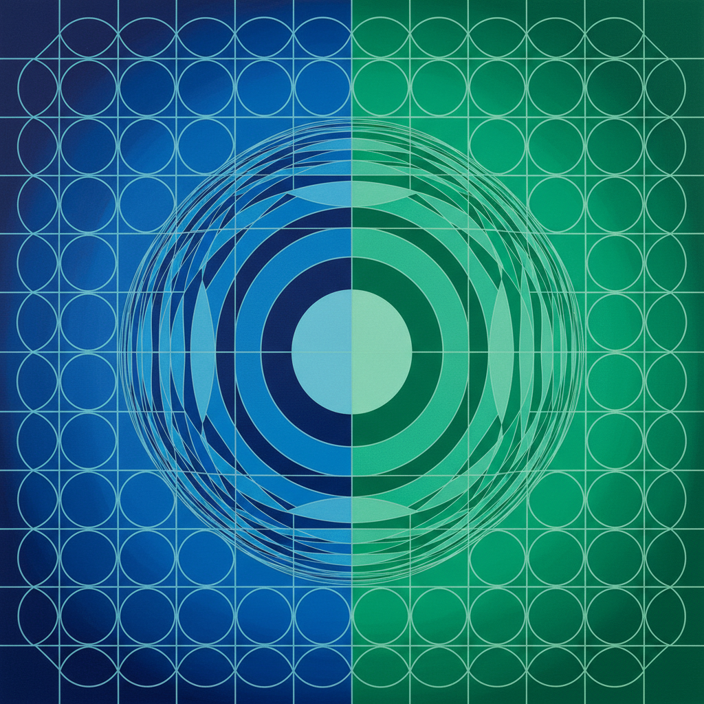

# Victor Vasarely 瓦萨雷利

> "Every form is a base for colour, every colour is the attribute of a form." — Victor Vasarely

## 概述

维克多·瓦萨雷利（Victor Vasarely，1906–1997）是匈牙利裔法国艺术家，被誉为"欧普艺术之父"。他用精确的几何图形和色彩渐变创造出强烈的三维幻觉和视觉振动，将艺术从精英画廊带入公共空间和日常设计。

## 核心特征

| 特征 | 描述 |
|------|------|
| 几何幻觉 | 平面图形产生的立体错觉 |
| 色彩渐变 | 系统性的色阶过渡 |
| 球体效果 | 平面网格膨胀为球形 |
| 可复制性 | 艺术作为可民主化的视觉单元 |
| 建筑整合 | 大型公共壁画和环境艺术 |
| 行星单元 | "plastique cinétique"动态造型 |

## 代表作品

| 作品 | 年代 | 意义 |
|------|------|------|
| *Zebra* | 1937 | 欧普艺术的最早作品之一 |
| *Vega Series* | 1957–70s | 膨胀球体的经典系列 |
| *Planetary Folklore* | 1960s | 宇宙主题的色彩单元 |
| *Fondation Vasarely* | 1976 | 建筑即艺术品 |

## AI生成概念图

## 与其他风格的关系

- **Op Art** → 欧普艺术的创始人
- **Bridget Riley** → 英国欧普艺术的平行发展
- **Bauhaus** → 受包豪斯设计教育影响
- **Kinetic Art** → 动态艺术的先驱
