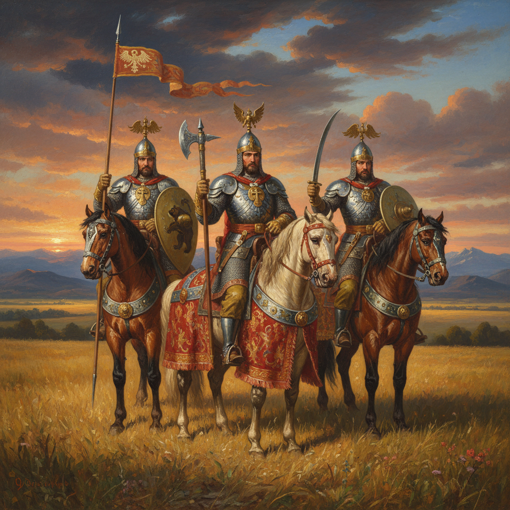

# Vasnetsov Art 瓦斯涅佐夫艺术

> "I have always been drawn only to the fairy tale, the epic, the fantastic." — Viktor Vasnetsov

## 概述

瓦斯涅佐夫艺术（Vasnetsov Art）是19世纪俄罗斯画家维克托·米哈伊洛维奇·瓦斯涅佐夫（Viktor Mikhailovich Vasnetsov, 1848-1926）创立的民族浪漫主义绘画风格。瓦斯涅佐夫被誉为"俄罗斯童话和史诗的画家"——他将俄罗斯民间传说、神话史诗和东正教传统转化为壮丽的视觉画面，开创了俄罗斯民族浪漫主义绘画的新方向。

瓦斯涅佐夫最著名的作品《三勇士》（1898）描绘了俄罗斯民间传说中的三位英雄骑士——伊利亚·穆罗梅茨、多布雷尼亚·尼基季奇和阿廖沙·波波维奇——他们骑马守卫在俄罗斯大地上，象征着民族的力量和精神。他的另一杰作《十字路口的骑士》（1882）以一个面对命运抉择的孤独骑士，表达了俄罗斯民族在历史十字路口的思考。

瓦斯涅佐夫艺术的核心要素包括：1）民间传说——俄罗斯童话和史诗题材；2）民族浪漫——民族精神的浪漫表达；3）装饰性——接近装饰艺术的风格；4）英雄主义——对英雄和勇士的歌颂；5）宗教艺术——东正教壁画和圣像；6）建筑设计——民族风格的建筑装饰；7）想象力——丰富的幻想和想象。

## 核心特征

| 特征 | 描述 |
|------|------|
| 民间传说 | 俄罗斯童话史诗题材 |
| 民族浪漫 | 民族精神浪漫表达 |
| 装饰性 | 接近装饰艺术风格 |
| 英雄主义 | 对英雄勇士的歌颂 |
| 宗教艺术 | 东正教壁画圣像 |
| 想象力 | 丰富幻想和想象 |

## 视觉特征

- **英雄骑士**：身披铠甲的俄罗斯勇士
- **童话场景**：魔法森林和奇幻景观
- **装饰边框**：民族风格的装饰元素
- **浓烈色彩**：饱和而浓烈的色彩
- **宏大场面**：史诗般的宏大构图
- **民族服饰**：精细描绘的俄罗斯传统服饰

## 代表作品

| 作品 | 年代 | 意义 |
|------|------|------|
| *三勇士* (Bogatyrs) | 1898 | 俄罗斯民族精神的象征 |
| *十字路口的骑士* (Knight at the Crossroads) | 1882 | 命运的抉择 |
| *阿廖努什卡* (Alyonushka) | 1881 | 童话的忧伤 |
| *飞毯* (The Flying Carpet) | 1880 | 童话的奇幻 |
| *伊凡王子骑灰狼* (Ivan Tsarevich on the Grey Wolf) | 1889 | 童话冒险 |
| *基辅弗拉基米尔大教堂壁画* | 1885-1896 | 宗教艺术巅峰 |

## 历史时间线

| 时期 | 事件 |
|------|------|
| 1848年 | 出生于维亚特卡省 |
| 1867-1875年 | 就读圣彼得堡美术学院 |
| 1878年 | 加入巡回展览画派 |
| 1880年代 | 开始童话和史诗题材创作 |
| 1885-1896年 | 创作基辅大教堂壁画 |
| 1898年 | 完成《三勇士》 |
| 1926年 | 在莫斯科去世 |

## 中国语境

瓦斯涅佐夫在中国有着独特的影响。他将民间传说和神话转化为严肃艺术的方法，与中国画家将民间故事和历史传说入画的传统有深刻的共鸣。中国连环画和年画艺术家从瓦斯涅佐夫的作品中获得了将民族叙事视觉化的灵感。《三勇士》在中国被视为"民族精神的视觉化表达"的典范——它证明了民间传说可以成为高雅艺术的题材。瓦斯涅佐夫的装饰性风格也影响了中国20世纪中期的壁画和公共艺术创作。他证明了一个国家的神话和传说是艺术创作的宝贵资源——这一理念激励了中国艺术家对本民族神话传说的重新发掘和视觉化表达。

## 概念图

## 与其他风格的关系

- **Peredvizhniki** → 巡回展览画派
- **Repin** → 列宾（现实主义同道）
- **Art Nouveau** → 新艺术运动
- **Pre-Raphaelites** → 拉斐尔前派
- **Romanticism** → 浪漫主义
- **Russian Revival** → 俄罗斯复兴运动

---

*浮光艺志 | Chronicle of Artistry*
