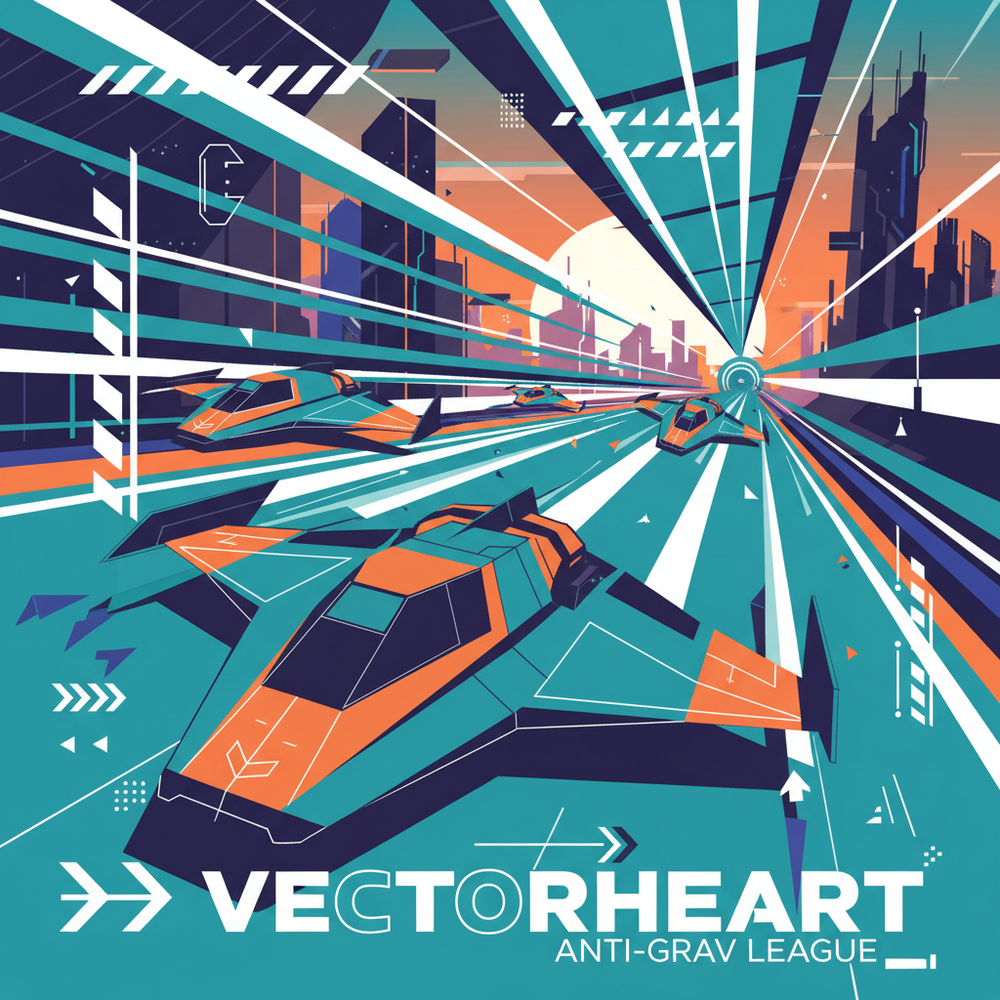
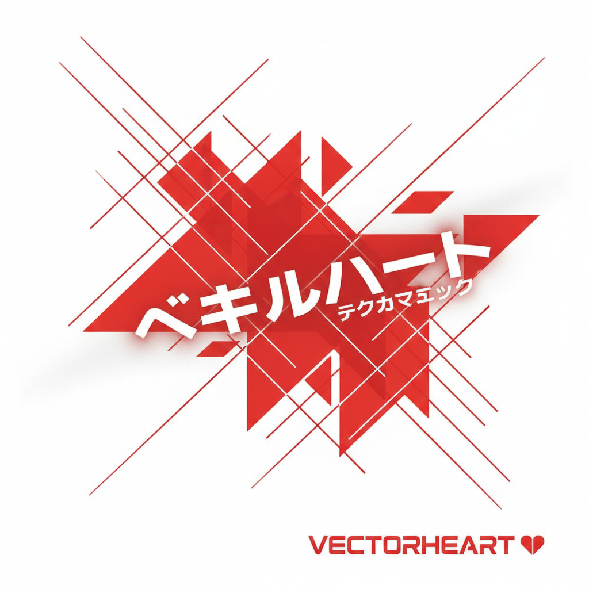

# Vectorheart | 矢量心美学

> 速度、精度、未来——用45度斜线和高对比色块切割出一个数字化的明天。

## 概述

- **时间跨度**：1995 – 2004（复兴：2010s Neo-Vectorheart）
- **发源地**：英国谢菲尔德（The Designers Republic）、全球电子音乐与游戏设计圈
- **核心理念**：以矢量图形的精确几何感表达科技速度与未来主义，融合瑞士现代主义排版与工业设计的功利美学
- **别名**：Wipeout Design、Neo-Vectorheart（2010s复兴）

## 历史背景

### 起源：The Designers Republic

1986年，Ian Anderson 在谢菲尔德创立 The Designers Republic（tDR），这间工作室几乎以一己之力定义了 Vectorheart 美学。他们为电子音乐厂牌 Warp Records 设计的唱片封面，以及为 PlayStation 游戏《Wipeout》系列打造的全套视觉系统，成为这一风格的圣经级作品。

tDR 的设计语言融合了：
- 瑞士国际主义排版的网格严谨性
- 日本动漫与消费文化的图形符号
- 后现代主义对品牌文化的讽刺性挪用
- 电子音乐的精密数码质感

### Wipeout：定义一个时代

1995年，Psygnosis 发行的反重力赛车游戏《Wipeout》不仅是一款游戏，更是一个文化事件。tDR 为游戏设计的虚构赛车队品牌标识、赛道广告和UI界面，将 Vectorheart 美学推向了主流。游戏搭配 The Chemical Brothers、The Prodigy 等电子音乐人的原声，成为90年代俱乐部文化与游戏文化交汇的标志。

### 与其他Y2K风格的关系

Vectorheart 与 Metalheart 同属Y2K时代的数字设计风格，但二者有明确区分：
- **Vectorheart**：平面、几何、高对比、精确
- **Metalheart**：3D、有机扭曲、金属质感、混沌

## 视觉特征

### 图形语言
- 45度和60度斜线切割
- 锐利的矢量几何形状（三角形、箭头、平行四边形）
- 动态对角线构图，暗示速度与运动
- 极简图标与符号系统

### 色彩
- 高对比度配色（黑底+荧光色）
- 常见组合：黑/白/红、黑/橙/灰、深蓝/亮绿
- 大面积纯色块
- 偶尔使用金属银/铬色

### 排版
- 未来主义无衬线字体（Bank Gothic、Eurostile、DIN）
- 极小字号的技术标注文字
- 文字作为图形元素参与构图
- 条形码、编号、坐标等伪技术信息

### 质感
- 完全平面，无渐变或极少渐变
- 干净利落的边缘
- 偶尔使用半透明叠加
- 网格线和辅助线作为装饰元素

## 代表人物与作品

| 创作者 | 代表作 | 说明 |
|--------|--------|------|
| The Designers Republic | Wipeout 系列视觉 | 定义性作品，虚构品牌系统 |
| The Designers Republic | Warp Records 唱片封面 | Autechre、Aphex Twin 等 |
| Bionic Systems | 电子音乐海报 | 德国 Vectorheart 代表 |
| Attik | 品牌设计 | 90年代英国设计先锋 |
| Neville Brody | Fuse 字体项目 | 实验排版与数字美学 |

## 影响与传承

### 直接影响
- 2000年代的科技品牌视觉（早期 PlayStation 品牌语言）
- 电子音乐唱片设计的标准范式
- 赛车游戏的UI设计传统

### Neo-Vectorheart（2010s复兴）
2010年代，随着怀旧浪潮兴起，Vectorheart 以 Neo-Vectorheart 的形式回归：
- 独立游戏视觉设计
- Synthwave/Outrun 音乐封面中的几何元素
- 运动品牌的复古未来主义营销

## 图片画廊

<!-- 图片存放于 assets/artworks/vectorheart/ -->

| | |
|:---:|:---:|
|  |  |
| *矢量心概念* | *The Designers Republic 风格* |

**推荐图片来源**：
- [The Designers Republic 官网 Wipeout 项目页](https://www.thedesignersrepublic.com/project/wipeout)
- [CARI Institute: Vectorheart](https://cari.institute/aesthetics/vectorheart)
- [Are.na: Vectorheart](https://www.are.na/evan-collins-1522646491/vectorheart-eqxlv27j7xo)
- [Aesthetics Wiki: Vectorheart](https://aesthetics.fandom.com/wiki/Vectorheart)

## 延伸阅读

- [WipEout Futurism: The Visual Archives (Thames & Hudson, 2024)](https://mbook.kongfz.com/258816/8108758069/) — tDR 与 Wipeout 的完整视觉档案
- [搜狐：音乐那张永远年轻的脸庞 — tDR与Warp的设计革命](https://m.sohu.com/a/335710287_494887/)
- [Aesthetics Wiki: Vectorheart](https://aesthetics.fandom.com/wiki/Vectorheart)
- [CARI Institute: Vectorheart](https://cari.institute/aesthetics/vectorheart)
- ["设计师共和国"的回归：低调涅槃](http://www.cqvip.com/qk/61472x/201104/37363373.html)

---

[← Gen X Soft Club](gen-x-soft-club.md) | [→ Chromecore](chromecore.md) | [↑ 返回目录](README.md)
