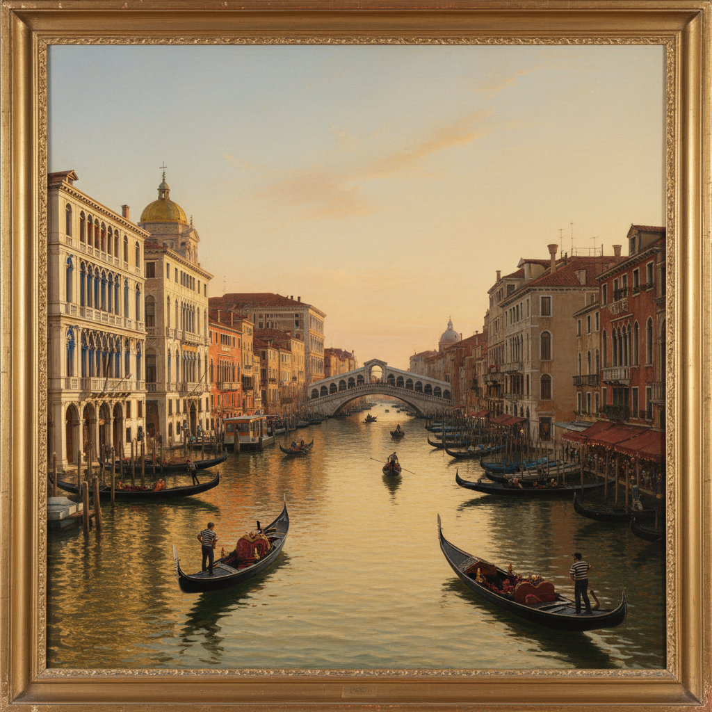

# Veduta Painting 城市风景画

> **时期：** 17世纪–19世纪  
> **关键词：** 城市全景、精确透视、建筑记录、大旅行、暗箱辅助

## 概述

Veduta（城市风景画）是以精确描绘城市景观为目的的绘画类型，在18世纪的威尼斯和罗马达到巅峰。卡纳莱托和贝洛托借助暗箱装置，以照相般的精确度记录了运河、广场和宫殿——这些画作既是艺术品，也是"大旅行"时代贵族带回家的视觉纪念品。

## 风格特征

- **精确透视**：严格的线性透视构图
- **建筑细节**：对建筑的忠实记录
- **光影氛围**：特定时刻的光线效果
- **全景视角**：宽幅的城市全景
- **暗箱辅助**：早期光学设备的使用

## 代表人物与作品

- 卡纳莱托《威尼斯大运河》系列
- 贝洛托 德累斯顿和华沙城景
- 瓜尔迪 威尼斯随想曲
- 皮拉内西 罗马废墟版画

## 概念图

