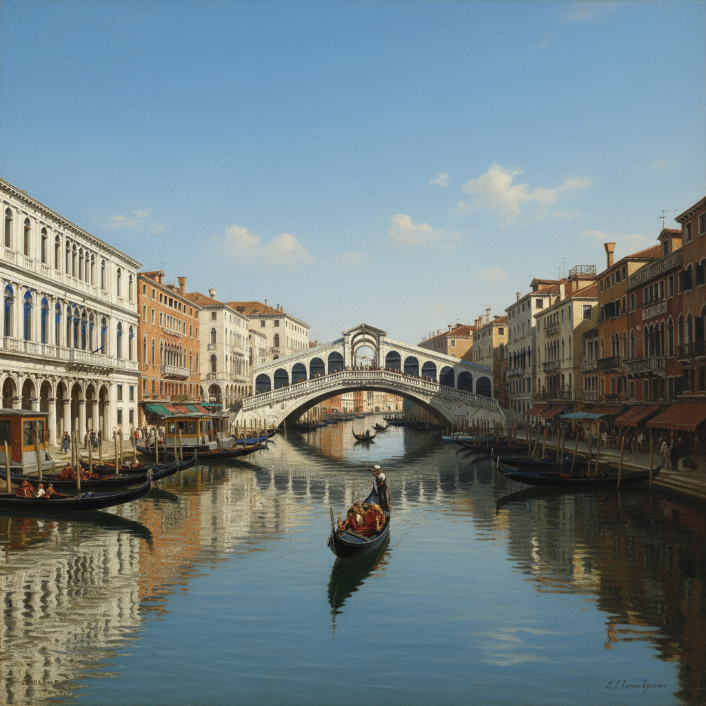

# Vedutismo 风景画派（威尼斯城市风景）

> "Venice is like eating an entire box of chocolate liqueurs in one go." — Truman Capote

## 概述

Vedutismo（意大利语 *veduta* 意为"景观"）是18世纪意大利（尤其是威尼斯和罗马）发展起来的城市风景画传统。Veduta 画家以近乎摄影般的精确度描绘城市建筑、广场、运河和街道，既是艺术品也是"大旅行"（Grand Tour）时代贵族游客的纪念品。

这一传统发展出了暗箱（camera obscura）辅助绘画的技法，是摄影术的直接先驱之一。

## 核心特征

| 特征 | 描述 |
|------|------|
| 城市全景 | 精确描绘城市建筑和公共空间 |
| 透视精确 | 严格的线性透视，常借助暗箱 |
| 建筑细节 | 每一块石头、每一扇窗户的精确记录 |
| 光线真实 | 特定时刻的自然光照效果 |
| 人物点景 | 小型人物增添生活气息 |
| 纪念功能 | 为大旅行游客提供城市"照片" |

## 视觉特征

- **透视**：精确的单点或两点透视
- **建筑**：每一个建筑细节的忠实记录
- **光线**：意大利阳光下的明确阴影
- **水面**：威尼斯运河的精确反射
- **天空**：清澈的蓝天或戏剧性的云层
- **人物**：微小但生动的街头人物

## 代表人物

| 画家 | 代表作 | 特点 |
|------|--------|------|
| Canaletto | *The Grand Canal* 系列 | 威尼斯veduta巅峰 |
| Bernardo Bellotto | 华沙、德累斯顿城市风景 | Canaletto的侄子 |
| Francesco Guardi | 威尼斯风景 | 更自由的笔触 |
| Giovanni Paolo Panini | 罗马废墟和广场 | 罗马veduta代表 |
| Gaspar van Wittel | 意大利城市全景 | veduta传统先驱 |

## 子类型

| 类型 | 描述 | 代表 |
|------|------|------|
| Veduta esatta | 精确写实的城市风景 | Canaletto |
| Veduta ideata | 想象中的理想化风景 | Guardi |
| Capriccio | 将真实建筑重新组合的幻想风景 | Panini |

## 历史背景

1. **1690年代**：van Wittel 开创意大利城市风景画传统
2. **1720-60年代**：Canaletto 的威尼斯veduta达到巅峰
3. **18世纪中后期**：Bellotto 将传统带到中欧各国
4. **19世纪**：摄影术发明后，veduta的记录功能被取代

## 与其他风格的关系

- **Baroque** → 从巴洛克的建筑装饰画发展而来
- **Neoclassicism** → 罗马废墟veduta影响了新古典主义
- **Photography** → veduta的精确记录是摄影的精神先驱
- **Impressionism** → 莫奈的威尼斯系列继承了veduta传统
- **Architectural Painting** → 建筑画的重要分支

## 概念图

---

*浮光艺志 | Chronicle of Artistry*
