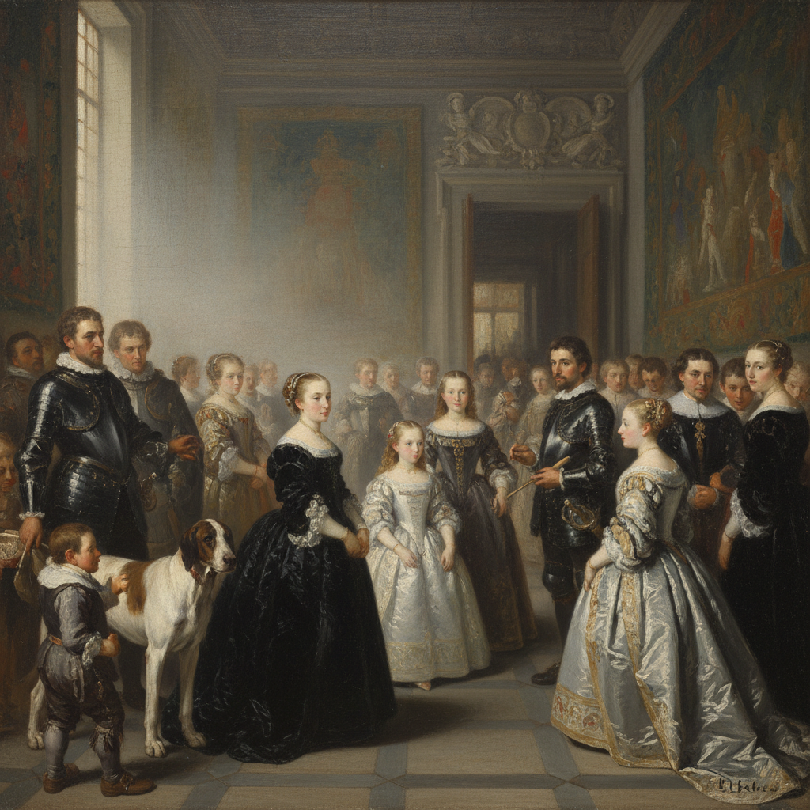

# Diego Velázquez 委拉斯开兹

> "I would rather be the first painter of common things than second in higher art." — Velázquez

## 概述

迭戈·罗德里格斯·德·席尔瓦·委拉斯开兹（Diego Rodríguez de Silva y Velázquez，1599–1660）是西班牙黄金时代最伟大的画家，也是西方艺术史上对后世画家影响最深远的大师之一。他作为西班牙国王菲利普四世的宫廷画家，以无与伦比的观察力和"看见什么画什么"的诚实态度创造了一种超越时代的写实主义。

马奈称他为"画家中的画家"，印象派从他的松散笔触中找到了灵感，弗朗西斯·培根反复重新诠释他的《教皇英诺森十世》——委拉斯开兹是永恒的现代。

## 核心特征

| 特征 | 描述 |
|------|------|
| 绝对诚实 | 不美化、不丑化——如实描绘所见 |
| 松散笔触 | 近看是抽象的色块，远看完美成像 |
| 空气感 | 画出了物体之间的空气和距离 |
| 灰色调 | 银灰色调的微妙色彩——"灰色的交响曲" |
| 心理洞察 | 对人物性格和心理的深刻揭示 |
| 空间革命 | 《宫娥》中的空间和视线游戏 |

## 视觉特征

- **笔触**：近看松散抽象，远看精确成像
- **色调**：银灰、黑色、肉色的微妙和谐
- **空气**：物体之间可感知的空气和距离
- **光线**：自然的、不戏剧化的光线
- **人物**：绝对诚实的面容——不美化也不丑化
- **空间**：深远的、可呼吸的空间

## 代表作品

| 作品 | 年代 | 意义 |
|------|------|------|
| *Las Meninas* | 1656 | "西方绘画的神学"——空间和视线的革命 |
| *Portrait of Pope Innocent X* | 1650 | "太真实了"——教皇本人的评价 |
| *The Surrender of Breda* | 1634-35 | 历史画的人性化——胜利者的优雅 |
| *Rokeby Venus* | 1647-51 | 西班牙唯一的裸体画 |
| *The Spinners* | 1657 | 神话与现实的融合 |
| *Water Seller of Seville* | 1618-22 | 早期杰作——水滴的写实 |

## 真实作品（公共领域）

| 作品 | 来源 |
|------|------|
| *Las Meninas* | [Museo del Prado](https://www.museodelprado.es/en/the-collection/art-work/las-meninas/9fdc7800-9ade-48b0-ab8b-edee94ea877f) |
| *Pope Innocent X* | [Galleria Doria Pamphilj](https://www.doriapamphilj.it/) |

> ⚠️ 本条目优先使用真实作品。

## AI生成概念图

## 与其他风格的关系

- **Impressionism** → 马奈和印象派从他的笔触中找到灵感
- **Realism** → 现实主义的先驱——"画家中的画家"
- **Baroque** → 巴洛克时期但超越巴洛克的戏剧性
- **Francis Bacon** → 培根反复重新诠释他的教皇像
- **Manet** → 马奈直接继承了委拉斯开兹的传统

---

*浮光艺志 | Chronicle of Artistry*
