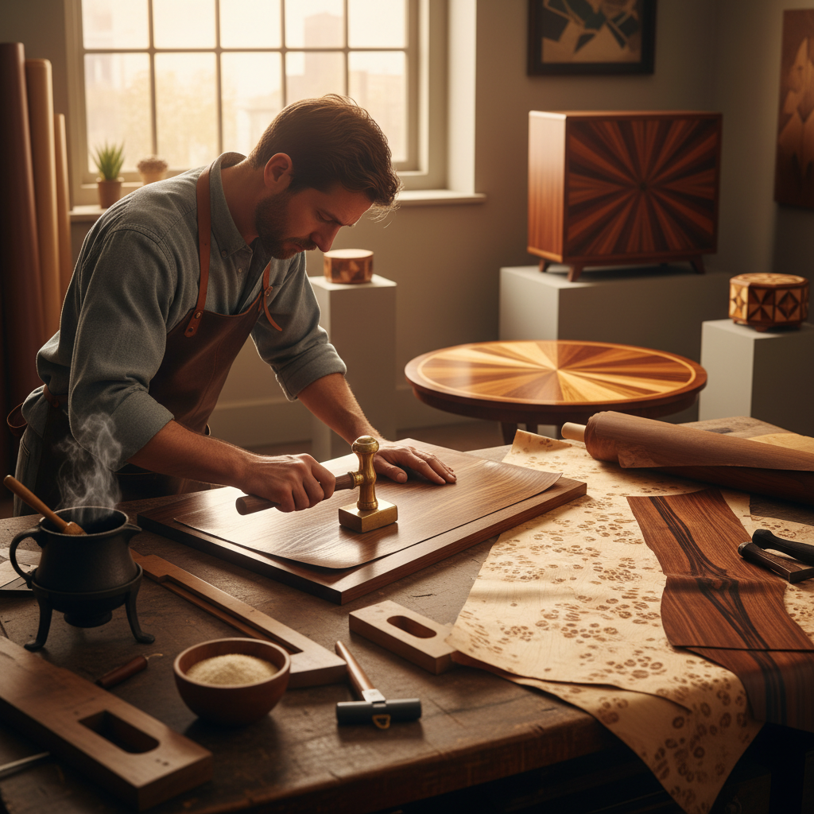

# Veneering 贴面工艺

> "Veneering is wood's most elegant disguise — a thin slice of rare beauty laid over humble structure, giving every surface the face of a masterpiece." — Unknown

## 概述

贴面工艺（Veneering）是将珍贵木材切割成极薄的薄片（通常0.5-3mm厚），然后粘贴到较为普通的基材（如胶合板、中密度板或实木）表面的工艺。贴面工艺的意义在于：它让珍贵的木材资源得到最大化利用——一棵珍贵的胡桃木可以切割出足够覆盖数百件家具的贴面，而如果做成实木家具可能只够做几件。贴面工艺也允许艺术家利用木材的天然纹理——通过"书本匹配"（book matching）、"滑动匹配"（slip matching）等排列方式，创造出对称的、万花筒般的纹理图案。

贴面工艺的哲学在于：表面的艺术——用最薄的一层展现木材最美的面貌，让美丽不再是奢侈的专属。

## 核心特征

| 特征 | 描述 |
|------|------|
| 薄片 | 极薄的木材薄片 |
| 粘贴 | 粘贴于基材表面 |
| 纹理 | 利用天然木纹 |
| 匹配 | 纹理的排列匹配 |
| 经济 | 珍贵木材的经济利用 |
| 装饰 | 高度装饰性 |

## 视觉特征

- **纹理**：美丽的天然木纹
- **对称**：书本匹配的对称
- **光泽**：抛光后的光泽
- **色彩**：不同木材的色彩
- **连续**：连续的纹理流动
- **精致**：精致的表面效果

## 代表作品

| 作品 | 艺术家 | 年代 | 意义 |
|------|--------|------|------|
| *Egyptian veneer furniture* | 匿名 | 古埃及 | 最早的贴面 |
| *André-Charles Boulle furniture* | Boulle | 17世纪 | 法国贴面巅峰 |
| *Art Deco veneer furniture* | Various | 1920s-30s | 装饰艺术贴面 |
| *George Nakashima tables* | Nakashima | 1960s+ | 现代木艺 |
| *Contemporary veneer art* | Various | 当代 | 当代贴面艺术 |

## 历史时间线

| 时期 | 事件 |
|------|------|
| 古埃及 | 最早的贴面家具 |
| 17世纪 | 欧洲贴面工艺的黄金时代 |
| 18世纪 | 贴面技术的精细化 |
| 19世纪 | 工业化切割技术 |
| 20世纪 | 现代贴面材料和技术 |
| 当代 | 手工贴面的艺术复兴 |

## 中国语境

贴面工艺在中国传统家具中也有应用——明清家具中的"包镶"工艺（用珍贵木材薄片包覆在较普通的木材外面）与Veneering原理相同。中国传统的"大漆"家具也常在木胎上贴覆薄木片再施漆。当代中国的家具制造业广泛使用贴面技术——从工业化的人造板贴面到高端定制家具的手工贴面。中国的一些木工艺术家也在探索贴面的艺术表达——利用不同木材的色差和纹理创造装饰性的表面图案。

## AI生成概念图

## 与其他风格的关系

- **Marquetry** → 木镶嵌
- **Parquetry** → 镶木细工
- **Woodworking** → 木工
- **Furniture Making** → 家具制作
- **Lamination** → 层压
- **Surface Design** → 表面设计

---

*浮光艺志 | Chronicle of Artistry*
