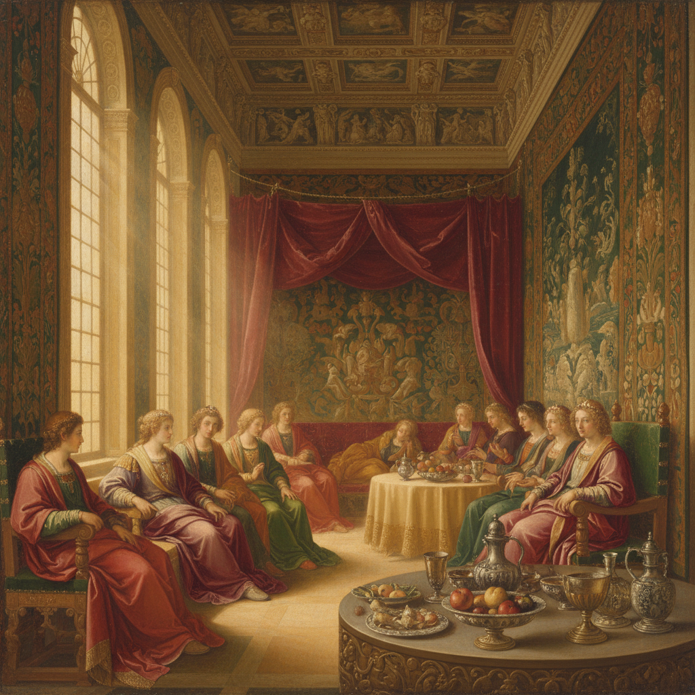

# Venetian School 威尼斯画派

> **时期：** 15世纪–18世纪  
> **关键词：** 色彩至上、油画革命、光线氛围、感官愉悦、提香

## 概述

Venetian School（威尼斯画派）是文艺复兴时期与佛罗伦萨画派分庭抗礼的另一极——如果佛罗伦萨崇拜线条和素描，威尼斯则崇拜色彩和光线。乔尔乔内的神秘氛围、提香的金色肌肤、丁托列托的戏剧光影、委罗内塞的华丽盛宴——威尼斯画家直接用色彩在画布上"雕塑"形体，创造出前所未有的感官丰富性。

## 风格特征

- **色彩优先**：用色彩而非线条塑造形体
- **油画技法**：多层透明罩染的光泽效果
- **大气氛围**：柔和的轮廓和光线过渡
- **感官丰富**：织物、肌肤、自然的极致表现
- **大尺幅**：宫殿和教堂的巨型画作

## 代表人物与作品

- 提香《乌尔比诺的维纳斯》
- 乔尔乔内《暴风雨》
- 丁托列托《最后的晚餐》
- 保罗·委罗内塞《迦拿的婚礼》

## 概念图

