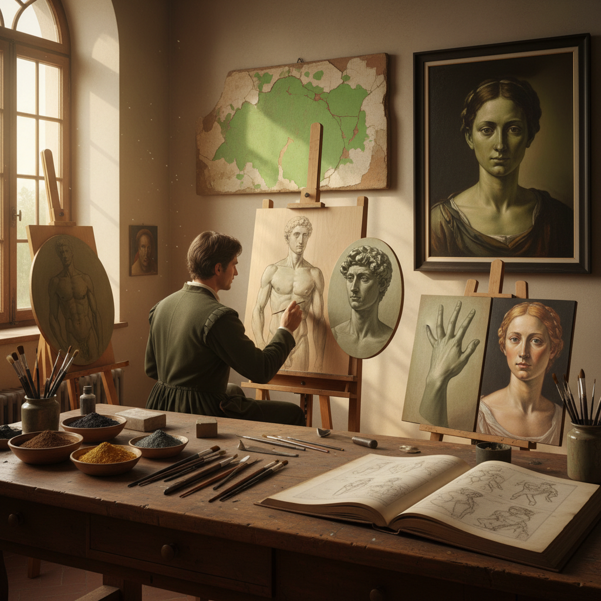

# Verdaccio 绿灰底层画

> "Verdaccio is the skeleton beneath the skin of Renaissance painting — a monochrome underpainting in greenish-grey that maps every shadow and highlight before a single hue of flesh or fabric is laid over it, giving the final image its sculptural solidity." — Unknown

## 概述

绿灰底层画（Verdaccio）是一种文艺复兴时期的底层画技法——使用绿灰色（由黑色、白色和黄赭石混合而成，有时加入绿土）在画面上建立完整的明暗关系，然后在这个单色底层上叠加彩色颜料。Verdaccio为最终的画面提供了坚实的明暗结构和立体感。

Verdaccio最著名的使用者是意大利文艺复兴画家——Cennino Cennini在其《艺术之书》（Il Libro dell'Arte，约1390年）中详细描述了这种技法。Verdaccio特别适合人物画——绿灰色底层透过上方的肤色颜料，产生自然的皮肤色调（绿色是红色的补色，能中和过于红润的肤色）。这种技法至今仍被古典写实画家使用。

## 核心特征

| 特征 | 描述 |
|------|------|
| 绿灰 | 绿灰色的底层 |
| 单色 | 单色明暗建立 |
| 结构 | 建立明暗结构 |
| 文艺复兴 | 文艺复兴技法 |
| 肤色 | 特别适合肤色 |
| 底层 | 作为底层使用 |

## 视觉特征

- **绿灰**：绿灰色的色调
- **立体**：强烈的立体感
- **结构**：清晰的明暗结构
- **古典**：古典的质感
- **透明**：透过上层可见
- **冷调**：冷色调的底层

## 代表作品

| 作品 | 艺术家 | 年代 | 意义 |
|------|--------|------|------|
| *Sistine Chapel (underpainting)* | Michelangelo | 1508-12 | 西斯廷教堂底层 |
| *Giotto frescoes* | Giotto | 14世纪 | 早期verdaccio应用 |
| *Il Libro dell'Arte* | Cennini | ~1390 | 技法文献记录 |
| *Contemporary verdaccio studies* | Various | 当代 | 当代verdaccio练习 |
| *Classical atelier paintings* | Various | 当代 | 古典画室作品 |

## 历史时间线

| 时期 | 事件 |
|------|------|
| 13世纪 | Verdaccio在意大利壁画中的使用 |
| 14世纪 | Giotto等画家的系统应用 |
| ~1390 | Cennini记录verdaccio技法 |
| 15-16世纪 | 文艺复兴画家的广泛使用 |
| 17世纪后 | 被其他底层画法逐渐取代 |
| 当代 | 古典写实画派的复兴 |

## 中国语境

Verdaccio在中国的古典写实绘画教育中有一定的知名度。中国的一些美术院校在油画教学中介绍verdaccio作为古典技法之一。中国的古典写实画家在创作人物画时会使用verdaccio底层。中国的油画技法研究者对文艺复兴绘画技法（包括verdaccio）进行了深入研究。一些中国画家将verdaccio与中国传统绘画的"墨分五色"理念进行比较。

## AI生成概念图

## 与其他风格的关系

- **Grisaille** → 灰色画
- **Terre Verte** → 绿土
- **Underpainting** → 底层画
- **Fresco** → 湿壁画
- **Oil Painting** → 油画
- **Classical Realism** → 古典写实

---

*浮光艺志 | Chronicle of Artistry*
