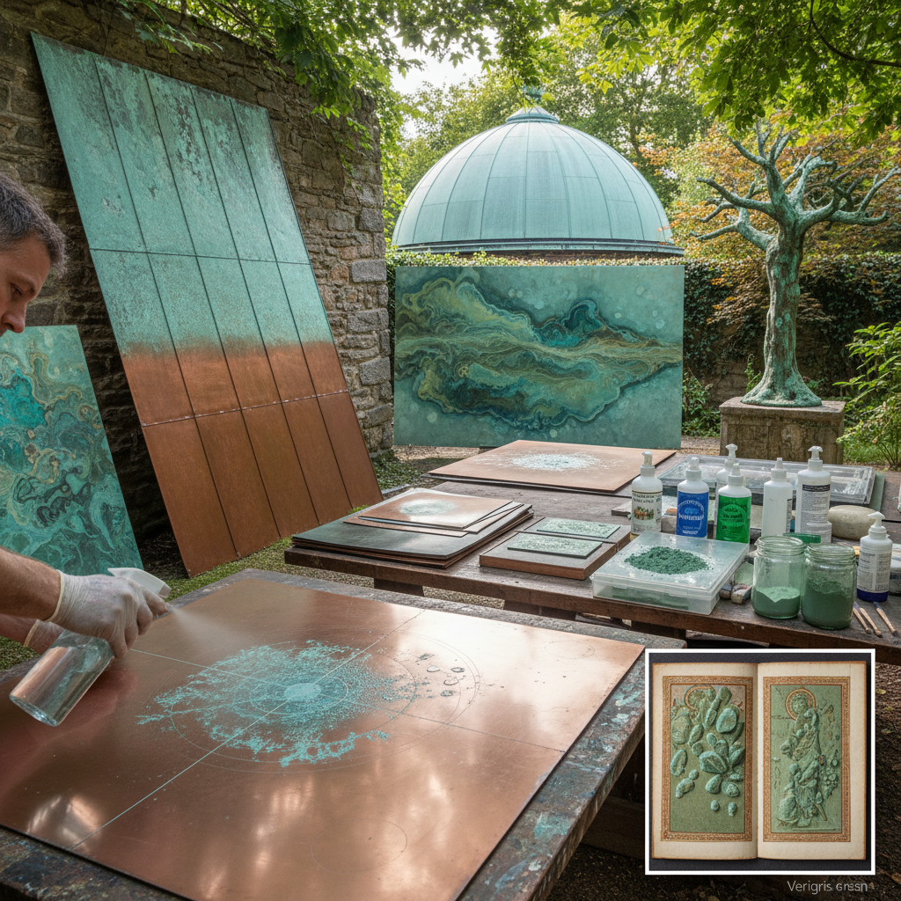

# Verdigris Art 铜绿艺术

> "Verdigris is nature's own pigment grown on copper — the blue-green bloom that forms when the metal breathes in moist air over time, a color so beautiful that artists scraped it from old copper roofs to use as paint, and architects learned to welcome it as a living finish that transforms buildings from bright penny-new to the dignified sage green of age and weather." — Unknown

## 概述

铜绿艺术（Verdigris Art）是一种利用铜及铜合金表面自然形成或人工催化的绿色/蓝绿色铜锈（verdigris）作为美学元素的艺术形式。Verdigris的化学成分主要是碱式碳酸铜（Cu₂(OH)₂CO₃），是铜在潮湿空气中长期暴露后形成的腐蚀产物。

Verdigris在艺术史上有双重身份：作为颜料，verdigris是中世纪和文艺复兴时期最重要的绿色颜料之一——通过将铜片暴露在醋蒸气中人工制造；作为装饰效果，verdigris是建筑和雕塑上最受欢迎的自然"做旧"效果之一。当代艺术家有意利用verdigris的形成过程作为创作手段——通过控制铜表面的化学环境来"种植"特定的铜绿图案。

## 核心特征

| 特征 | 描述 |
|------|------|
| 铜绿 | 铜的自然氧化产物 |
| 蓝绿 | 蓝绿色的色彩 |
| 自然 | 自然形成的过程 |
| 时间 | 需要时间形成 |
| 保护 | 保护底层金属 |
| 活性 | 持续变化的表面 |

## 视觉特征

- **蓝绿**：标志性的蓝绿色
- **斑驳**：不均匀的斑驳效果
- **层次**：多层次的色彩变化
- **有机**：有机的生长形态
- **古老**：古老和时间的象征
- **优雅**：优雅的自然美感

## 代表作品

| 作品 | 艺术家 | 年代 | 意义 |
|------|--------|------|------|
| *Statue of Liberty verdigris* | 自然形成 | 1886至今 | 自由女神像的铜绿 |
| *Copenhagen copper roofs* | 建筑师 | 多个世纪 | 哥本哈根铜屋顶 |
| *Verdigris pigment paintings* | 中世纪画家 | 中世纪 | 铜绿颜料绘画 |
| *Contemporary verdigris installations* | Various | 当代 | 当代铜绿装置 |
| *Japanese temple roofs* | 日本建筑 | 传统 | 日本寺庙铜绿屋顶 |

## 历史时间线

| 时期 | 事件 |
|------|------|
| 古代 | 铜绿的自然观察 |
| 中世纪 | 铜绿作为颜料的使用 |
| 文艺复兴 | 铜绿颜料的广泛应用 |
| 19世纪 | 合成绿色颜料取代铜绿 |
| 当代 | 铜绿作为艺术媒介的复兴 |

## 中国语境

铜绿在中国文化中有重要的审美意义。中国古代青铜器上的铜绿被视为"古色"——是文物年代和真伪的重要标志。中国传统建筑中的铜构件（如铜瓦、铜门钉）随时间形成的铜绿被视为美的象征。中国的古玩收藏中，"铜绿"是鉴赏青铜器的重要审美维度。当代中国的一些建筑师和艺术家有意使用铜材料并期待其自然形成铜绿。中国传统绘画中也使用铜绿（石绿/孔雀石绿）作为矿物颜料。

## AI生成概念图

## 与其他风格的关系

- **Bronze Patina** → 青铜锈色
- **Oxidation Art** → 氧化艺术
- **Architecture** → 建筑
- **Metalwork** → 金属工艺
- **Natural Pigments** → 天然颜料
- **Wabi-Sabi** → 侘寂美学

---

*浮光艺志 | Chronicle of Artistry*
