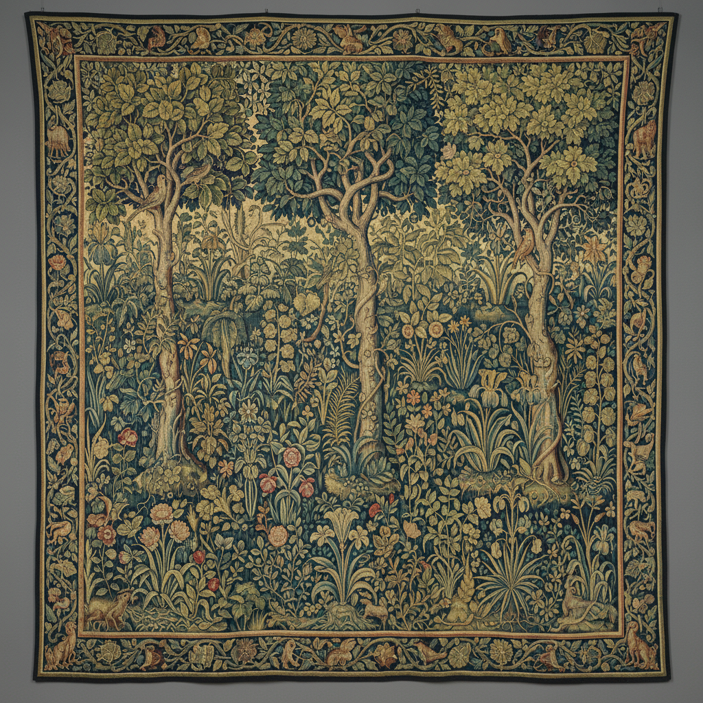

# Verdure Tapestry Art 绿荫挂毯艺术

> "Verdure tapestries are woven forests — dense compositions of foliage, trees, ferns, and flowering plants fill the entire field with an all-over pattern of green upon green, creating textile landscapes where the viewer stands at the edge of an enchanted wood, surrounded by leaves rendered in dozens of shades from blue-green shadow to golden-green sunlight." — Unknown

## 概述

绿荫挂毯艺术（Verdure Tapestry Art）是一种以植物和风景为主题的挂毯织造传统——以大面积的绿色植物、树木、蕨类和花卉填满整个画面，创造出茂密的森林或花园景观。绿荫挂毯是欧洲挂毯传统中最持久和最受欢迎的类型之一，从中世纪一直延续到今天。

绿荫挂毯艺术的实践包括：1）设计——设计以植物为主的构图；2）织造——在织机上用彩色丝线和毛线织造；3）色彩——使用多种绿色调创造深度；4）植物——各种植物的精细描绘；5）动物——常包含鸟类和小动物；6）装饰——作为室内装饰的功能；7）当代绿荫——将传统主题与现代织造结合的创作。

## 核心特征

| 特征 | 描述 |
|------|------|
| 绿色 | 以绿色为主的色调 |
| 植物 | 植物和树木为主题 |
| 密集 | 密集的构图 |
| 装饰 | 室内装饰功能 |
| 中世纪 | 中世纪的传统 |
| 自然 | 自然景观的表现 |

## 视觉特征

- **绿色**：多种绿色调的丰富变化
- **密集**：密集的植物填满画面
- **深度**：前后层次的深度感
- **细节**：植物的精细描绘
- **和谐**：和谐的自然氛围
- **装饰**：装饰性的整体效果

## 代表作品

| 作品 | 艺术家/文化 | 年代 | 意义 |
|------|-------------|------|------|
| *Millefleurs tapestries* | 法国/佛兰德斯 | 15世纪 | 千花挂毯 |
| *Feuilles de Choux* | 佛兰德斯 | 16世纪 | 卷心菜叶挂毯 |
| *Aubusson verdures* | 法国 | 17-18世纪 | 奥比松绿荫挂毯 |
| *English verdure tapestries* | 英国 | 17世纪 | 英国绿荫挂毯 |
| *Contemporary verdure* | 国际 | 当代 | 当代绿荫挂毯 |

## 历史时间线

| 时期 | 事件 |
|------|------|
| 14世纪 | 绿荫挂毯的早期发展 |
| 15世纪 | 千花挂毯的黄金时代 |
| 16-17世纪 | 佛兰德斯和法国的发展 |
| 18世纪 | 奥比松绿荫挂毯的流行 |
| 当代 | 绿荫主题的当代诠释 |

## 中国语境

绿荫挂毯与中国的传统织物艺术有一定的可比性。中国的缂丝——精细的丝织品中有大量的花卉和植物主题。中国的刺绣——苏绣、湘绣等中有精美的植物和花鸟题材。中国的壁挂织物——在少数民族地区有丰富的传统。中国当代的纤维艺术——有一些艺术家以植物和自然为主题进行创作。中国的室内设计中，绿荫挂毯作为欧式装饰元素——在一些高端空间中使用。中国的工艺美术教育中，绿荫挂毯作为欧洲织物艺术的重要类型——在相关课程中介绍。

## AI生成概念图

## 与其他风格的关系

- **Millefleurs** → 千花挂毯
- **Aubusson** → 奥比松挂毯
- **Gobelins** → 戈布兰挂毯
- **Tapestry Weaving** → 挂毯织造
- **Landscape Art** → 风景艺术
- **Textile Art** → 纺织艺术

---

*浮光艺志 | Chronicle of Artistry*
