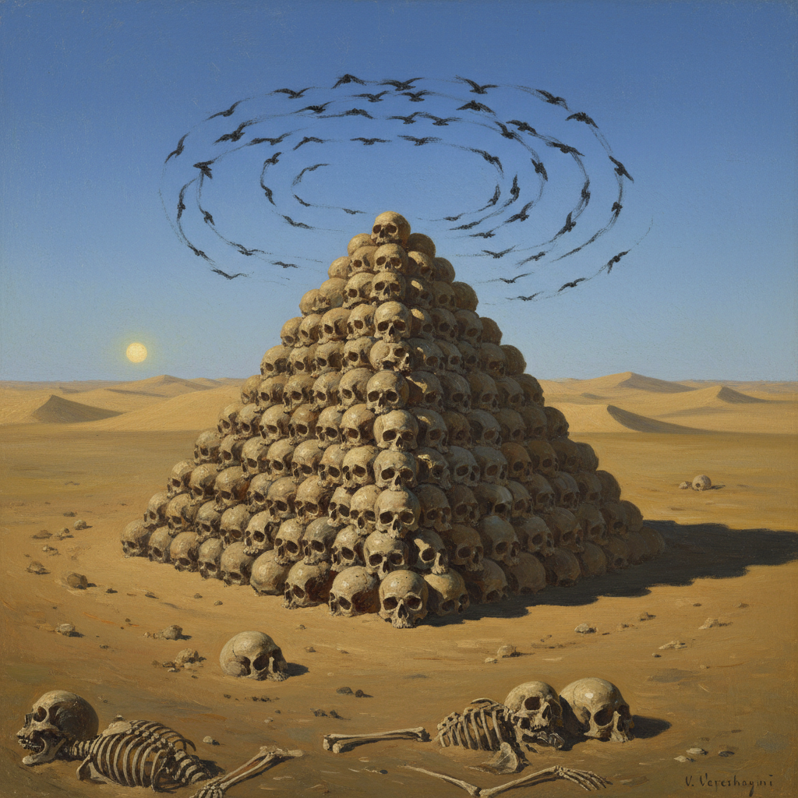

# Vereshchagin Art 韦列夏金艺术

> "I dedicate this work to all great conquerors, past, present, and future." — Vasily Vereshchagin

## 概述

韦列夏金艺术（Vereshchagin Art）是19世纪俄罗斯战争画大师瓦西里·瓦西里耶维奇·韦列夏金（Vasily Vasilyevich Vereshchagin, 1842-1904）创立的反战现实主义绑画风格。韦列夏金是世界美术史上最伟大的战争画家之一——但他不是歌颂战争的画家，而是揭露战争残酷真相的画家。他亲身参加了多次战争——从中亚征服到俄土战争——用画笔记录了战争的真实面貌。

韦列夏金最著名的作品《战争的礼赞》（1871）描绘了一座由人类头骨堆成的金字塔——乌鸦在上空盘旋，荒凉的天空下只有死亡的寂静。这幅画以其震撼的视觉冲击力成为反战艺术的永恒象征。他的"土耳其斯坦系列"和"1812年系列"以纪实的手法展现了战争对人类的摧残。韦列夏金最终在1904年日俄战争中随旗舰"彼得罗巴甫洛夫斯克号"沉没而殉难。

韦列夏金艺术的核心要素包括：1）反战主题——揭露战争的残酷真相；2）纪实精神——亲历战场的真实记录；3）异域风情——中亚、印度、巴尔干的风土；4）震撼构图——具有强烈视觉冲击力；5）民族志——对不同文化的客观记录；6）道德力量——艺术作为道德批判的工具；7）全景叙事——系列作品的全景式叙事。

## 核心特征

| 特征 | 描述 |
|------|------|
| 反战主题 | 揭露战争残酷真相 |
| 纪实精神 | 亲历战场真实记录 |
| 异域风情 | 中亚印度巴尔干风土 |
| 震撼构图 | 强烈视觉冲击力 |
| 民族志 | 对不同文化客观记录 |
| 道德力量 | 艺术作为道德批判工具 |

## 视觉特征

- **战场废墟**：战后的荒凉和破坏
- **异域建筑**：中亚和印度的建筑
- **强烈阳光**：中亚烈日下的强烈光影
- **纪实构图**：如摄影般的纪实角度
- **色彩对比**：蓝天与黄沙的强烈对比
- **死亡意象**：骷髅、废墟、荒野

## 代表作品

| 作品 | 年代 | 意义 |
|------|------|------|
| *战争的礼赞* (The Apotheosis of War) | 1871 | 反战艺术的象征 |
| *被遗忘的士兵* (Forgotten) | 1871 | 战争的残酷 |
| *进攻前* (Before the Attack) | 1881 | 战争的等待 |
| *希普卡山口的一切平静* (All Quiet at Shipka Pass) | 1878-1879 | 讽刺的力量 |
| *泰姬陵* (Taj Mahal) | 1874-1876 | 异域之美 |
| *拿破仑在莫斯科* (Napoleon in Moscow) | 1891-1900 | 1812年系列 |

## 历史时间线

| 时期 | 事件 |
|------|------|
| 1842年 | 出生于诺夫哥罗德省 |
| 1860-1863年 | 就读圣彼得堡美术学院 |
| 1867-1870年 | 参加中亚征服战争 |
| 1871年 | 创作《战争的礼赞》 |
| 1877-1878年 | 参加俄土战争 |
| 1880年代 | 游历印度、巴勒斯坦 |
| 1904年 | 在日俄战争中殉难 |

## 中国语境

韦列夏金在中国有着特殊的意义。他的反战艺术理念——用画笔揭露战争的残酷而非歌颂战争——与中国"以史为鉴"的传统有深刻的共鸣。《战争的礼赞》在中国美术教育中被作为"艺术的社会责任"的经典案例——它证明了艺术可以成为反对暴力和战争的有力武器。韦列夏金的纪实精神——亲赴战场、用画笔记录真实——也为中国战争题材绑画提供了重要的方法论参考。他对中亚和东方文化的客观记录，展现了一种超越民族偏见的人文主义视野。韦列夏金最终以身殉艺的悲壮结局，使他成为"艺术家的勇气"这一主题的永恒象征。

## 概念图

## 与其他风格的关系

- **Peredvizhniki** → 巡回展览画派
- **Repin** → 列宾（现实主义同道）
- **Critical Realism** → 批判现实主义
- **Orientalism** → 东方主义
- **War Art** → 战争艺术传统
- **Documentary Art** → 纪实艺术

---

*浮光艺志 | Chronicle of Artistry*
