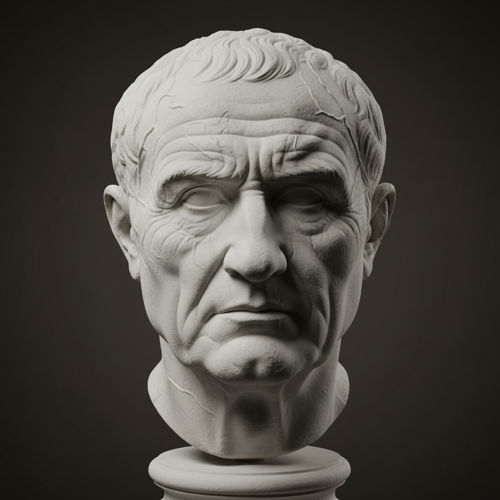

# Verism Art 真实主义

> **时期：** 古罗马 / 19世纪–20世纪  
> **关键词：** 极端写实、不美化、皱纹疤痕、罗马肖像、残酷真实

## 概述

Verism（真实主义）有两个历史语境：古罗马共和国时期的肖像雕塑传统——刻意保留老年人的皱纹、疣子和疤痕，以彰显智慧和经验；以及19世纪意大利歌剧和文学中的真实主义运动，追求对底层生活的不加修饰的描绘。在视觉艺术中，verism意味着拒绝一切理想化，直面现实的残酷与美。

## 风格特征

- **不美化**：保留所有"缺陷"和衰老痕迹
- **极端细节**：皱纹、毛孔、疤痕的精确记录
- **心理真实**：通过外表揭示内在性格
- **反理想化**：拒绝古典美的标准
- **尊严感**：在真实中发现另一种美

## 代表人物与作品

- 古罗马共和国肖像雕塑
- 卢西安·弗洛伊德 当代肖像
- 杜安·汉森 超写实雕塑
- 罗恩·穆克 巨型人体雕塑

## 概念图

