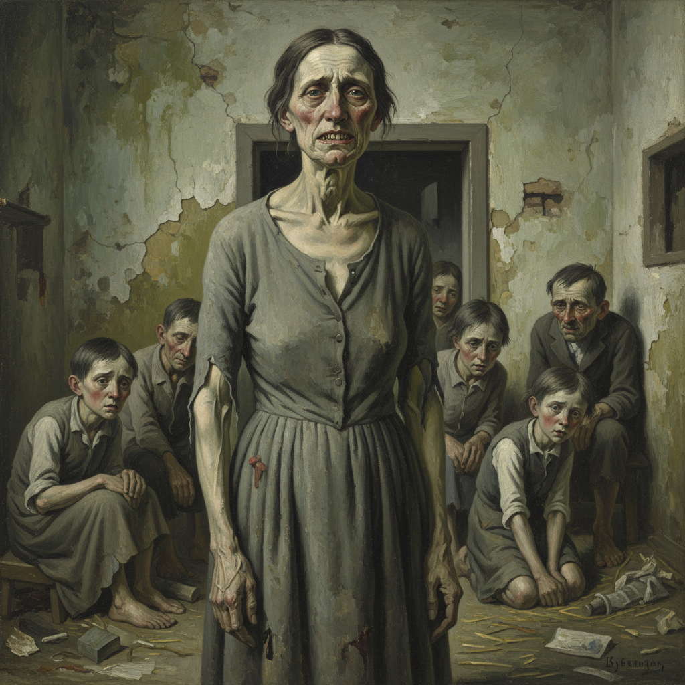

# Verism Painting 真实主义绘画

> **时期：** 1920年代–1930年代  
> **关键词：** 新客观主义左翼、极端写实、社会底层、丑陋真相、魏玛德国

## 概述

Verism Painting（真实主义绘画）是新客观主义运动中更为激进的左翼分支——画家们以近乎残忍的精确度描绘社会底层的丑陋现实。奥托·迪克斯的妓女和伤兵、乔治·格罗斯的腐败资本家——真实主义者不仅拒绝美化，更主动寻找最令人不安的真相，用艺术作为社会控诉的工具。

## 风格特征

- **极端写实**：不回避任何丑陋细节
- **社会底层**：妓女、伤兵、乞丐、罪犯
- **讽刺夸张**：漫画式的人物变形
- **冷酷光线**：手术室般的无情照明
- **叙事性**：每幅画都是一个社会故事

## 代表人物与作品

- 奥托·迪克斯 大都市三联画
- 乔治·格罗斯 社会讽刺画
- 鲁道夫·施利希特 柏林夜生活
- 卡尔·胡巴赫 街头人物

## 概念图

