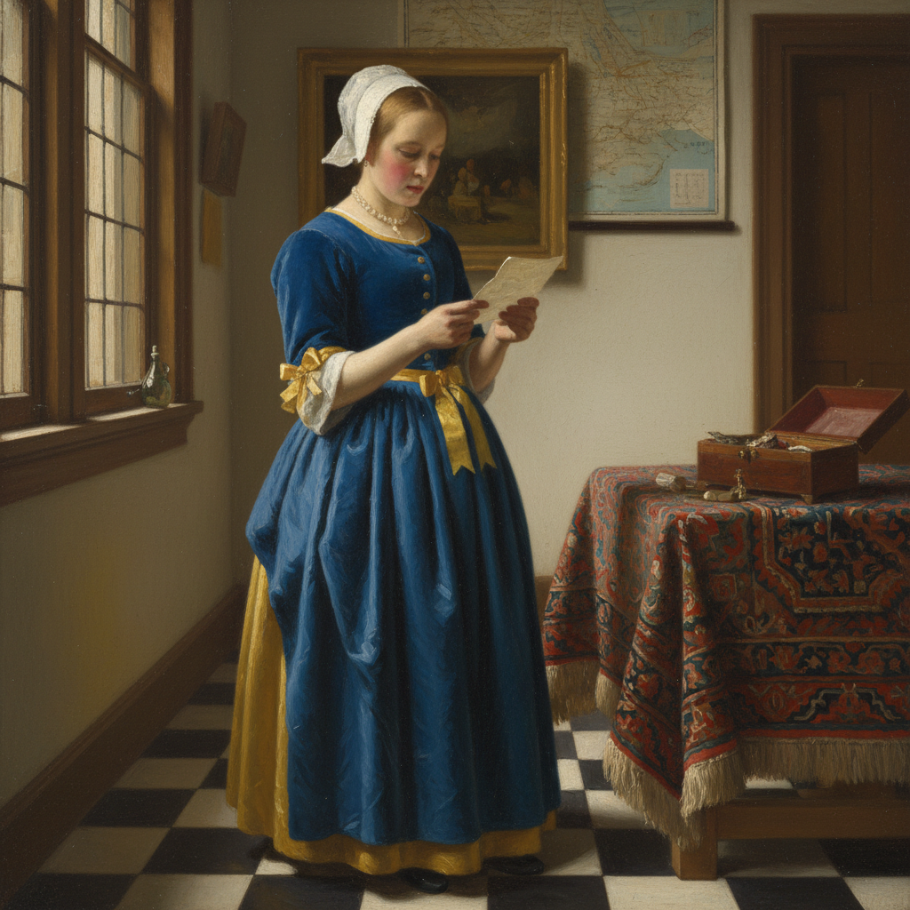

# Johannes Vermeer 维米尔

> "Vermeer's light is the light of truth." — Philip Steadman

## 概述

约翰内斯·维米尔（Johannes Vermeer，1632–1675）是荷兰黄金时代最神秘的画家。他一生仅留下约35幅作品，却以无与伦比的光线处理和宁静的室内场景成为西方绘画史上最受崇敬的大师之一。

维米尔的画面如同凝固的时间——一个女人在窗边读信，珍珠耳环反射着柔和的光，一切都沉浸在荷兰北方特有的银灰色光线中。

## 核心特征

| 特征 | 描述 |
|------|------|
| 光线魔术 | 从左侧窗户倾泻的柔和自然光 |
| 室内场景 | 几乎所有作品都是同一间房间 |
| 极少产出 | 一生仅约35幅已知作品 |
| 暗箱技术 | 可能使用暗箱辅助观察光学效果 |
| 珍珠般质感 | 光点的颗粒感——"维米尔的珍珠" |
| 日常诗意 | 将平凡的家庭场景升华为永恒 |

## 视觉特征

- **光线**：柔和的、从左侧窗户射入的自然光
- **色彩**：群青蓝、柠檬黄、珍珠白的经典组合
- **质感**：织物、陶瓷、金属的精确再现
- **光点**：散焦的高光点——暗箱效果
- **构图**：严谨的几何空间，地砖透视
- **氛围**：宁静、私密、时间凝固

## 代表作品

| 作品 | 年代 | 意义 |
|------|------|------|
| *Girl with a Pearl Earring* | c.1665 | "北方的蒙娜丽莎" |
| *The Milkmaid* | c.1658 | 日常劳动的尊严 |
| *Woman Reading a Letter* | c.1663 | 光线与私密的典范 |
| *The Art of Painting* | c.1666 | 绘画艺术的寓言 |
| *View of Delft* | c.1661 | 最伟大的城市风景画 |

## 真实作品（公共领域）

| 作品 | 来源 |
|------|------|
| *The Milkmaid* | [Rijksmuseum](https://www.rijksmuseum.nl/en/collection/SK-A-2344) |
| *Girl with a Pearl Earring* | [Mauritshuis](https://www.mauritshuis.nl/en/our-collection/artworks/670-girl-with-a-pearl-earring/) |
| *View of Delft* | [Mauritshuis](https://www.mauritshuis.nl/en/our-collection/artworks/92-view-of-delft/) |

> ⚠️ 本条目优先使用真实作品。

## AI生成概念图

## 与其他风格的关系

- **Dutch Golden Age** → 荷兰黄金时代的巅峰
- **Camera Obscura** → 光学辅助绘画的先驱
- **Photorealism** → 照相写实主义的精神先祖
- **Intimism** → 亲密主义的源头
