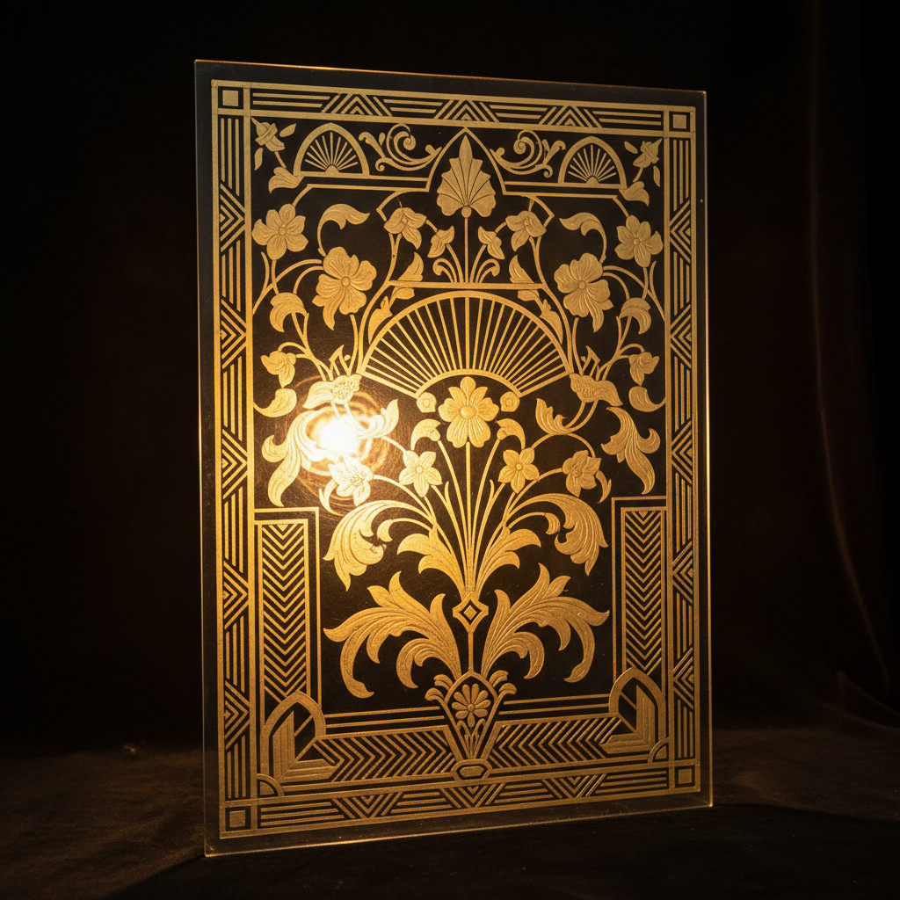

# Verre Églomisé Art 背面镀金玻璃艺术

> "Verre églomisé is painting behind glass — gold or silver leaf is applied to the back of a glass panel, then selectively scraped away and painted to create images that glow with metallic luminosity when viewed from the front. The glass protects the delicate gilding and painting forever, sealing the art in a transparent tomb that preserves every detail while adding its own depth and reflective quality." — Unknown

## 概述

背面镀金玻璃艺术（Verre Églomisé Art）是一种在玻璃背面施加金箔或银箔，然后在箔面上刻画图案并着色的装饰技法——从正面观看时，图案在金属箔的光泽中呈现出独特的华丽效果。Verre églomisé（法语"églomisé玻璃"）得名于18世纪法国装饰家Jean-Baptiste Glomy，但这种技法可追溯到古罗马时期。

背面镀金玻璃艺术的实践包括：1）玻璃准备——清洁和准备玻璃面板；2）贴箔——在玻璃背面贴金箔或银箔；3）刻画——在金箔上刻画图案轮廓；4）去除——去除图案区域的金箔；5）着色——在去除金箔的区域着色；6）保护——在背面涂覆保护层；7）当代背面镀金玻璃——将传统技法与现代设计结合的创作。

## 核心特征

| 特征 | 描述 |
|------|------|
| 背面 | 在玻璃背面工作 |
| 金箔 | 使用金箔或银箔 |
| 反向 | 需要反向思维 |
| 华丽 | 华丽的金属光泽 |
| 保护 | 玻璃保护画面 |
| 古老 | 古罗马的传统 |

## 视觉特征

- **光泽**：金属箔的华丽光泽
- **深度**：玻璃增加的深度感
- **精细**：精细的刻画线条
- **华丽**：华丽富贵的效果
- **反射**：金属的反射效果
- **永久**：玻璃保护的永久性

## 代表作品

| 作品 | 艺术家/文化 | 年代 | 意义 |
|------|-------------|------|------|
| *Roman gold glass* | 古罗马 | 3-4世纪 | 最早的背面镀金玻璃 |
| *Islamic glass painting* | 伊斯兰 | 中世纪 | 伊斯兰玻璃绘画 |
| *Baroque mirror frames* | 欧洲 | 17-18世纪 | 巴洛克镜框装饰 |
| *Art Deco panels* | 欧洲 | 1920-30年代 | 装饰艺术风格面板 |
| *Contemporary églomisé* | 国际 | 当代 | 当代背面镀金玻璃 |

## 历史时间线

| 时期 | 事件 |
|------|------|
| 3-4世纪 | 古罗马金箔玻璃的起源 |
| 中世纪 | 伊斯兰世界的发展 |
| 17-18世纪 | 欧洲巴洛克时期的繁荣 |
| 1920-30年代 | 装饰艺术运动中的复兴 |
| 当代 | 背面镀金玻璃的艺术化发展 |

## 中国语境

背面镀金玻璃艺术在中国有一定的历史和当代发展。中国清代的玻璃画（背面绘画）与verre églomisé有相似之处——虽然不一定使用金箔但同样是在玻璃背面作画。中国广州的玻璃画在18-19世纪是重要的外销艺术品——将中国绘画技法与玻璃背面绘画结合。中国当代的一些装饰艺术家开始学习背面镀金玻璃技法——将其应用于室内装饰和艺术创作。中国的高端室内设计中，背面镀金玻璃作为一种华丽的装饰元素——被应用于酒店、会所和豪宅。中国的一些玻璃艺术工作室开始提供背面镀金玻璃定制服务——将传统技法与现代设计需求结合。中国的文物修复中，对清代玻璃画的保护和修复是重要的课题——传承这一独特的装饰艺术传统。

## AI生成概念图

## 与其他风格的关系

- **Gilding** → 镀金工艺
- **Glass Art** → 玻璃艺术
- **Reverse Glass Painting** → 玻璃背画
- **Gold Leaf** → 金箔工艺
- **Decorative Art** → 装饰艺术
- **Mirror Art** → 镜面艺术

---

*浮光艺志 | Chronicle of Artistry*
