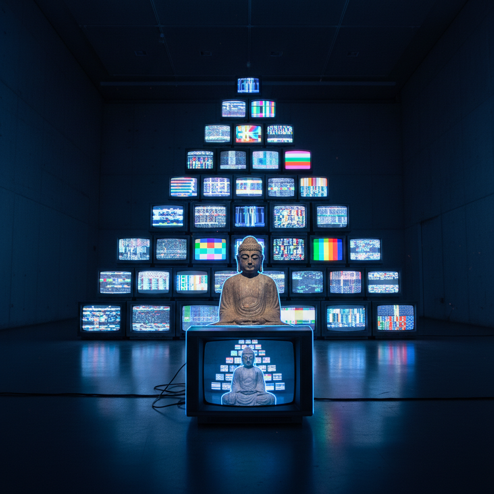

# Video Art 影像艺术

> "Television has been attacking us all our lives. Now we can attack it back." — Nam June Paik

## 概述

影像艺术（Video Art）是以电子影像（录像、数字视频）为主要媒介的艺术形式。它不是电影，不是电视，不是纪录片——它是将运动影像作为独立的艺术材料进行实验的创作实践。

从白南准（Nam June Paik）1960年代的电视雕塑到比尔·维奥拉（Bill Viola）的慢动作冥想、从布鲁斯·瑙曼（Bruce Nauman）的工作室录像到皮皮洛蒂·瑞斯特（Pipilotti Rist）的沉浸式投影，影像艺术已成为当代艺术最重要的媒介之一。

## 核心特征

| 特征 | 描述 |
|------|------|
| 时间媒介 | 影像是时间的艺术——持续、循环、变化 |
| 非叙事 | 不追求传统的故事结构 |
| 实验性 | 对影像技术本身的探索和颠覆 |
| 循环播放 | 通常以循环方式展示——没有开始和结束 |
| 空间性 | 投影和屏幕在空间中的布置 |
| 身体性 | 早期影像艺术大量使用艺术家自己的身体 |

## 视觉特征

- **屏幕**：CRT电视、投影、LED屏——显示设备是作品的一部分
- **时间**：极慢（Viola）或极快、循环或单次
- **身体**：艺术家的身体作为表演对象
- **空间**：多屏、多投影的空间装置
- **技术**：信号干扰、色彩失真、像素化
- **声音**：声音与影像的关系——同步或分离

## 代表作品

| 作品 | 艺术家 | 年代 | 意义 |
|------|--------|------|------|
| *TV Buddha* | Nam June Paik | 1974 | 佛像观看自己的闭路电视——经典 |
| *The Crossing* | Bill Viola | 1996 | 水与火的慢动作冥想 |
| *Clown Torture* | Bruce Nauman | 1987 | 重复和折磨的心理压力 |
| *Ever Is Over All* | Pipilotti Rist | 1997 | 女性用花砸碎车窗——欢乐的破坏 |
| *The Clock* | Christian Marclay | 2010 | 24小时的电影时钟——时间的蒙太奇 |
| *Semiotics of the Kitchen* | Martha Rosler | 1975 | 厨房用具的女性主义表演 |

## 历史时间线

| 时期 | 事件 |
|------|------|
| 1963 | Paik的第一次电视展览——影像艺术诞生 |
| 1965 | Sony Portapak便携录像机——艺术家可以自己录像 |
| 1970s | Nauman、Acconci——身体和工作室录像 |
| 1970s | 女性主义影像——Rosler、Jonas |
| 1980s | Viola——影像的精神性和冥想性 |
| 1990s | Rist——影像的欢乐和感官性 |
| 2000s | 多屏装置和数字技术的爆发 |
| 2010 | Marclay的*The Clock*——影像艺术的里程碑 |
| 2010s-至今 | VR影像、AI生成视频、社交媒体影像 |

## 子类型

| 子类型 | 特征 |
|--------|------|
| 单频影像 | 单屏播放的录像作品 |
| 影像装置 | 多屏、多投影的空间作品 |
| 电视雕塑 | Paik——电视机作为雕塑材料 |
| 行为录像 | 记录行为艺术的影像 |
| 影像散文 | 影像与文字的散文式结合 |
| 沉浸式影像 | 大尺度投影的环境影像 |

## 中国语境

影像艺术在中国从1990年代开始发展，张培力被称为"中国影像艺术之父"。中国的影像艺术家如杨福东、曹斐、陆扬等在国际上获得广泛认可。中国快速变化的社会现实为影像艺术提供了丰富的素材——从城市化到数字化、从集体记忆到个人身份。中国的短视频文化（抖音、快手）虽然不是"艺术"，但它们与影像艺术共享了运动影像作为表达媒介的基本逻辑。

## AI生成概念图

## 与其他风格的关系

- **Performance Art** → 行为艺术的记录催生了影像艺术
- **Fluxus** → 激浪派的Paik是影像艺术的创始人
- **Installation Art** → 影像装置是装置艺术的重要分支
- **Conceptual Art** → 概念艺术的去物质化在影像中延续
- **Immersive Art** → 沉浸式艺术大量使用影像投影
- **Net Art** → 网络艺术将影像带入互联网空间

---

*浮光艺志 | Chronicle of Artistry*
