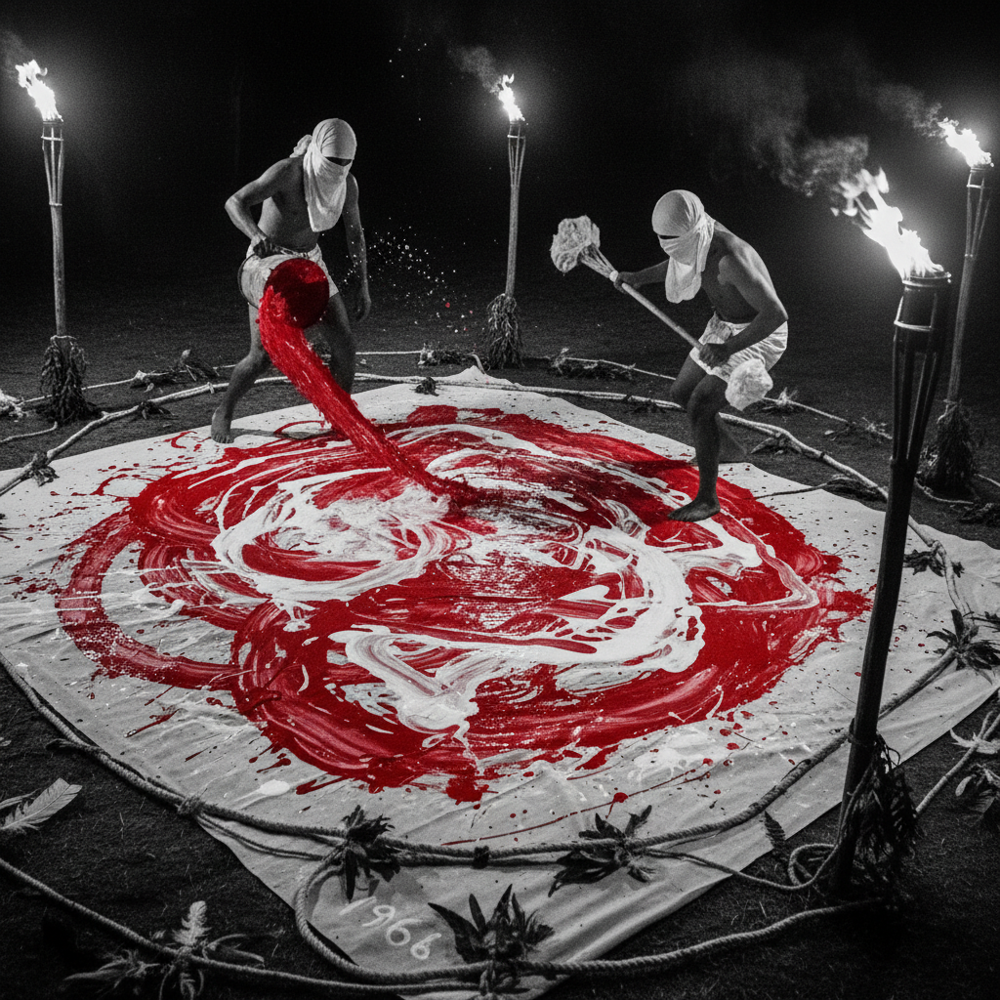

# Vienna Actionism 维也纳行动主义

> **时期：** 1960–1971  
> **关键词：** 身体艺术、仪式性、极端表演、物质性、心理释放

## 概述

维也纳行动主义是1960年代奥地利最激进的艺术运动之一。以赫尔曼·尼奇（Hermann Nitsch）、京特·布鲁斯（Günter Brus）、奥托·穆尔（Otto Muehl）和鲁道夫·施瓦茨科格勒（Rudolf Schwarzkogler）为核心，他们将身体本身作为画布和材料——通过仪式性的行为表演，挑战艺术、道德和社会的边界。

## 风格特征

- **身体作为媒介**：用身体取代画布进行创作
- **仪式性**：带有宗教祭祀般的结构和节奏
- **物质性**：使用颜料、有机物质等真实材料
- **极端性**：突破舒适区的表演行为
- **文献记录**：摄影和影像作为作品的延伸

## 代表人物与作品

- Hermann Nitsch《神秘剧场》系列
- Günter Brus 身体分析行动
- Otto Muehl 物质行动
- Rudolf Schwarzkogler 行动摄影

## 概念图

