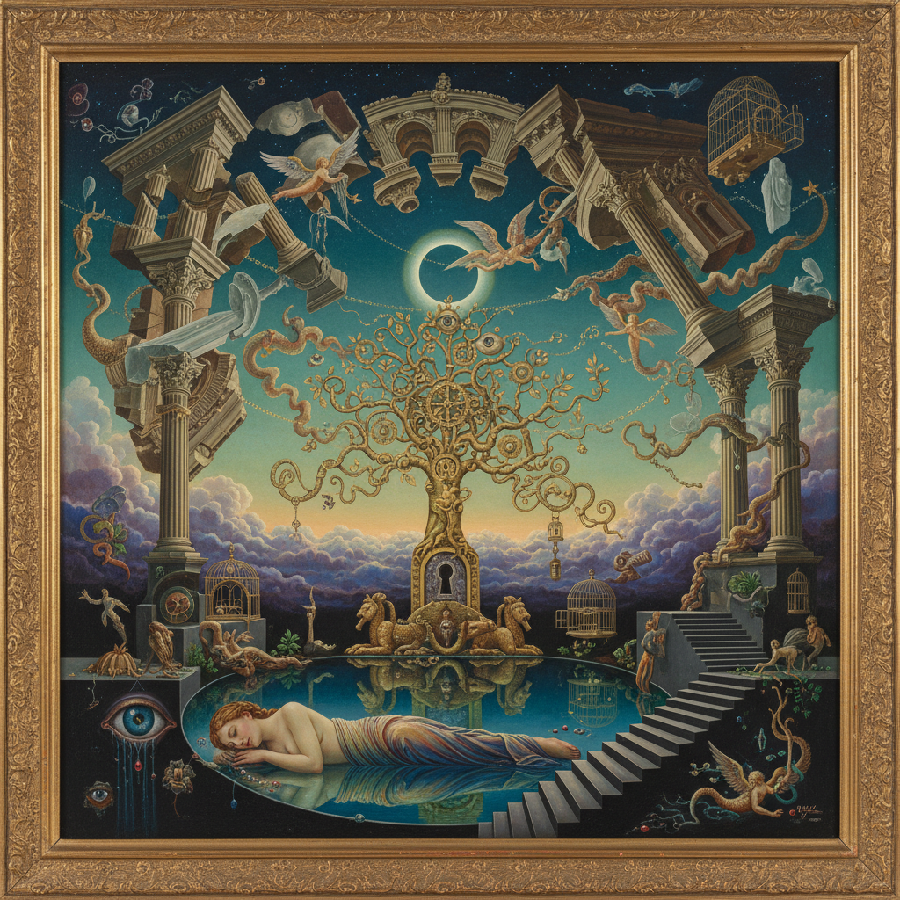

# Vienna Fantastic Realism 维也纳幻想现实主义

> **时期：** 1946年–1970年代  
> **关键词：** 维也纳画派、古典技法、超现实梦境、战后奥地利、精神分析

## 概述

Vienna Fantastic Realism（维也纳幻想现实主义）是1946年在维也纳美术学院由阿尔伯特·帕里斯·居特斯洛教授的学生们创立的画派。在战后废墟中，恩斯特·富克斯、阿里克·布劳尔等人拒绝抽象表现主义的潮流，转向文艺复兴的蛋彩画技法，用极致精密的笔触描绘弗洛伊德式的梦境和神话世界。

## 风格特征

- **蛋彩画技法**：文艺复兴时期的古典媒介
- **精密细节**：放大镜下仍然完美
- **梦境逻辑**：弗洛伊德式的象征体系
- **神话叙事**：圣经、希腊神话的重新诠释
- **珠宝质感**：宝石般的色彩饱和度

## 代表人物与作品

- 恩斯特·富克斯《摩西与燃烧的荆棘》
- 阿里克·布劳尔 自然精灵
- 鲁道夫·豪斯纳 亚当系列
- 沃尔夫冈·胡特尔 维也纳建筑幻想
- 安东·莱姆登 东方幻境

## 概念图

