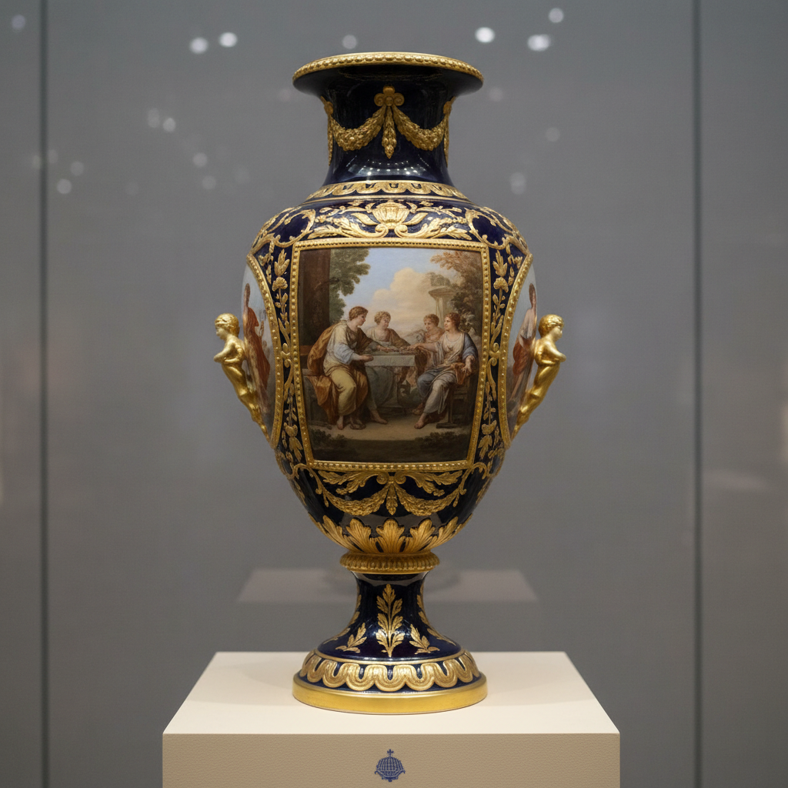

# Vienna Porcelain Art 维也纳瓷器艺术

> "Vienna porcelain is Habsburg elegance made tangible — the second oldest porcelain factory in Europe, established in 1718, where Rococo exuberance met Classical restraint to produce wares of extraordinary refinement, famous for its rich ground colors, museum-quality painted scenes, and the beehive mark that guaranteed imperial quality, a tradition that influenced ceramic art across the entire Austro-Hungarian Empire." — Unknown

## 概述

维也纳瓷器艺术（Vienna Porcelain Art）是奥地利哈布斯堡王朝时期（1718-1864年）在维也纳皇家瓷器工厂生产的精美瓷器艺术。维也纳瓷器是欧洲第二古老的瓷器工厂（仅次于迈森）——以其丰富的彩色底釉、精美的绘画装饰和"蜂巢"标志著称。维也纳瓷器在19世纪初达到巅峰——其绘画装饰的精细程度堪比油画，被誉为"瓷器上的美术馆"。

维也纳瓷器艺术的核心要素包括：1）哈布斯堡——哈布斯堡王朝的赞助；2）蜂巢标志——标志性的蜂巢商标；3）精美绘画——如油画般的精美绘画；4）彩色底釉——丰富的彩色底釉；5）古典题材——神话和古典题材；6）金彩装饰——华丽的金彩装饰；7）帝国风格——奥匈帝国的风格。

## 核心特征

| 特征 | 描述 |
|------|------|
| 哈布斯堡 | 哈布斯堡王朝赞助 |
| 蜂巢标志 | 标志性蜂巢商标 |
| 精美绘画 | 如油画般精美绘画 |
| 彩色底釉 | 丰富彩色底釉 |
| 古典题材 | 神话和古典题材 |
| 金彩装饰 | 华丽金彩装饰 |

## 视觉特征

- **深色底釉**：深蓝、深红等底釉
- **绘画精细**：极其精细的绘画
- **古典场景**：神话和历史场景
- **金彩繁复**：繁复的金色装饰
- **开光构图**：底色上的绘画开光
- **帝国气派**：庄重华丽的气派

## 代表作品

| 作品 | 艺术家/文化 | 年代 | 意义 |
|------|-------------|------|------|
| *维也纳彩绘花瓶* | 维也纳 | 19世纪初 | 绘画巅峰 |
| *杜巴里风格* | 维也纳 | 18世纪 | 洛可可风格 |
| *帝国风格餐具* | 维也纳 | 19世纪初 | 帝国风格 |
| *神话题材盘* | 维也纳 | 19世纪 | 古典题材 |
| *蜂巢标志瓷器* | 维也纳 | 各时期 | 品牌标识 |

## 历史时间线

| 时期 | 事件 |
|------|------|
| 1718年 | 维也纳瓷器工厂建立 |
| 1744年 | 成为皇家工厂 |
| 1784-1805年 | Sorgenthal时期的巅峰 |
| 1864年 | 皇家工厂关闭 |
| 当代 | 维也纳瓷器的收藏和研究 |

## 中国语境

维也纳瓷器与中国瓷器的关系类似于其他欧洲瓷器工厂——早期模仿中国风格，后来发展出独立的欧洲风格。维也纳瓷器工厂的建立（1718年）仅比迈森晚8年——它是欧洲最早掌握硬质瓷器技术的工厂之一。维也纳瓷器的彩色底釉技术与中国的颜色釉有相似之处——但维也纳发展出了更加丰富的底釉色彩系统。维也纳瓷器19世纪初的绘画装饰达到了欧洲瓷器的最高水平——其精细程度甚至超过了中国的珐琅彩。维也纳瓷器工厂虽然在1864年关闭——但其艺术遗产对整个奥匈帝国的陶瓷产业产生了深远影响，包括捷克、匈牙利等地的瓷器工厂都继承了维也纳的传统。

## AI生成概念图

## 与其他风格的关系

- **Meissen** → 迈森
- **Sevres** → 塞夫勒
- **Habsburg Art** → 哈布斯堡艺术
- **Neoclassicism** → 新古典主义
- **Empire Style** → 帝国风格
- **European Porcelain** → 欧洲瓷器

---

*浮光艺志 | Chronicle of Artistry*
