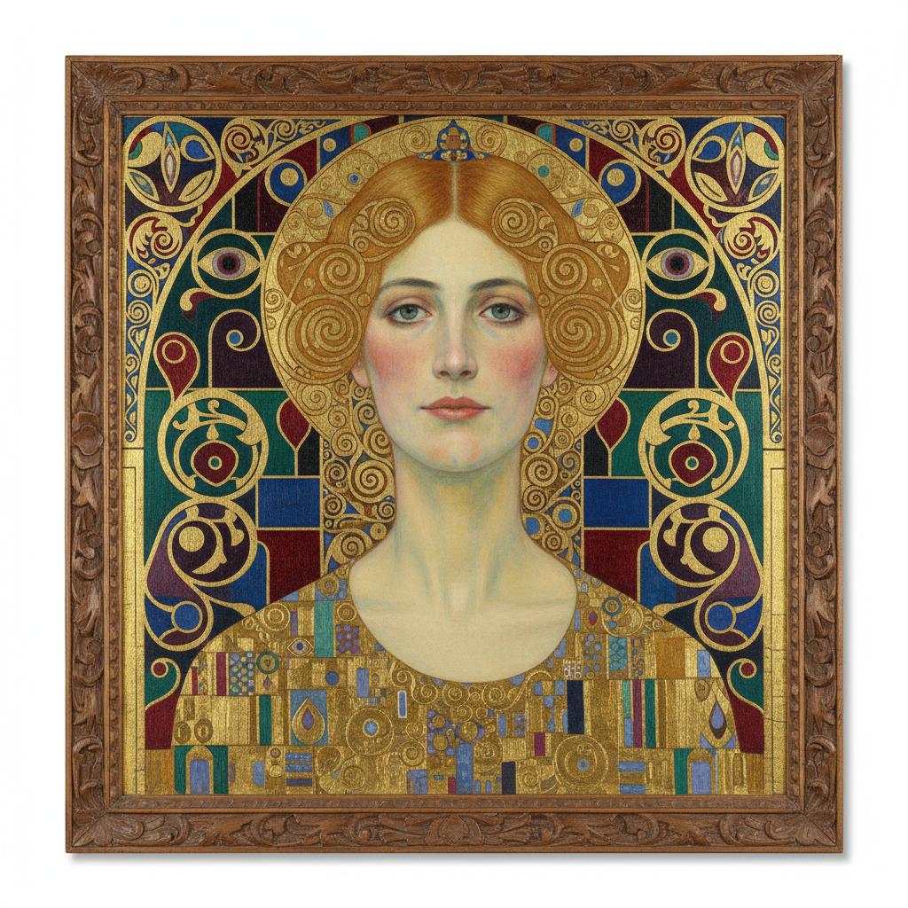

# Vienna Secession Painting 维也纳分离派绘画

> **时期：** 1897年–1905年  
> **关键词：** 克里姆特、反学院、装饰与象征、金色时期、总体艺术品

## 概述

Vienna Secession（维也纳分离派）是1897年由古斯塔夫·克里姆特领导的艺术家从保守的维也纳艺术家协会中"分离"出来的运动——他们追求艺术的自由和创新，拒绝学院派的陈规。克里姆特的《吻》、埃贡·席勒的扭曲人体——分离派将装饰性与深刻的心理内容融为一体，创造了世纪末维也纳独特的视觉文化。

## 风格特征

- **装饰与象征融合**：华丽表面下的深层含义
- **金色运用**：拜占庭式的金箔技法
- **平面化**：装饰图案与人物的融合
- **情色与死亡**：世纪末的焦虑主题
- **总体艺术品**：展览空间本身即作品

## 代表人物与作品

- 古斯塔夫·克里姆特《吻》《生命之树》
- 埃贡·席勒 扭曲自画像
- 科洛曼·莫泽 装饰艺术
- 奥斯卡·科柯施卡 表现主义肖像

## 概念图

