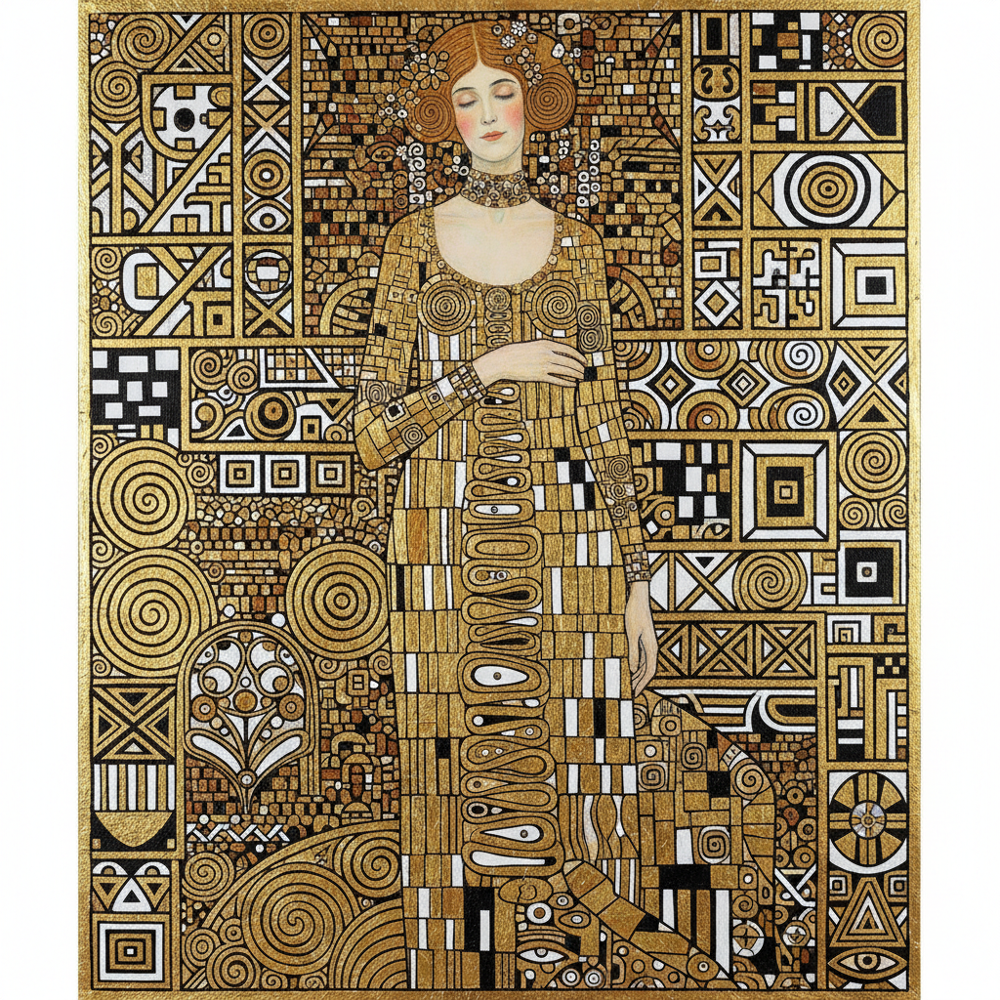

# Vienna Secession 维也纳分离派



> **"每个时代有它的艺术，每种艺术有它的自由。"**

## 概述

| 维度 | 描述 |
|------|------|
| 时期 | 1897–1905（核心期）/影响至今 |
| 别名 | Vienna Secession, Wiener Secession, 维也纳分离派 |
| 核心色彩 | 金色、白色、黑色——奢华与纯净的对比 |
| 关键元素 | 金箔装饰、几何+有机融合、总体艺术(Gesamtkunstwerk) |
| 代表人物 | Gustav Klimt, Koloman Moser, Josef Hoffmann, Otto Wagner |
| 关联风格 | Art Nouveau, Symbolism, Arts and Crafts, Jugendstil, Art Deco |

---

## 历史脉络

| 年份 | 事件 |
|------|------|
| 1897 | Klimt等19位艺术家"分离"出维也纳艺术家协会 |
| 1898 | 分离派展览馆建成——"金色圆顶" |
| 1898 | 杂志《Ver Sacrum》(神圣之春)创刊 |
| 1902 | 贝多芬壁画展——Klimt的巅峰 |
| 1903 | 维也纳工坊(Wiener Werkstätte)成立 |
| 1905 | Klimt等人退出分离派 |
| 1907 | Klimt《吻》——分离派最著名的作品 |

### 核心哲学

维也纳分离派的精神是**"打破学院的枷锁——艺术必须自由，必须现代"**：
- 座右铭："Der Zeit ihre Kunst, der Kunst ihre Freiheit"（每个时代有它的艺术，每种艺术有它的自由）
- "总体艺术——绘画、建筑、家具、珠宝、服装都是一体的"
- "装饰不是罪——装饰是人类的本能"
- "我们不反对传统——我们反对僵化"
- "金色不是庸俗——是神圣"

---

## 视觉语法

### 色彩系统

```
主色：
  金色 (#FFD700) — 神圣、奢华、Klimt
  白色 (#FFFFFF) — 纯净、现代
  黑色 (#000000) — 力量、对比

辅色：
  深红 (#8B0000) — 激情、生命
  翠绿 (#006400) — 自然、有机
  紫色 (#4B0082) — 神秘、精神

规则：
  - 金色是标志——但不滥用
  - 几何+有机的融合
  - 平面化+装饰性
  - 黑白金三色组合
```

### 标志性元素

| 类别 | 元素 |
|------|------|
| 装饰 | 金箔、马赛克、螺旋、方格 |
| 人物 | Klimt式女性——装饰化的身体 |
| 几何 | 方格、圆形、螺旋——Hoffmann的几何 |
| 有机 | 藤蔓、花卉、流水——Moser的有机 |
| 字体 | Ver Sacrum字体——方正+装饰 |
| 态度 | 自由、现代、总体、奢华 |

---

## 与千禧怀旧/当代的关系

### Klimt的永恒流行
- 《吻》= 世界上被复制最多的艺术品之一
- Klimt × 时尚/家居/文创 = 永不过时的商业价值
- "Klimt的金色——是Instagram时代之前的'金色滤镜'"

### 对当代设计的影响
- 几何+有机的融合 = 当代品牌设计的核心手法
- 总体艺术(Gesamtkunstwerk) = 品牌体验设计的先驱
- 维也纳工坊 = 设计师品牌的原型

---

## 设计应用

| 场景 | 应用方式 |
|------|----------|
| 品牌 | 金色+几何+奢华+文化 |
| 空间 | 总体设计+装饰+材料 |
| 时尚 | Klimt图案+金色元素 |
| 出版 | 装饰性排版+插画 |

---

## 相关风格

← [Symbolism 象征主义](symbolism.md) | [Art Nouveau 新艺术](art-nouveau.md) →

↑ [返回千禧怀旧目录](README.md) | [返回总目录](../README.md)
