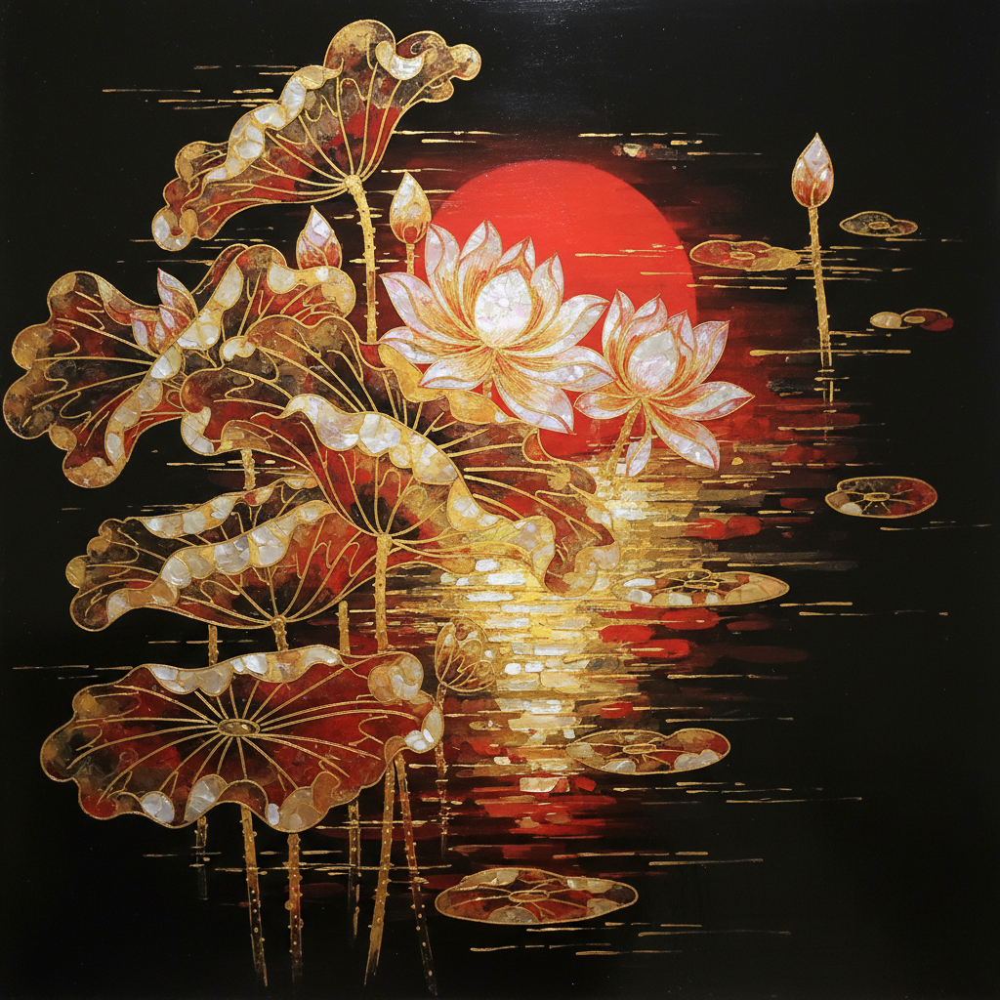

# Vietnamese Lacquer Art 越南漆画 | Sơn mài

> **"百层漆，千次磨——在黑暗中打磨出光。"**

## 概述

越南漆画（Sơn mài）是20世纪越南最重要的艺术创新之一，将传统漆器工艺转化为独立的绘画媒介。1925年河内美术学院（印度支那美术学院）成立后，法国教师与越南学生共同探索将传统漆艺提升为纯艺术的可能性。越南艺术家成功地将数千年的亚洲漆器传统与西方绘画构图融合，创造出一种独特的、具有深邃光泽和丰富层次的绘画形式。

## 制作工艺

1. **底板准备**：木板涂布多层底漆，每层干燥后打磨
2. **绘制**：用漆液混合颜料绘画（每层极薄）
3. **嵌入材料**：金箔、银箔、蛋壳、螺钿等
4. **层层叠加**：通常需要15–30层漆
5. **打磨显现**：用细砂纸和手掌打磨，让下层图案透出
6. **抛光**：最终用手掌和头发油脂抛光至镜面效果
7. **总耗时**：一幅作品通常需要3–6个月

## 核心特征

- **多层透明**：层层漆的叠加创造出独特的深度感
- **减法工艺**：通过打磨"减去"上层，露出下层
- **天然材料**：漆树汁液（Rhus succedanea）为基础
- **嵌入技法**：蛋壳碎片创造月光效果，金箔创造阳光
- **黑色底色**：深邃的黑漆底色赋予画面神秘感
- **时间性**：漆的干燥需要湿度而非温度，过程缓慢

## 色彩体系

| 颜色 | 来源 |
|------|------|
| 黑 | 天然漆氧化 |
| 红/朱 | 朱砂 + 漆 |
| 金 | 金箔嵌入 |
| 银/白 | 银箔、蛋壳碎片 |
| 棕 | 漆的自然色 |
| 蓝绿 | 现代颜料（20世纪后） |

## 代表艺术家

| 艺术家 | 代表作/特征 |
|--------|------------|
| Nguyễn Gia Trí | 越南漆画之父，抽象风景 |
| Phạm Hậu | 风景与建筑 |
| Nguyễn Sáng | 革命题材漆画 |
| Trần Văn Cẩn | 人物与日常生活 |

## 视觉特征

- 深邃的黑色底色中浮现的光
- 金色和红色的温暖光泽
- 蛋壳碎片创造的细腻肌理
- 多层透明带来的深度和神秘感
- 镜面般的光滑表面
- 东方构图与西方透视的融合

## 与其他风格的关系

| 风格 | 关系 |
|------|------|
| 日本漆器 Urushi | 共享漆艺传统，但越南发展为绘画 |
| 中国漆器 | 技术源流，但越南独创漆画形式 |
| 法国印象派 | 河内美术学院的西方影响 |
| 抽象表现主义 | 漆的偶然性与抽象表现共鸣 |
| 当代越南艺术 | 漆画仍是越南当代艺术的核心媒介 |

## 概念图

---

*浮光艺志 | Chronicle of Artistry*
