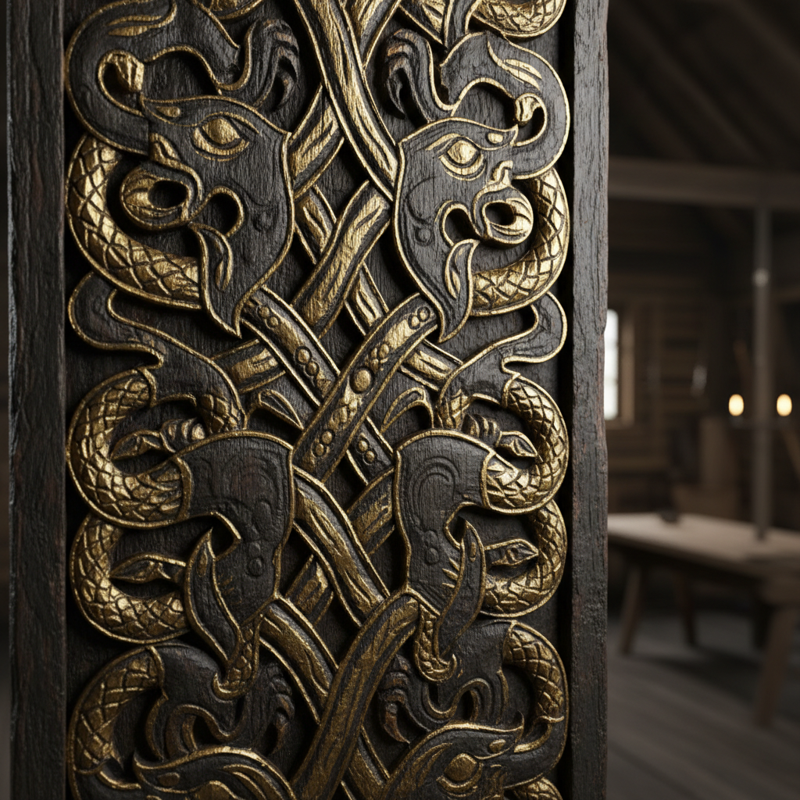

# 维京艺术 · Viking Art

> "我们在木头和金属上刻下永恒的纠缠，让神灵与野兽共舞。" —— 北欧萨迦

## 概述

维京艺术（Viking Art）是8世纪末至11世纪斯堪的纳维亚地区（今挪威、瑞典、丹麦）发展出的独特装饰艺术体系。维京艺术以高度风格化的动物纹样（zoomorphic interlace）为核心，将野兽、蛇龙和植物藤蔓编织成无尽的纠缠图案，应用于船首雕刻、武器装饰、首饰、石碑和木雕。这一传统融合了日耳曼动物风格、凯尔特编织纹和东方（拜占庭、伊斯兰）影响，形成了北欧文明最具辨识度的视觉语言。

## 核心特征

| 特征 | 描述 |
|------|------|
| 时期 | 约793年–1100年 |
| 地域 | 斯堪的纳维亚、冰岛、英国、诺曼底、基辅罗斯 |
| 媒介 | 木雕、金属工艺、石碑、骨雕、纺织 |
| 核心理念 | 以纠缠的动物纹样表达宇宙的有机联系 |
| 色彩 | 金色、银色、黑色（雕刻为主，少量彩绘） |

## 视觉特征

- **动物纠缠纹**：高度抽象化的野兽身体相互缠绕
- **带状编织**：无尽的带状图案象征命运的交织
- **抓握兽（Gripping Beast）**：动物爪子抓握自身或邻近图案
- **植物卷须**：后期融入的藤蔓和叶片纹样
- **对称与重复**：严格的镜像对称和节奏重复

## 代表作品

| 作品 | 出土地/创作地 | 年代 | 类型 |
|------|---------------|------|------|
| 奥塞贝格船葬木雕 | 挪威 | 约834 | 木雕 |
| 耶灵石碑 | 丹麦 | 约965 | 石碑浮雕 |
| 乌尔内斯木门雕刻 | 挪威 | 约1050 | 木雕 |
| 马门风格银器 | 丹麦 | 10世纪 | 金属工艺 |
| 博雷风格马具装饰 | 挪威 | 9世纪 | 铜鎏金 |

## 发展时间线

| 时期 | 风格阶段 |
|------|----------|
| 约750-840 | 奥塞贝格风格（Oseberg）：早期抓握兽 |
| 约840-880 | 博雷风格（Borre）：环链纹与抓握兽 |
| 约880-950 | 耶灵风格（Jelling）：S形带状动物 |
| 约950-1000 | 马门风格（Mammen）：植物纹融入 |
| 约980-1070 | 林格里克风格（Ringerike）：植物卷须主导 |
| 约1040-1100 | 乌尔内斯风格（Urnes）：最后的优雅纠缠 |

## 中国语境

维京艺术与中国的直接历史联系有限，但通过丝绸之路存在间接交流——维京人通过伏尔加贸易路线获取中国丝绸和唐代银币。在视觉语言层面，维京动物纠缠纹与中国商周青铜器上的饕餮纹和蟠螭纹有结构性相似——都是将动物形象高度抽象化并编织成装饰图案。当代中国设计师在北欧风格设计中经常引用维京纹样元素。

## AI 概念图

*AI 生成概念图：维京艺术风格*

## 关联词条

- [[celtic-art]] - 凯尔特艺术
- [[russian-folk-art]] - 俄罗斯民间艺术

---

*浮光艺志 · Chronicle of Artistry*
