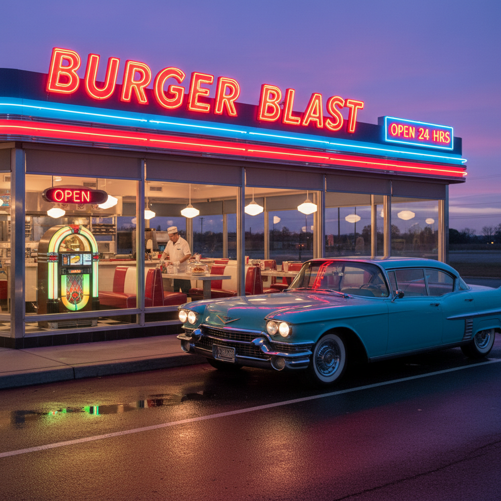

# Vintage Americana 复古美国风



> **"公路旁的霓虹汽车旅馆、铬合金点唱机、樱桃派和可口可乐——永远停在1950年代的美国梦。"**

## 概述

| 维度 | 描述 |
|------|------|
| 时期 | 1950s 设定 / 持续怀旧至今 |
| 别名 | Vintage Americana, Retro Diner, 50s Nostalgia, Rockabilly |
| 核心色彩 | 樱桃红、奶油白、天蓝、铬银、薄荷绿 |
| 关键元素 | 霓虹招牌、老爷车、点唱机、公路旅馆、汉堡店 |
| 代表人物 | Edward Hopper、Norman Rockwell、Elvis Presley |
| 关联风格 | Retrofuturism, Rockabilly, Diner Aesthetic |

---

## 历史脉络

### 1950s：美国梦的视觉巅峰

战后美国经济繁荣创造了一种独特的视觉文化：
- 汽车文化：尾翼、铬合金、双色车身
- 公路文化：66号公路、汽车旅馆、路边餐厅
- 消费文化：可口可乐、麦当劳、电视广告
- 流行文化：摇滚乐、猫王、詹姆斯·迪恩

### 为什么它成为"永恒怀旧"？

Vintage Americana 之所以被反复怀念，是因为它代表了一种**简单的乐观主义**：
- 经济在增长，未来是光明的
- 一辆车、一栋房、一份工作 = 美好生活
- 设计是为了让人开心（不是为了极简）
- 颜色越亮、车越大、霓虹越闪 = 越好

### 文化影响

| 作品 | 贡献 |
|------|------|
| 《Grease》(1978) | 50s 青春文化的浪漫化 |
| 《American Graffiti》(1973) | 汽车+摇滚+青春 |
| 《Twin Peaks》(1990) | 50s 美学的暗黑化 |
| 《Fallout》游戏系列 | 50s 美学的核末日版 |
| Lana Del Rey | 当代对 Americana 的忧郁重塑 |

---

## 视觉语法

### 色彩系统

```
主色：
  樱桃红 (#DC143C) — 可口可乐、老爷车
  奶油白 (#FFFDD0) — 餐厅瓷砖、冰淇淋
  天蓝 (#87CEEB) — 晴朗天空、泳池
  铬银 (#C0C0C0) — 汽车装饰、点唱机
  薄荷绿 (#98FB98) — 冰箱、餐厅内饰

辅色：
  黑色 (#000000) — 皮夹克、唱片
  金色 (#FFD700) — 霓虹、装饰
  粉色 (#FFB6C1) — 凯迪拉克、奶昔

质感：
  铬合金 — 汽车、家电
  霓虹灯 — 招牌
  皮革 — 座椅、夹克
  瓷砖 — 餐厅地板
  乙烯基 — 唱片、座椅
```

### 标志性元素

| 类别 | 元素 |
|------|------|
| 交通 | 尾翼老爷车、摩托车、公路 |
| 餐饮 | 路边餐厅、点唱机、奶昔、樱桃派 |
| 娱乐 | 汽车影院、保龄球馆、溜冰场 |
| 招牌 | 霓虹灯、箭头指示牌、汽车旅馆 |
| 服装 | 皮夹克、波点裙、猫眼墨镜 |
| 音乐 | 点唱机、黑胶唱片、摇滚乐 |

---

## 与千禧怀旧的关系

### 对"怀旧的怀旧"
- 千禧一代通过电影/游戏接触 50s 美学
- 《Fallout》系列让 50s 美学成为游戏文化的一部分
- Lana Del Rey 的音乐让 Americana 成为 2010s 的情绪符号
- 这是一种"二手怀旧"——怀念一个自己没经历过的时代

---

## 中国语境

- "美式复古"餐厅/咖啡馆
- 50s 风格的婚纱摄影
- 美式复古家具/装饰的流行
- 与"港风"复古的平行（同为对黄金时代的怀念）

---

## 设计应用

| 场景 | 应用方式 |
|------|----------|
| 品牌 | 红+白+蓝+复古字体+霓虹效果 |
| 空间 | 铬合金+红色皮革+黑白瓷砖+霓虹 |
| 包装 | 复古插画+手写字体+做旧质感 |
| 数字 | 霓虹动效+复古色调+点唱机UI |

---

## 相关风格

← [Retrofuturism 复古未来主义](retrofuturism.md) | [Dieselpunk 柴油朋克](dieselpunk.md) →

↑ [返回千禧怀旧目录](README.md) | [返回总目录](../README.md)
