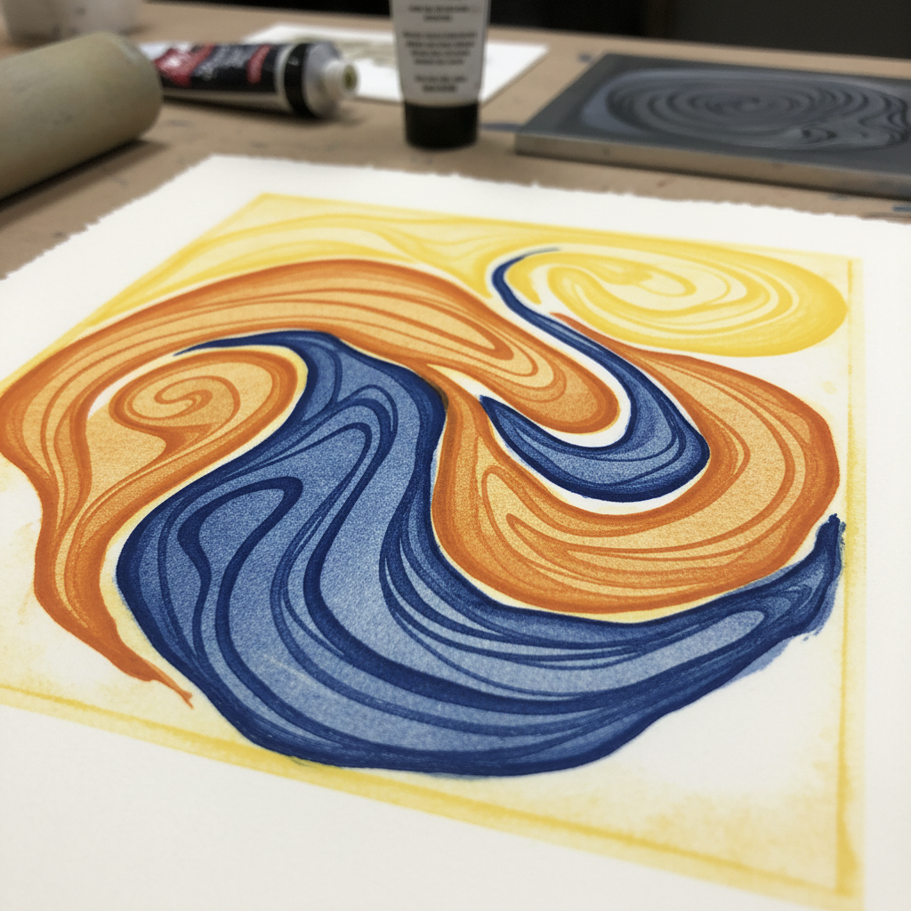

# Viscosity Printing Art 粘度印刷艺术

> "Viscosity printing is color alchemy on a single plate — inks of different thicknesses applied with rollers of different hardness selectively fill etched depths and ride on surfaces, producing multi-color intaglio prints from one pass through the press. The physics of ink viscosity becomes the artist's palette, as thick ink refuses to mix with thin, creating clean separations without multiple plates." — Unknown

## 概述

粘度印刷艺术（Viscosity Printing Art）是一种利用不同粘度的油墨在单块凹版上同时印刷多种颜色的技法——由斯坦利·威廉·海特（Stanley William Hayter）在巴黎Atelier 17工作室开发。通过使用不同硬度的滚筒施加不同粘度的油墨，利用油墨之间的排斥性在一次印刷中实现多色效果。

粘度印刷艺术的实践包括：1）多层蚀刻——在版面上创造不同深度的蚀刻；2）填充油墨——用稀薄油墨填充最深的凹槽；3）硬滚筒——用硬滚筒施加中等粘度的油墨；4）软滚筒——用软滚筒施加高粘度的油墨；5）一次印刷——一次通过印刷机完成多色；6）色彩分离——利用粘度差异实现色彩分离；7）当代粘度印刷——将传统技法与现代创作结合。

## 核心特征

| 特征 | 描述 |
|------|------|
| 单版 | 单块版多色印刷 |
| 粘度 | 利用油墨粘度差异 |
| 一次 | 一次印刷多色 |
| 物理 | 基于物理原理 |
| 实验 | 实验性的技法 |
| Hayter | 海特工作室传统 |

## 视觉特征

- **多色**：单版的多色效果
- **融合**：色彩的微妙融合
- **深度**：凹版的深度感
- **实验**：实验性的视觉效果
- **流动**：油墨的流动质感
- **丰富**：丰富的色彩层次

## 代表作品

| 作品 | 艺术家/文化 | 年代 | 意义 |
|------|-------------|------|------|
| *Stanley William Hayter* | 英国/法国 | 1940-80年代 | 粘度印刷的发明者 |
| *Atelier 17 prints* | 国际 | 1940年代起 | Atelier 17工作室作品 |
| *Krishna Reddy prints* | 印度/美国 | 1960-2000年代 | 雷迪的粘度印刷 |
| *Contemporary viscosity* | 国际 | 当代 | 当代粘度印刷 |
| *Experimental intaglio* | 国际 | 当代 | 实验性凹版 |

## 历史时间线

| 时期 | 事件 |
|------|------|
| 1940年代 | 海特在Atelier 17开发粘度印刷 |
| 1950-60年代 | 技法在国际版画界传播 |
| 1970年代 | Krishna Reddy的进一步发展 |
| 1980-90年代 | 粘度印刷的教育化 |
| 当代 | 粘度印刷的持续实验 |

## 中国语境

粘度印刷在中国的版画教育和创作中有一定的影响。中国的版画教育中，粘度印刷作为重要的凹版技法——在中央美术学院等院校教授。中国的版画艺术家对海特工作室的传统有所了解——一些中国艺术家曾在Atelier 17学习。中国当代的版画创作中，粘度印刷作为一种实验性技法——被用于探索色彩和材料的可能性。中国的版画工作坊中，粘度印刷——作为进阶技法在专业课程中教授。中国的版画展览中，使用粘度印刷技法的作品——因其独特的视觉效果而受到关注。

## AI生成概念图

## 与其他风格的关系

- **Intaglio** → 凹版印刷
- **Etching** → 蚀刻版画
- **Color Printing** → 彩色印刷
- **Experimental Print** → 实验版画
- **Printmaking** → 版画
- **Atelier 17** → 17号工作室

---

*浮光艺志 | Chronicle of Artistry*
