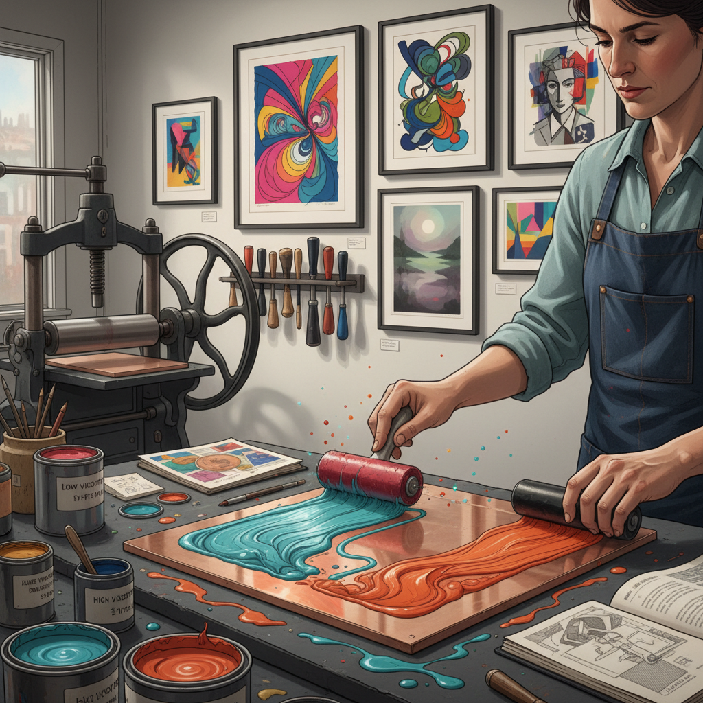

# Viscosity Printing 粘度版画

> "Viscosity printing is alchemy on the press — inks of different thicknesses repelling and attracting across a single plate, separating into distinct color layers through the physics of fluid dynamics rather than the mechanics of multiple plates." — Unknown

## 概述

粘度版画（Viscosity Printing）是一种利用油墨粘度差异在单一版面上实现多色套印的凹版画技法。由英籍法国版画家斯坦利·威廉·海特（Stanley William Hayter）在20世纪中期于巴黎Atelier 17工作室发展完善。其原理基于物理学中的粘度排斥——不同粘度的油墨互相排斥，高粘度油墨不会覆盖低粘度油墨，反之亦然。

粘度版画的操作方法：在一块深蚀刻的凹版上，先用软辊将低粘度（稀薄）的油墨滚入凹槽深处，再用硬辊将高粘度（浓稠）的油墨滚在版面凸起部分。由于粘度差异，两种油墨各自停留在不同层面而不混合。通过控制蚀刻深度、辊子硬度和油墨粘度，可以在一次印刷中获得多种颜色的分离效果——无需多次套印。

## 核心特征

| 特征 | 描述 |
|------|------|
| 粘度 | 利用油墨粘度差异 |
| 单版 | 单版多色 |
| 物理 | 基于物理原理 |
| 分离 | 颜色自然分离 |
| 创新 | 20世纪版画创新 |
| 偶然 | 部分偶然效果 |

## 视觉特征

- **多色**：单版多色效果
- **层次**：色彩的层次分离
- **有机**：有机的色彩边界
- **丰富**：丰富的色彩变化
- **质感**：独特的印刷质感
- **深度**：色彩的深度感

## 代表作品

| 作品 | 艺术家 | 年代 | 意义 |
|------|--------|------|------|
| *Cinq Personnages* | S.W. Hayter | 1946 | 粘度版画的开创 |
| *Atelier 17 prints* | Various | 1940s-60s | 工作室的集体探索 |
| *Color intaglio works* | Krishna Reddy | 20世纪 | 粘度版画的发展 |
| *Contemporary viscosity* | Various | 当代 | 当代粘度版画 |
| *Multi-color single plate* | Various | 当代 | 单版多色的创新 |

## 历史时间线

| 时期 | 事件 |
|------|------|
| 1930s | Hayter建立Atelier 17 |
| 1940s | 粘度版画原理的发现 |
| 1950s | 技法的系统化发展 |
| 1960s | 全球版画工作室的传播 |
| 1970s-80s | 粘度版画的成熟和多样化 |
| 当代 | 粘度版画在版画教育中的标准化 |

## 中国语境

粘度版画在中国的版画教育中有一定的介绍和实践。中国的美术学院版画系在教授凹版画技法时，会介绍粘度版画作为高级技法之一。中国的一些版画家在创作中使用粘度版画技法来实现丰富的色彩效果。中国的版画工作室和国际版画交流活动中，粘度版画作为一种创新技法受到关注。

## AI生成概念图

## 与其他风格的关系

- **Intaglio** → 凹版画
- **Etching** → 蚀刻版画
- **Aquatint** → 飞尘腐蚀
- **Color Printmaking** → 彩色版画
- **Monotype** → 独幅版画
- **Collagraph** → 拼贴版画

---

*浮光艺志 | Chronicle of Artistry*
