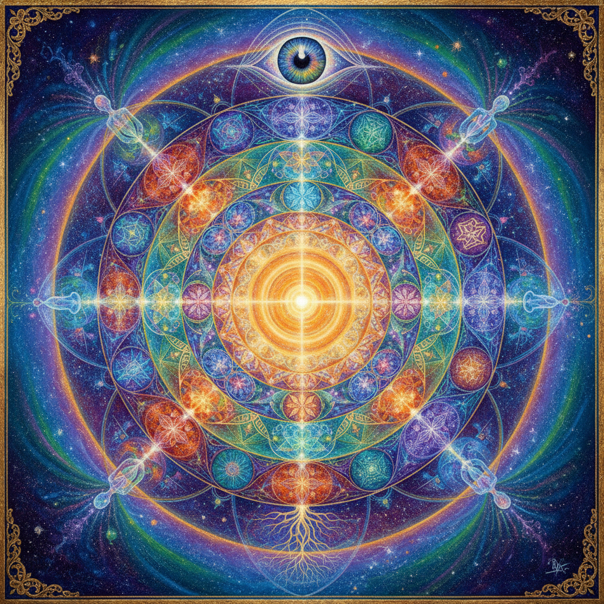

# Visionary Art 幻视艺术

> **时期：** 1960年代–至今  
> **关键词：** 灵性体验、意识扩展、神圣几何、迷幻视觉、超越现实

## 概述

Visionary Art（幻视艺术）是试图描绘超越日常感知的精神体验和意识状态的艺术运动。受冥想、迷幻体验、神秘主义和宗教异象的启发，幻视艺术家用极度精细的技法描绘内在视觉——分形图案、发光的能量场、多维空间和神圣几何——创造出一种"看见不可见"的视觉语言。

## 风格特征

- **极度精细**：超写实的技法描绘超现实内容
- **发光效果**：内在光源和能量辐射
- **神圣几何**：曼陀罗、分形、黄金比例
- **多维空间**：超越三维的空间表现
- **意识主题**：冥想、觉醒、宇宙意识

## 代表人物与作品

- 亚历克斯·格雷《神圣镜》系列
- 恩斯特·福克斯（维也纳幻想现实主义）
- 马蒂·克拉维恩（荷兰幻视艺术）
- Android Jones（数字幻视艺术）

## 概念图

